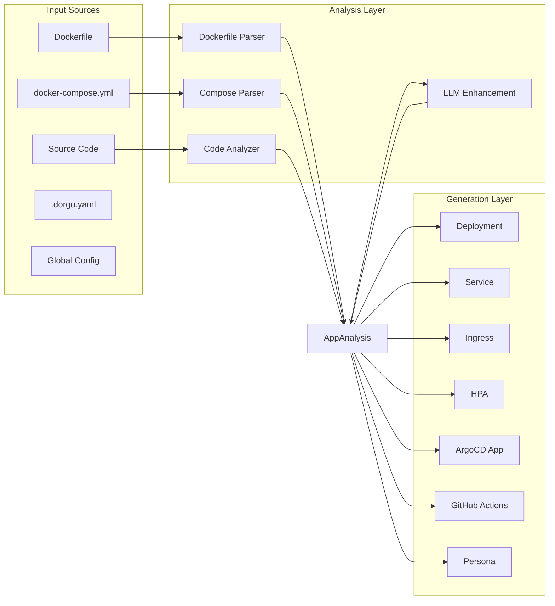
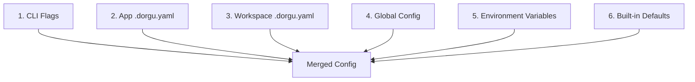

# CLI Pipeline

The `dorgu generate` command runs a three-stage pipeline: **analyze** the application, optionally **enhance** with an LLM, then **generate** Kubernetes manifests. The central data structure flowing through every stage is `AppAnalysis`.

## Pipeline Overview

## Analyzers

The analysis layer extracts everything Dorgu needs to know about your application from its existing project files. Each analyzer contributes to the shared `AppAnalysis` struct.

### Dockerfile Parser

Parses `Dockerfile` to extract:

- **Base image** and tag (e.g., `node:20-alpine`, `golang:1.22`)
- **Exposed ports** from `EXPOSE` directives
- **Environment variables** from `ENV` instructions
- **Working directory**, **entrypoint**, and **command** (`WORKDIR`, `ENTRYPOINT`, `CMD`)
- **User** directive for security context (`USER`)
- **Labels** for metadata extraction (`LABEL`)
- **Multi-stage builds** -- identifies the final stage for runtime analysis

The parser handles line continuations (`\`) and ignores commented-out instructions.

### Docker-Compose Parser

Parses `docker-compose.yml` to extract:

- **Services** and their container images
- **Port mappings** (host:container)
- **Environment variables** and env files
- **Volume mounts** for persistence detection
- **Service dependencies** from `depends_on`
- **Health checks** for probe generation

### Code Analyzer

Performs static analysis on source code to detect:

- **Language** -- Node.js, Python, Go, Java, Ruby, Rust
- **Framework** -- Express, FastAPI, Django, Spring Boot, Rails, Gin, Actix, and more
- **Dependencies** from package manifests (`package.json`, `requirements.txt`, `go.mod`, `pom.xml`, `Gemfile`, `Cargo.toml`)
- **Health and metrics endpoints** -- detects `/health`, `/healthz`, `/ready`, `/metrics` route registrations
- **Application type** -- web server, API, worker, static site

## LLM Integration

LLM enhancement is **optional** and enriches the analysis with intelligent suggestions for resource sizing, scaling strategies, and security hardening.

Dorgu uses an **interface-based design** with a factory pattern that selects the configured provider:

| Provider | Model Examples | Configuration |
|----------|---------------|---------------|
| OpenAI | GPT-4o, GPT-4o-mini | `OPENAI_API_KEY` |
| Anthropic | Claude Sonnet, Claude Haiku | `ANTHROPIC_API_KEY` |
| Gemini | Gemini Pro, Gemini Flash | `GEMINI_API_KEY` |
| Ollama | Llama, Mistral, CodeGemma | Local, no API key needed |

All providers implement the same interface, so switching between them requires only a config change. When no LLM is configured, Dorgu falls back to deterministic heuristics.

## Generators

Each generator takes the completed `AppAnalysis` and produces one output file:

| Generator | Output File | Key Features |
|-----------|-------------|--------------|
| Deployment | `k8s/deployment.yaml` | Resource limits, health probes, security context, non-root UID |
| Service | `k8s/service.yaml` | ClusterIP, maps detected ports |
| Ingress | `k8s/ingress.yaml` | nginx class, TLS via cert-manager |
| HPA | `k8s/hpa.yaml` | CPU-based scaling, optional memory |
| ArgoCD | `k8s/argocd/application.yaml` | Auto-detected repo URL, sync policy |
| GitHub Actions | `.github/workflows/deploy.yaml` | Build, push, deploy pipeline |
| Persona YAML | `persona.yaml` | ApplicationPersona CRD |

<Info>
Generators are independently toggled. Use `--skip-argocd` or `--skip-ci` flags to exclude specific outputs, or configure defaults in `.dorgu.yaml`.
</Info>

## Config Layering

Configuration is resolved from six sources. Higher-priority sources override lower ones on a per-key basis:

This means you can set organization-wide defaults in the global config (`~/.config/dorgu/config.yaml`), override per workspace, and fine-tune per application -- while CLI flags always take the highest priority for one-off runs.

## Central Type: AppAnalysis

`AppAnalysis` is the central struct that flows through the entire pipeline. Every analyzer writes to it, and every generator reads from it. It lives in `internal/types/analysis.go`.

Key fields include:

- **name** -- Application name, inferred from the directory or config
- **type** -- Application type (web, api, worker, static)
- **language** -- Detected programming language
- **framework** -- Detected framework (Express, FastAPI, Spring Boot, etc.)
- **ports** -- Exposed ports with protocol information
- **healthChecks** -- Detected health and readiness endpoints
- **envVars** -- Environment variables with sensitivity classification
- **dependencies** -- External service dependencies (databases, caches, queues)
- **resourceProfile** -- CPU and memory recommendations
- **scaling** -- Min/max replicas and scaling triggers
- **securityContext** -- Non-root user, read-only filesystem, capabilities

This single struct acts as the contract between the analysis and generation layers, ensuring every generator has access to the full picture of the application.
