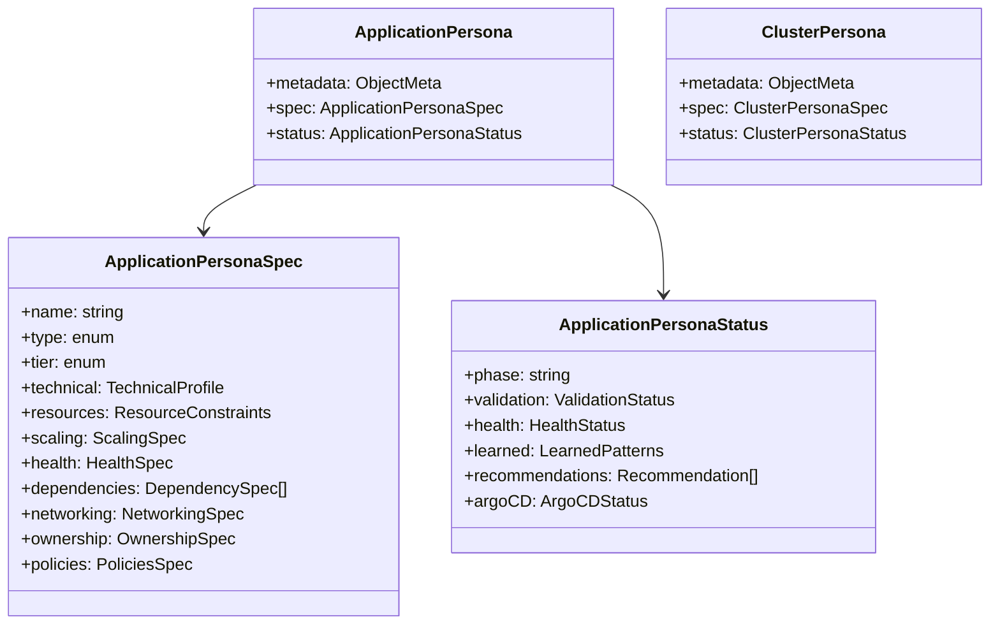
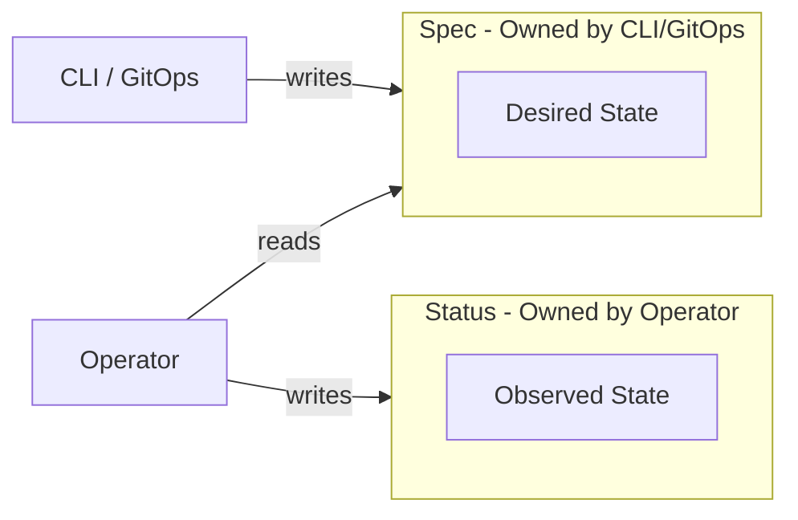

Dorgu extends Kubernetes with two Custom Resource Definitions (CRDs) that capture application identity and cluster context. These CRDs are the central data model that connects the CLI, Operator, and integrations.

## CRD Overview

The primary CRD is **ApplicationPersona**, which describes a single application's desired operational profile and the Operator's observed state. The secondary CRD is **ClusterPersona**, which captures cluster-level context.



## Ownership Model

The spec and status of an ApplicationPersona are owned by different actors. This separation is fundamental to Dorgu's design.



| Actor | Writes | Mechanism |
|-------|--------|-----------|
| CLI / GitOps | `spec` | `dorgu persona apply` or ArgoCD sync |
| Operator | `status` | Status subresource updates during reconciliation |

The CLI and GitOps tools define the desired state in the spec. The Operator observes the cluster and writes its findings to the status. The Operator **never** modifies the spec.

## API Group and Scope

Both CRDs belong to the `dorgu.io/v1` API group.

| Resource | Scope |
|----------|-------|
| ApplicationPersona | Namespaced |
| ClusterPersona | Cluster |

ApplicationPersonas live in the same namespace as the workloads they describe. ClusterPersona is cluster-scoped since it represents the entire cluster.

## ApplicationPersona Spec Fields

The spec defines the desired operational profile for an application.

| Field | Type | Required | Description |
|-------|------|----------|-------------|
| `name` | string | Yes | Application name (matches `app.kubernetes.io/name` label) |
| `type` | enum | Yes | `api`, `web`, `worker`, `cron`, `daemon` |
| `tier` | enum | No | `critical`, `standard`, `best-effort` |
| `technical` | object | No | Language, framework, and description |
| `resources` | object | No | CPU/memory requests and limits |
| `scaling` | object | No | `minReplicas`, `maxReplicas`, `targetCPU`, `behavior` |
| `health` | object | No | `livenessPath`, `readinessPath`, `port` |
| `dependencies` | array | No | Each entry: `name`, `type`, `required`, `healthCheck` |
| `networking` | object | No | Ports and ingress configuration |
| `ownership` | object | No | `team`, `owner`, `repository`, `oncall` |
| `policies` | object | No | Security context, deployment strategy, maintenance windows |

## ApplicationPersona Status Fields

The status is populated entirely by the Operator and reflects the observed state of the application.

| Field | Type | Description |
|-------|------|-------------|
| `phase` | enum | `Pending`, `Active`, `Degraded`, `Failed` |
| `validation.passed` | bool | Whether the latest validation passed |
| `validation.issues[]` | array | Each entry: `severity`, `field`, `message`, `suggestion` |
| `health.status` | enum | `Healthy`, `Degraded`, `Unhealthy`, `Unknown` |
| `learned.resourceBaseline` | object | `avgCPU`, `avgMemory`, `peakCPU`, `peakMemory` |
| `argoCD.syncStatus` | enum | `Synced`, `OutOfSync`, `Unknown` |
| `argoCD.healthStatus` | enum | `Healthy`, `Degraded`, `Progressing`, `Missing`, `Unknown` |
| `recommendations[]` | array | Improvement suggestions generated by the Operator |

## Full ApplicationPersona Example

A complete ApplicationPersona for a critical API service:

```yaml
apiVersion: dorgu.io/v1
kind: ApplicationPersona
metadata:
  name: order-service
  namespace: commerce
spec:
  name: order-service
  version: "1.0"
  type: api
  tier: critical
  technical:
    language: go
    framework: gin
    description: Order processing and management service
  resources:
    requests:
      cpu: 100m
      memory: 128Mi
    limits:
      cpu: 500m
      memory: 512Mi
  scaling:
    minReplicas: 2
    maxReplicas: 10
    targetCPU: 70
    behavior: balanced
  health:
    livenessPath: /health
    readinessPath: /ready
    port: 8080
    startupGracePeriod: 30s
  dependencies:
    - name: postgres
      type: database
      required: true
    - name: redis
      type: cache
      required: false
  networking:
    ports:
      - port: 8080
        protocol: TCP
        purpose: HTTP API
      - port: 9090
        protocol: TCP
        purpose: Metrics
    ingress:
      enabled: true
      host: orders.example.com
      paths: ["/api/v1/orders"]
      tlsEnabled: true
  ownership:
    team: commerce-platform
    owner: jane.doe@example.com
    repository: https://github.com/example/order-service
  policies:
    security:
      runAsNonRoot: true
      readOnlyRootFilesystem: true
      allowPrivilegeEscalation: false
    deployment:
      strategy: RollingUpdate
      maxSurge: "25%"
      maxUnavailable: "0"
```

## ClusterPersona

ClusterPersona is a cluster-scoped resource that captures the overall cluster context. The Operator's ClusterPersona controller automatically discovers and populates its status.

### ClusterPersona Spec Fields

| Field | Type | Required | Description |
|-------|------|----------|-------------|
| `name` | string | Yes | Human-readable cluster name |
| `description` | string | No | Cluster purpose or notes |
| `environment` | enum | No | `development`, `staging`, `production` |
| `policies` | object | No | Cluster-wide policy defaults |
| `conventions` | object | No | Naming and labeling conventions |
| `defaults` | object | No | Default values for ApplicationPersona fields |
| `resourceQuotas` | object | No | Cluster-level resource budget |

### ClusterPersona Status Fields

| Field | Type | Description |
|-------|------|-------------|
| `phase` | enum | `Discovering`, `Ready`, `Degraded` |
| `nodes[]` | array | Node names, roles, capacity, and conditions |
| `resourceSummary` | object | Total and allocatable CPU/memory across all nodes |
| `addons[]` | array | Detected add-ons (ArgoCD, Prometheus, Grafana, etc.) |
| `kubernetesVersion` | string | Cluster Kubernetes version |
| `platform` | string | Detected platform (EKS, GKE, AKS, Kind, etc.) |
| `applicationCount` | int | Total number of managed ApplicationPersonas |

The ClusterPersona controller reconciles every 5 minutes, scanning nodes, namespaces, and well-known add-on namespaces to keep the status current.
