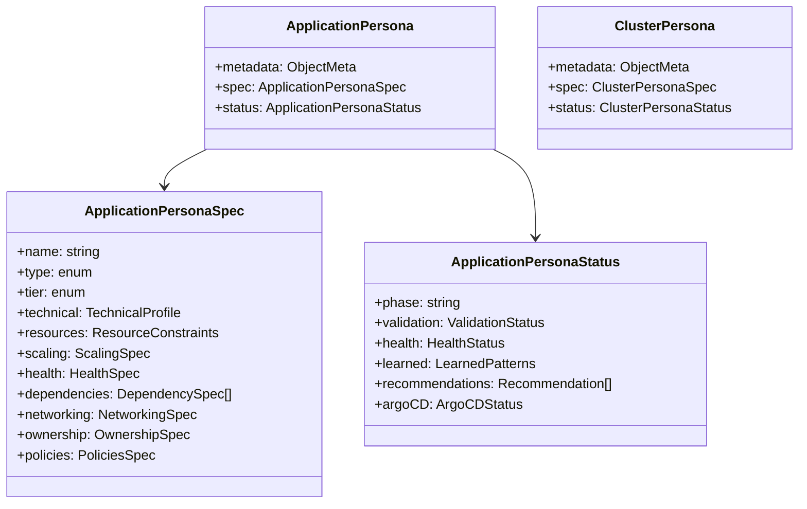
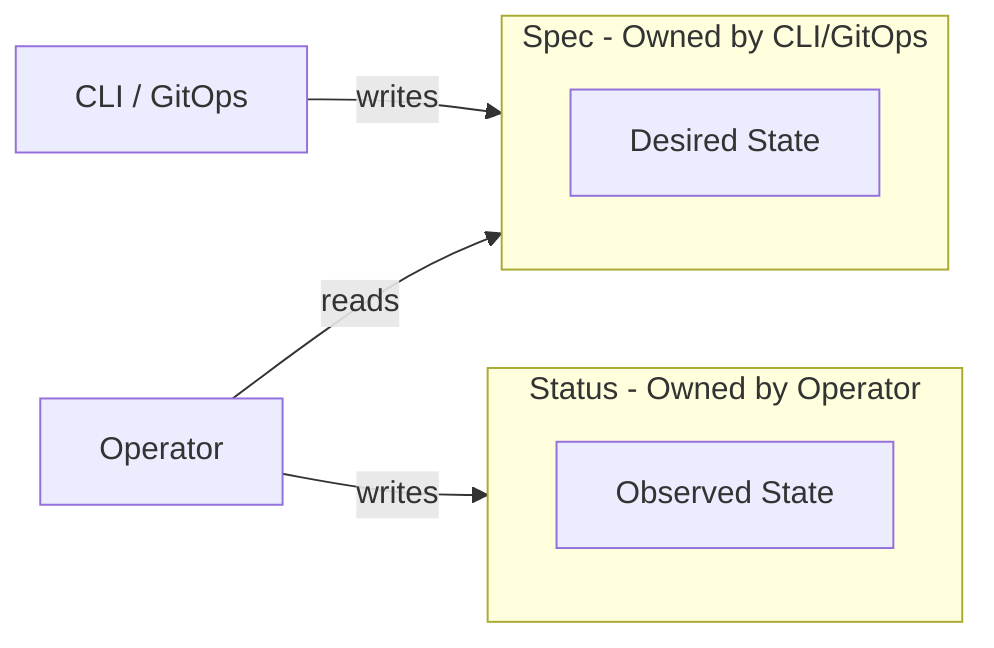

Dorgu extends Kubernetes with five Custom Resource Definitions (CRDs) that capture application identity, cluster context, and the self-healing record. These CRDs are the central data model that connects the CLI, Operator, and integrations — and they mean your incident history and remediation record live in your own cluster, not a vendor's database.

## CRD Overview

| CRD | Scope | Purpose |
|-----|-------|---------|
| **ApplicationPersona** | Namespaced | A single application's desired operational profile and the Operator's observed state |
| **ClusterPersona** | Cluster | Cluster-level identity: nodes, add-ons, capacity, platform, and policy |
| **IncidentMemory** | Namespaced | A detected incident, its diagnosed root cause, and how it was resolved |
| **RemediationAction** | Namespaced | A proposed fix, its approval state, and its verification outcome |
| **DorguEvent** | Namespaced | A classified, correlated Kubernetes event with a TTL |

The primary CRD is **ApplicationPersona**, which describes a single application's desired operational profile and the Operator's observed state. **ClusterPersona** captures cluster-level context. The remaining three are the self-healing loop's memory — see [Self-healing](/operator/features/self-healing).


```mermaid
classDiagram
    class ApplicationPersona {
        +metadata: ObjectMeta
        +spec: ApplicationPersonaSpec
        +status: ApplicationPersonaStatus
    }
    class ApplicationPersonaSpec {
        +name: string
        +type: enum
        +tier: enum
        +technical: TechnicalProfile
        +resources: ResourceConstraints
        +scaling: ScalingSpec
        +health: HealthSpec
        +dependencies: DependencySpec[]
        +networking: NetworkingSpec
        +ownership: OwnershipSpec
        +policies: PoliciesSpec
    }
    class ApplicationPersonaStatus {
        +phase: string
        +validation: ValidationStatus
        +health: HealthStatus
        +learned: LearnedPatterns
        +recommendations: Recommendation[]
        +argoCD: ArgoCDStatus
    }
    class ClusterPersona {
        +metadata: ObjectMeta
        +spec: ClusterPersonaSpec
        +status: ClusterPersonaStatus
    }
    ApplicationPersona --> ApplicationPersonaSpec
    ApplicationPersona --> ApplicationPersonaStatus
```

## Ownership Model

The spec and status of an ApplicationPersona are owned by different actors. This separation is fundamental to Dorgu's design.


```mermaid
flowchart LR
    subgraph Spec ["Spec - Owned by CLI/GitOps"]
        SpecFields["Desired State"]
    end
    subgraph Status ["Status - Owned by Operator"]
        StatusFields["Observed State"]
    end
    CLI["CLI / GitOps"] -->|writes| Spec
    Operator["Operator"] -->|writes| Status
    Operator -->|reads| Spec
```

| Actor | Writes | Mechanism |
|-------|--------|-----------|
| CLI / GitOps | `spec` | `dorgu persona apply` or ArgoCD sync |
| Operator | `status` | Status subresource updates during reconciliation |
| Operator | `spec` | Only via a **human-approved** RemediationAction |

The CLI and GitOps tools define the desired state in the spec. The Operator observes the cluster and writes its findings to the status.

The one exception is remediation: when you approve a `RemediationAction`, the Operator applies that action's JSON merge patch to the ApplicationPersona `spec`. That is a change you explicitly authorized, scoped to the fields in the proposal you reviewed. Nothing else lets the Operator write a spec.

<Warning>
  The Operator never creates or modifies Deployments, Services, or any other **workload** resource — with or without approval. Applying workload changes stays with the CLI, ArgoCD, Flux, or `kubectl`. See the [trust model](/cli/architecture/trust-model).
</Warning>

<Note>
  If you manage personas through GitOps, an approved remediation's patch will show as drift on the next sync — mirror the change back into your repo so your pipeline does not revert the fix. `dorgu remediation approve --no-heal` does not avoid this: it skips the *Deployment* patch only, and the persona is still updated by the Operator once the action is `Approved`.
</Note>

## API Group and Scope

All CRDs belong to the `dorgu.io/v1` API group.

| Resource | Scope | Short name |
|----------|-------|------------|
| ApplicationPersona | Namespaced | — |
| ClusterPersona | Cluster | — |
| IncidentMemory | Namespaced | `im` |
| RemediationAction | Namespaced | `ra` |
| DorguEvent | Namespaced | `de` |

ApplicationPersonas live in the same namespace as the workloads they describe. ClusterPersona is cluster-scoped since it represents the entire cluster.

## ApplicationPersona Spec Fields

The spec defines the desired operational profile for an application.

| Field | Type | Required | Description |
|-------|------|----------|-------------|
| `name` | string | Yes | Application name (matches `app.kubernetes.io/name` label) |
| `type` | enum | Yes | `api`, `web`, `worker`, `cron`, `daemon` |
| `tier` | enum | No | `critical`, `standard`, `best-effort` |
| `technical` | object | No | Language, framework, and description |
| `resources` | object | No | CPU/memory requests and limits |
| `scaling` | object | No | `minReplicas`, `maxReplicas`, `targetCPU`, `behavior` |
| `health` | object | No | `livenessPath`, `readinessPath`, `port` |
| `dependencies` | array | No | Each entry: `name`, `type`, `required`, `healthCheck` |
| `networking` | object | No | Ports and ingress configuration |
| `ownership` | object | No | `team`, `owner`, `repository`, `oncall` |
| `policies` | object | No | Security context, deployment strategy, maintenance windows |

## ApplicationPersona Status Fields

The status is populated entirely by the Operator and reflects the observed state of the application.

| Field | Type | Description |
|-------|------|-------------|
| `phase` | enum | `Pending`, `Active`, `Degraded`, `Failed` |
| `validation.passed` | bool | Whether the latest validation passed |
| `validation.issues[]` | array | Each entry: `severity`, `field`, `message`, `suggestion` |
| `health.status` | enum | `Healthy`, `Degraded`, `Unhealthy`, `Unknown` |
| `learned.resourceBaseline` | object | `avgCPU`, `avgMemory`, `peakCPU`, `peakMemory` |
| `argoCD.syncStatus` | enum | `Synced`, `OutOfSync`, `Unknown` |
| `argoCD.healthStatus` | enum | `Healthy`, `Degraded`, `Progressing`, `Missing`, `Unknown` |
| `recommendations[]` | array | Improvement suggestions generated by the Operator |

## Full ApplicationPersona Example

A complete ApplicationPersona for a critical API service:

```yaml
apiVersion: dorgu.io/v1
kind: ApplicationPersona
metadata:
  name: order-service
  namespace: commerce
spec:
  name: order-service
  version: "1.0"
  type: api
  tier: critical
  technical:
    language: go
    framework: gin
    description: Order processing and management service
  resources:
    requests:
      cpu: 100m
      memory: 128Mi
    limits:
      cpu: 500m
      memory: 512Mi
  scaling:
    minReplicas: 2
    maxReplicas: 10
    targetCPU: 70
    behavior: balanced
  health:
    livenessPath: /health
    readinessPath: /ready
    port: 8080
    startupGracePeriod: 30s
  dependencies:
    - name: postgres
      type: database
      required: true
    - name: redis
      type: cache
      required: false
  networking:
    ports:
      - port: 8080
        protocol: TCP
        purpose: HTTP API
      - port: 9090
        protocol: TCP
        purpose: Metrics
    ingress:
      enabled: true
      host: orders.example.com
      paths: ["/api/v1/orders"]
      tlsEnabled: true
  ownership:
    team: commerce-platform
    owner: jane.doe@example.com
    repository: https://github.com/example/order-service
  policies:
    security:
      runAsNonRoot: true
      readOnlyRootFilesystem: true
      allowPrivilegeEscalation: false
    deployment:
      strategy: RollingUpdate
      maxSurge: "25%"
      maxUnavailable: "0"
```

## ClusterPersona

ClusterPersona is a cluster-scoped resource that captures the overall cluster context. The Operator's ClusterPersona controller automatically discovers and populates its status.

### ClusterPersona Spec Fields

| Field | Type | Required | Description |
|-------|------|----------|-------------|
| `name` | string | Yes | Human-readable cluster name |
| `description` | string | No | Cluster purpose or notes |
| `environment` | enum | No | `development`, `staging`, `production` |
| `policies` | object | No | Cluster-wide policy defaults |
| `conventions` | object | No | Naming and labeling conventions |
| `defaults` | object | No | Default values for ApplicationPersona fields |
| `resourceQuotas` | object | No | Cluster-level resource budget |

### ClusterPersona Status Fields

| Field | Type | Description |
|-------|------|-------------|
| `phase` | enum | `Discovering`, `Ready`, `Degraded` |
| `nodes[]` | array | Node names, roles, capacity, and conditions |
| `resourceSummary` | object | Total and allocatable CPU/memory across all nodes |
| `addons[]` | array | Detected add-ons (ArgoCD, Prometheus, Grafana, etc.) |
| `kubernetesVersion` | string | Cluster Kubernetes version |
| `platform` | string | Detected platform (EKS, GKE, AKS, Kind, etc.) |
| `applicationCount` | int | Total number of managed ApplicationPersonas |

The ClusterPersona controller reconciles every 5 minutes, scanning nodes, namespaces, and well-known add-on namespaces to keep the status current.

### Self-healing policy

`spec.policies.selfHealing` configures how the cluster heals.

| Field | Type | Default | Description |
|-------|------|---------|-------------|
| `enabled` | bool | `true` | Activates the healing system |
| `mode` | enum | `propose` | `observe`, `propose`, or `auto-approve` |
| `trustLevel` | int | `2` | Progressive trust level, 0–5 |
| `maxRemediationsPerHour` | int | `5` | Rate limit per persona |
| `excludeNamespaces` | array | `[]` | Namespaces excluded from remediation |
| `rollback.enabled` | bool | `true` | Cluster-level default: roll back on degradation |
| `rollback.healthCheckAfter` | duration | — | How long to wait before verifying |
| `rollback.maxRetries` | int | `1` | Rollback attempt limit |

<Note>
  `maxRemediationsPerHour` and `excludeNamespaces` are enforced by the safety checker. `mode` and `trustLevel` are recorded and fed to the AI planner as context, but no code path gates behavior on them today — approval is always required. The operator's auto-created persona uses `mode: observe`.
</Note>

## IncidentMemory

`IncidentMemory` is the record of a detected problem: what was seen, what caused it, and how it ended. It is created and maintained by the operator's health-check reconciler. Read them with [`dorgu incidents`](/cli/commands/incidents).

### Spec Fields

| Field | Type | Required | Description |
|-------|------|----------|-------------|
| `personaRef` | object | Yes | `kind` (`ApplicationPersona` or `ClusterPersona`), `name`, `namespace` |
| `category` | enum | Yes | `resource`, `scaling`, `health`, `security`, `deployment`, `dependency`, `node`, `controlplane` |
| `severity` | enum | Yes | `info`, `warning`, `critical` |
| `detection` | object | Yes | `signal`, `source`, `firstSeen`, `lastSeen`, `affectedResources[]` |
| `rootCause` | object | No | `summary`, `confidence`, `provider`, `contributing[]` |
| `relatedResources` | array | No | Other Kubernetes resources involved |
| `resolution` | object | No | `action`, `remediationRef`, `appliedAt`, `outcome`, `duration` |

`rootCause.provider` is `rule-based` or `ai-enhanced`. `resolution.outcome` is `resolved`, `partial`, `failed`, or `rollback` — written by the remediation controller when the loop finishes.

### Status Fields

| Field | Type | Description |
|-------|------|-------------|
| `phase` | enum | `Detected`, `Investigating`, `Resolved`, `Recurring` |
| `occurrenceCount` | int | How many times this incident has been detected |
| `lastOccurrence` | timestamp | Most recent detection |
| `conditions[]` | array | Standard Kubernetes conditions |

An incident auto-resolves once its signal has been absent for 5 minutes.

## RemediationAction

`RemediationAction` is a proposed fix. The operator creates it, you approve or reject it, and the operator records what happened. Work with them via [`dorgu remediation`](/cli/commands/remediation).

### Spec Fields

| Field | Type | Required | Description |
|-------|------|----------|-------------|
| `incidentRef` | object | Yes | The IncidentMemory that triggered this remediation |
| `personaRef` | object | Yes | The persona to be remediated |
| `trustLevel` | int | Yes | Minimum trust level required to execute, 0–5 |
| `action` | object | Yes | Single-action fallback: `type`, `patch`, `prePatchState` |
| `steps[]` | array | No | The ordered plan. When non-empty, this is the plan of record. |
| `planSource` | enum | No | `rule-based` or `ai-anthropic` |
| `planSummary` | string | No | The AI's root-cause and plan explanation |
| `explanation` | string | Yes | Human-readable reason for the proposal |
| `confidence` | string | Yes | Diagnosis confidence as a decimal string, e.g. `"0.85"` |
| `approval` | object | No | `required` (default `true`), `deadline`, `autoApproveRule` |
| `rollback` | object | No | `enabled` (default `true`), `healthCheckAfter`, `maxRetries` (default `1`) |

`action.type` is one of `persona-update`, `notification`, or `git-pr`. `action.patch` is a JSON merge patch applied to the **Persona** spec — never to a workload.

### Step Fields

Each entry in `steps[]`:

| Field | Type | Description |
|-------|------|-------------|
| `order` | int | 1-based execution order |
| `id` | string | Stable per-plan step identifier |
| `type` | enum | `persona-update`, `workload-apply`, `restart`, `scale`, `config-change`, `manual` |
| `description` | string | Human-readable summary of the action |
| `rationale` | string | Why the step is proposed (the AI's reasoning) |
| `risk` | enum | `low`, `medium`, `high` |
| `autoExecutable` | bool | Whether the operator may apply this step without external action |
| `patch` | object | JSON merge patch for the Persona spec (`persona-update` steps) |
| `prePatchState` | object | Snapshot of the fields before the patch, used for rollback |

<Warning>
  `autoExecutable` may only be `true` on a `persona-update` step. This is enforced at the Kubernetes API server by a CEL validation rule on the CRD (`!self.autoExecutable || self.type == 'persona-update'`), not just in operator code. Every other step type is advisory, which is what preserves the operator's guarantee that it never writes workloads.
</Warning>

### Status Fields

| Field | Type | Description |
|-------|------|-------------|
| `phase` | enum | `Pending`, `Approved`, `Applying`, `Verifying`, `Completed`, `RolledBack`, `Failed`, `Rejected`, `Expired` |
| `approvedBy` | string | Who approved it — the CLI records `cli-user` |
| `approvedAt` | timestamp | When it was approved |
| `appliedAt` | timestamp | When the patch was applied |
| `verificationResult` | enum | `Healthy`, `Degraded`, `Unknown` |
| `currentStep` | int | 1-based order of the step being executed |
| `stepStatuses[]` | array | Per-step `order`, `phase` (`Pending`, `Applied`, `Verified`, `Failed`, `Skipped`), `appliedAt`, `verificationResult` |
| `conditions[]` | array | Standard Kubernetes conditions: `Applied`, `Verified`, `RolledBack` |

<Note>
  `steps[]` is populated, validated, and rendered by the CLI, and `currentStep` / `stepStatuses[]` exist in the schema — but the controller currently executes the single `spec.action` patch rather than walking the plan step by step. `autoApproveRule` is likewise present in the CRD and ignored by controllers: auto-approve graduation is not implemented.
</Note>

## DorguEvent

`DorguEvent` is a write-once, classified Kubernetes event record with TTL-based cleanup. The event pipeline watches core Kubernetes events, classifies them by severity and category, correlates them to a persona and incident where it can, and stores them. There is no status subresource — the record is immutable.

| Field | Type | Required | Description |
|-------|------|----------|-------------|
| `severity` | enum | Yes | `info`, `warning`, `critical` |
| `category` | enum | Yes | `resource`, `scaling`, `health`, `security`, `deployment`, `dependency`, `node`, `controlplane` |
| `source` | string | Yes | The detector that generated the event |
| `message` | string | Yes | Human-readable description |
| `involvedObject` | object | Yes | The Kubernetes resource the event relates to |
| `personaRef` | object | No | Linked persona, when one applies |
| `incidentRef` | object | No | Linked IncidentMemory, when correlated |
| `eventTime` | timestamp | Yes | When the original Kubernetes event occurred |
| `k8sEventRef` | string | No | Original Kubernetes Event UID, used for deduplication |
| `ttl` | duration | No | Retention period (default 24h) |

Stream them live with `dorgu watch events`.
