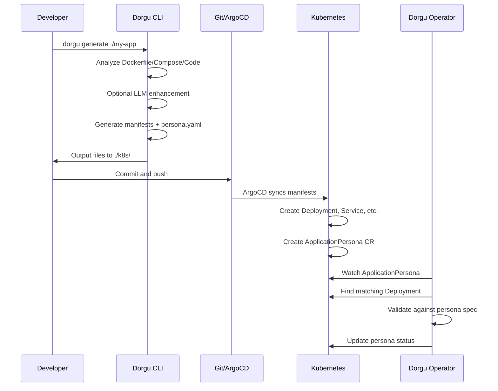
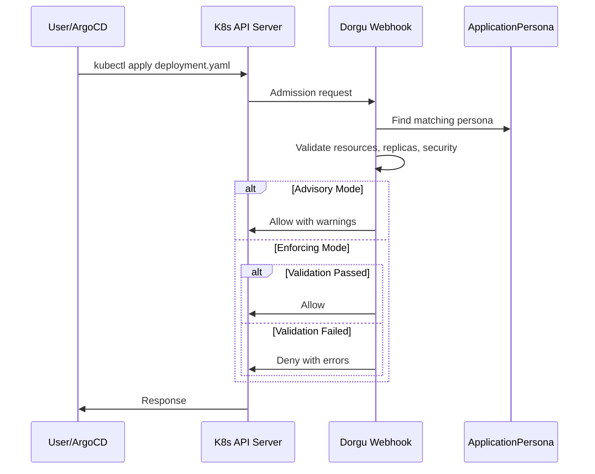
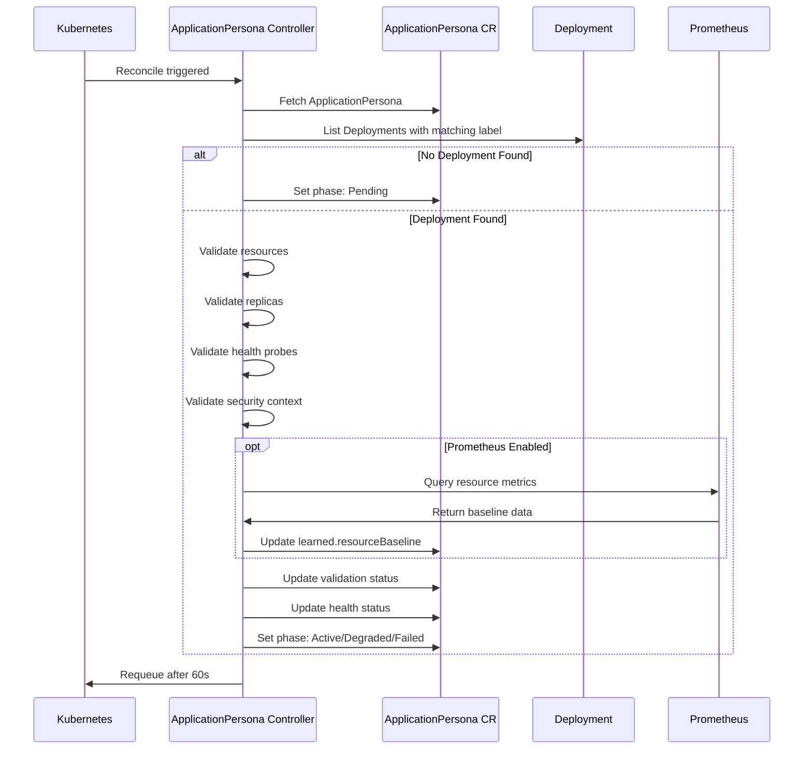
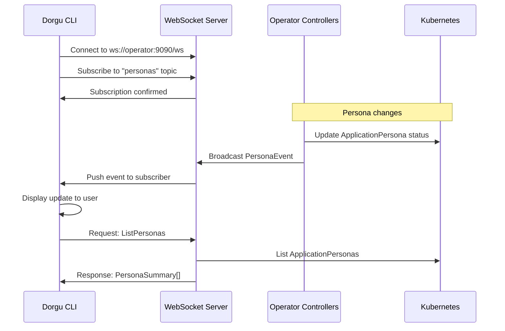
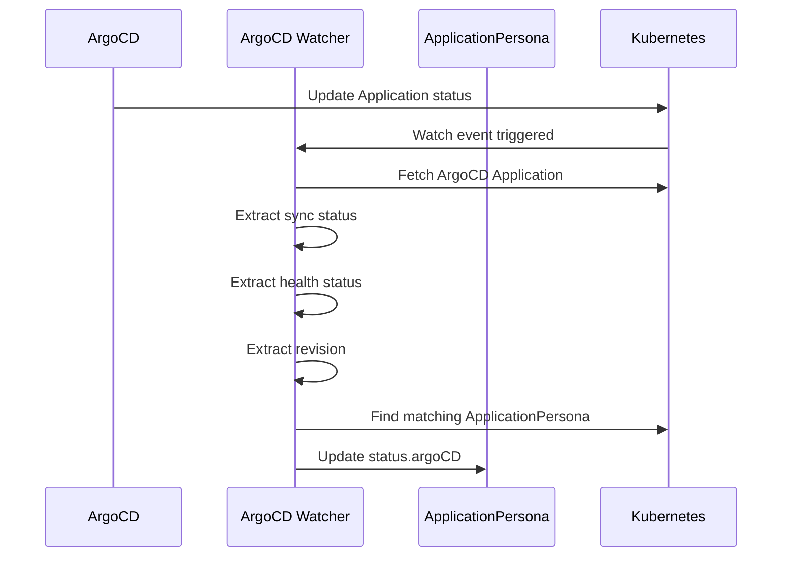
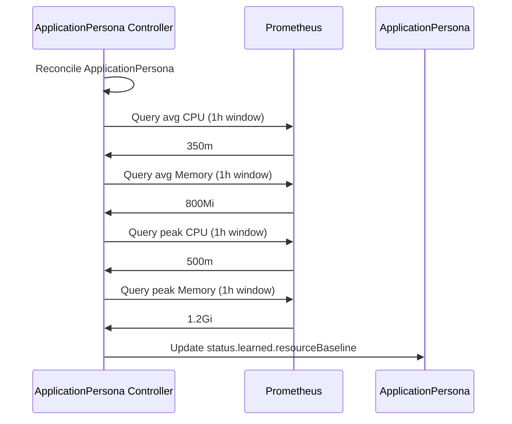
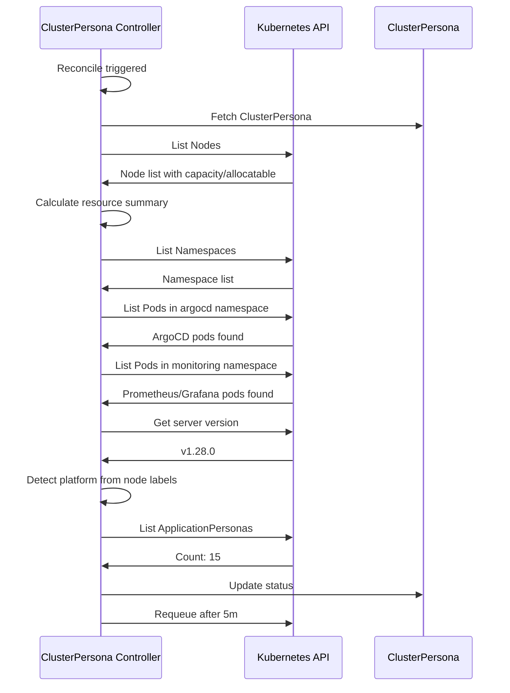
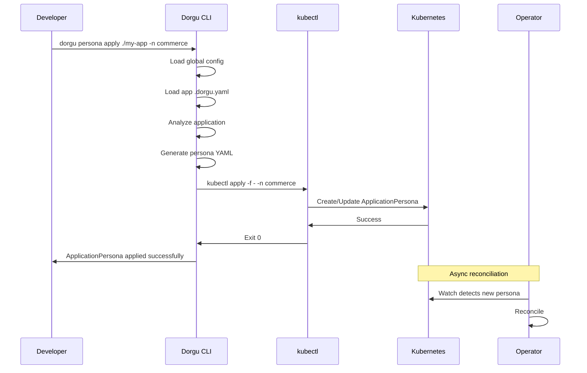
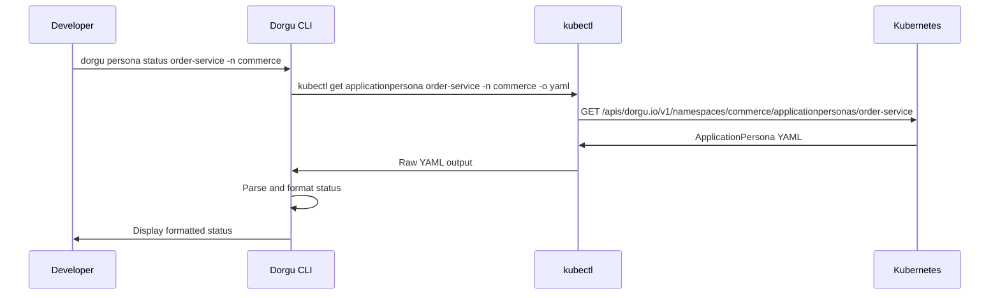
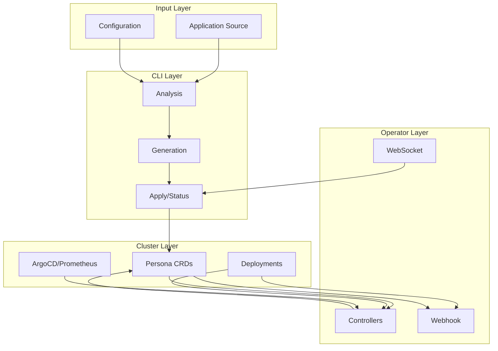

Dorgu's architecture involves multiple components working together: the CLI analyzes and generates, the Operator validates and observes, and integrations like ArgoCD and Prometheus feed additional context. This page walks through the key data flows with sequence diagrams.

## Application Onboarding

The most common flow starts when a developer onboards an application. The CLI analyzes the source, generates Kubernetes manifests and a persona, and the developer commits them to Git. From there, GitOps takes over.

The developer runs `dorgu generate`, commits the output, and ArgoCD syncs it to the cluster. The Operator then picks up the new ApplicationPersona and begins validating the associated workload.

## Deployment Validation (Webhook)

The Operator runs a validating admission webhook that intercepts Deployment changes before they are persisted. Depending on the configured mode, the webhook either warns or blocks non-compliant changes.

In **advisory mode**, the webhook allows all changes but attaches warnings when a deployment diverges from its persona. In **enforcing mode**, non-compliant changes are denied outright.

## Async Validation (Controller)

Beyond the webhook, the ApplicationPersona controller runs a continuous reconciliation loop. It re-validates every 60 seconds and optionally learns resource baselines from Prometheus.

The controller reconciles on watch events and on a 60-second timer. If Prometheus is available, it queries resource usage to build learned baselines over time.

## Real-time CLI Communication

The CLI can connect to the Operator via WebSocket for live updates. This enables commands like `dorgu persona watch` to stream status changes in real time.

The WebSocket interface supports two patterns: **subscribe** for push-based event streaming, and **request/response** for on-demand queries. Both run over a single persistent connection.

## ArgoCD Integration

When ArgoCD is present in the cluster, the Operator watches ArgoCD Application resources and reflects their sync and health status into the corresponding ApplicationPersona.

The ArgoCD watcher extracts sync status, health status, and the current revision from ArgoCD Application objects, then writes them into the persona's `status.argoCD` field.

## Prometheus Baseline Learning

When Prometheus is available, the controller queries it during reconciliation to learn actual resource consumption patterns for each application.

The controller queries average and peak CPU/memory over a 1-hour window and stores the results in `status.learned.resourceBaseline`. These baselines can then power right-sizing recommendations.

## ClusterPersona Discovery

The ClusterPersona controller runs a discovery loop every 5 minutes to build a comprehensive picture of the cluster's state, capabilities, and installed add-ons.

The ClusterPersona controller discovers nodes, resource capacity, installed add-ons (ArgoCD, Prometheus, Grafana), Kubernetes version, platform type, and the total count of managed ApplicationPersonas.

## Persona Apply Flow

The `dorgu persona apply` command is the primary way to create or update an ApplicationPersona in a cluster directly from the CLI.

The CLI loads configuration, analyzes the application, generates the persona YAML, and applies it via `kubectl`. The Operator then picks it up asynchronously through its watch and begins reconciliation.

## Persona Status Check

Checking the status of an ApplicationPersona retrieves the Operator's latest observations, including validation results, health status, and any recommendations.

The CLI fetches the raw ApplicationPersona from the cluster API and formats the status fields into a human-readable output showing phase, validation issues, health, and recommendations.

## Data Flow Summary

The following diagram shows how the major layers connect end-to-end.

Data flows from application source and configuration through the CLI's analysis and generation pipeline, into the cluster as Persona CRDs and workload resources. The Operator layer continuously reconciles, validates, and feeds observations back into the CRDs, while the WebSocket server enables the CLI to receive live updates.
