# System Architecture

Dorgu is a two-component system: a **CLI** that analyzes applications and generates Kubernetes manifests, and an **Operator** that validates deployments and manages cluster state. They communicate through Kubernetes CRDs and a WebSocket connection.

## System Diagram

```mermaid
flowchart TB
    subgraph CLI ["Dorgu CLI"]
        Generate["dorgu generate"]
        PersonaGen["dorgu persona generate"]
        PersonaApply["dorgu persona apply"]
        PersonaStatus["dorgu persona status"]
        ClusterInit["dorgu cluster init"]
        Watch["dorgu watch"]
        Sync["dorgu sync"]
    end

    subgraph Cluster ["Kubernetes Cluster"]
        subgraph CRDs ["Custom Resources"]
            AppPersona["ApplicationPersona CRD"]
            ClusterPersonaCR["ClusterPersona CRD"]
        end

        subgraph Operator ["Dorgu Operator"]
            AppController["ApplicationPersona Controller"]
            ClusterController["ClusterPersona Controller"]
            ArgoCDWatcher["ArgoCD Watcher"]
            WebhookVal["Validating Webhook"]
            WSServer["WebSocket Server"]
            PromClient["Prometheus Client"]
        end

        subgraph Workloads
            Deployments["Deployments"]
            Services["Services"]
        end

        subgraph Integrations
            ArgoCD["ArgoCD"]
            Prometheus["Prometheus"]
        end
    end

    Generate --> Manifests["K8s Manifests"]
    PersonaGen --> AppPersona
    PersonaApply --> AppPersona
    PersonaStatus --> AppPersona
    ClusterInit --> ClusterPersonaCR
    Watch --> WSServer
    Sync --> WSServer

    AppController --> AppPersona
    AppController --> Deployments
    AppController --> PromClient
    ClusterController --> ClusterPersonaCR
    ArgoCDWatcher --> ArgoCD
    ArgoCDWatcher --> AppPersona
    WebhookVal --> Deployments
    PromClient --> Prometheus
```



## Component Overview

| Component | Repository | Description |
|-----------|------------|-------------|
| Dorgu CLI | `dorgu-ai/dorgu` | CLI for manifest generation, persona management, cluster interaction |
| Dorgu Operator | `dorgu-ai/dorgu-operator` | K8s operator for deployment validation, cluster discovery, persona management |
| ApplicationPersona CRD | `dorgu.io/v1` | App identity, requirements, and operational context (namespaced) |
| ClusterPersona CRD | `dorgu.io/v1` | Cluster identity and state (cluster-scoped singleton) |

## Design Principles

### Don't replace, integrate

Dorgu generates standard Kubernetes, ArgoCD, and GitHub Actions manifests that work with your existing tooling. It does not introduce a proprietary deployment format or require you to change your workflow. The generated YAML is plain, readable, and fully customizable.

### Operator is read-only

The operator **NEVER** creates or modifies workload resources (Deployments, Services). It only reads cluster state, validates deployments against persona expectations, and updates Persona CRD status fields. This means Dorgu cannot accidentally break your running applications.

### Source-of-truth hierarchy

The CLI and GitOps pipelines own the `spec` fields of Persona CRDs, representing **desired intent**. The Operator owns the `status` fields, representing **observed reality** and learned patterns. This separation ensures a clean contract between what you declare and what the cluster reports.

## Repository Structure

The CLI follows a standard Go project layout:

```
dorgu/
├── cmd/dorgu/main.go
├── internal/
│   ├── analyzer/      # Dockerfile, Compose, Code analysis
│   ├── cli/           # Cobra commands
│   ├── config/        # Config loading and merging
│   ├── generator/     # Manifest generators + validation
│   ├── llm/           # LLM provider interface + implementations
│   ├── output/        # File writer and terminal formatter
│   ├── setup/         # Cluster setup wizard
│   ├── types/         # Shared AppAnalysis type
│   └── ws/            # WebSocket client
├── testdata/          # Test fixtures
└── testapps/          # Sample applications
```

<Info>
All business logic lives under `internal/` to enforce Go's package boundary. The `cmd/dorgu/main.go` entry point is intentionally thin -- it only wires together the CLI commands.
</Info>
