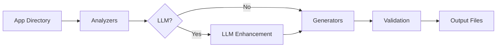

## Synopsis

```bash
dorgu generate [path] [flags]
```

Analyze a containerized application and generate production-ready Kubernetes manifests, ArgoCD configuration, CI/CD pipelines, and documentation.

The path should point to a directory containing a `Dockerfile` or `docker-compose.yml`. Defaults to `.` if omitted.

## Flags

| Flag | Type | Default | Description |
|------|------|---------|-------------|
| `-o`, `--output` | string | `./k8s` | Output directory for generated files |
| `-n`, `--name` | string | auto-detected | Override application name |
| `--namespace` | string | from config | Target Kubernetes namespace |
| `--dry-run` | bool | `false` | Print to stdout without writing files |
| `--skip-argocd` | bool | `false` | Skip ArgoCD Application generation |
| `--skip-ci` | bool | `false` | Skip CI/CD workflow generation |
| `--skip-persona` | bool | `false` | Skip persona document generation |
| `--llm-provider` | string | from config | LLM provider: `openai`, `anthropic`, `gemini`, `ollama` |
| `--skip-validation` | bool | `false` | Skip post-generation validation checks |

## Pipeline



The `generate` command runs a multi-stage pipeline:

1. **Analysis** — Parses Dockerfile, docker-compose.yml, and source code to detect language, framework, ports, health endpoints, and dependencies
2. **LLM enhancement** (optional) — Enriches analysis with deeper framework understanding, resource sizing, and security recommendations
3. **Generation** — Produces Kubernetes manifests from the analysis results
4. **Validation** — Checks generated manifests for correctness and best practices
5. **Output** — Writes files to disk (or stdout with `--dry-run`)

## Examples

**Basic generation:**
```bash
dorgu generate .
```

**Generate from a specific directory:**
```bash
dorgu generate ./my-app
```

**Custom output directory:**
```bash
dorgu generate ./my-app --output ./manifests
```

**Preview without writing files:**
```bash
dorgu generate . --dry-run
```

**With LLM-enhanced analysis:**
```bash
dorgu generate . --llm-provider openai
```

**Override app name and namespace:**
```bash
dorgu generate . --name order-service --namespace commerce
```

**Generate only K8s manifests (no ArgoCD, CI, or persona):**
```bash
dorgu generate . --skip-argocd --skip-ci --skip-persona
```

**Skip validation (useful for quick iterations):**
```bash
dorgu generate . --skip-validation
```

## Output files

| File | Description |
|------|-------------|
| `k8s/deployment.yaml` | Kubernetes Deployment with resource limits, health probes, security context |
| `k8s/service.yaml` | ClusterIP Service mapping detected ports |
| `k8s/ingress.yaml` | Ingress with TLS via cert-manager (if configured) |
| `k8s/hpa.yaml` | HorizontalPodAutoscaler with CPU-based scaling |
| `k8s/argocd/application.yaml` | ArgoCD Application pointing to your repo |
| `.github/workflows/deploy.yaml` | GitHub Actions CI/CD pipeline |
| `PERSONA.md` | Human-readable persona document |

## Validation report

After generation, a validation report runs automatically (unless `--skip-validation` is set). The report checks:

| Check | Severity | Description |
|-------|----------|-------------|
| Resource limits | Warning | Limits should be greater than or equal to requests |
| Port consistency | Error | Service ports must match deployment container ports |
| Health probes | Warning | Liveness and readiness probes should be configured |
| Security context | Warning | Containers should run as non-root with read-only filesystem |
| HPA bounds | Warning | Min replicas should be less than max replicas |
| Ingress host | Warning | Ingress should have a host configured |
| Image placeholder | Warning | Image should not be a placeholder value |
| kubectl dry-run | Error | Manifests must pass `kubectl apply --dry-run=client` |

Issues are reported with severity levels: **Error** (must fix), **Warning** (should fix), and **Info** (recommendation).
