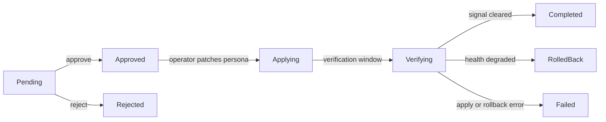

## Overview

The `dorgu remediation` command group is how you work with `RemediationAction` resources — the fixes the Dorgu Operator proposes after it detects and diagnoses an incident. You list them, read the proposed plan as a diff, then approve or reject.

Approving does two things: it records your decision on the `RemediationAction`, and it heals the running workload. The operator patches the `ApplicationPersona` (desired state); the CLI patches the `Deployment` with your credentials. See [Self-healing](/operator/features/self-healing) for the full loop.

<Note>
  All subcommands shell out to `kubectl`, so `kubectl` must be on your `PATH` and your current context must point at the target cluster. The alias `dorgu rem` works everywhere `dorgu remediation` does.
</Note>

## Lifecycle



| Phase | What it means |
|-------|---------------|
| `Pending` | Waiting for your decision. The operator takes no action. |
| `Approved` | You approved it. The operator applies the patch to the ApplicationPersona. |
| `Applying` | The patch landed. The operator is waiting out the verification window. |
| `Verifying` | The operator is re-running detection to check whether the original signal cleared. |
| `Completed` | Verification passed — the signal is gone and no new critical signals appeared. |
| `RolledBack` | Verification found the health degraded, so the operator restored `prePatchState`. |
| `Failed` | The apply failed, the rollback failed, or verification returned `Unknown` after 2 retries. |
| `Rejected` | You rejected it. |
| `Expired` | The approval deadline passed. |

<Warning>
  `Completed` only arrives **after the verification window** — 10 minutes by default (`spec.rollback.healthCheckAfter`). Your pod recovers within seconds of `approve`, but the remediation sits in `Applying` and then `Verifying` for the rest of that window. This is not stuck. It is the operator waiting long enough to be able to tell a real fix from a temporary one, so it can auto-roll-back if the health regresses.
</Warning>

---

## remediation list

### Synopsis

```bash
dorgu remediation list [flags]
```

Lists `RemediationAction` resources. By default it shows only active ones — `Pending`, `Approved`, `Applying`, `Verifying`, and `Failed`. Use `--all` to include `Completed`, `RolledBack`, `Rejected`, and `Expired`.

### Flags

| Flag | Type | Default | Description |
|------|------|---------|-------------|
| `-n, --namespace` | string | all namespaces | Filter by namespace |
| `--phase` | string | all | Filter by exact phase (`Pending`, `Approved`, `Applying`, `Verifying`, `Completed`, …) |
| `--all` | bool | `false` | Include completed, rolled-back, rejected, and expired remediations |
| `--limit` | int | `50` | Maximum number of remediations to show |
| `--kubeconfig` | string | `~/.kube/config` | Path to kubeconfig file |
| `--json` | bool | `false` | Output as JSON (inherited global flag) |

### Example output

```
Active Remediations (1)

NAMESPACE   NAME                PHASE    TYPE            PLAN          STEPS  CONFIDENCE  PERSONA     AGE
production  fix-oom-api-server  Pending  persona-update  ai-anthropic  3      0.85        api-server  4m
```

### Output columns

| Column | Description |
|--------|-------------|
| NAMESPACE | Namespace of the RemediationAction |
| NAME | Resource name |
| PHASE | Lifecycle phase (see [Lifecycle](#lifecycle)) |
| TYPE | `spec.action.type` — `persona-update`, `notification`, or `git-pr` |
| PLAN | `ai-anthropic` when Claude wrote the plan, `rule-based` when the deterministic rules did, `-` for older objects that carry no ordered plan |
| STEPS | Number of ordered steps in the plan, or `-` for a single-action object |
| CONFIDENCE | Diagnosis confidence as a decimal string, e.g. `0.85` |
| PERSONA | Name of the persona being remediated |
| AGE | Time since the RemediationAction was created |

<Note>
  **There is no severity here.** `RemediationAction` carries no `severity` field, so this command cannot filter or sort by it — the blank `SEVERITY` column and the `--severity` flag that matched nothing were both removed. Filter by `--phase`, and read severity from the linked incident with [`dorgu incidents describe`](/cli/commands/incidents), where `--severity` does work.
</Note>

### Examples

```bash
# Active remediations across all namespaces
dorgu remediation list

# Only the ones waiting on you
dorgu remediation list --phase Pending

# Everything in one namespace, including terminal phases
dorgu remediation list -n production --all --limit 100

# JSON for scripting
dorgu remediation list --json
```

---

## remediation diff

### Synopsis

```bash
dorgu remediation diff <name> -n <namespace> [flags]
```

Shows the full proposal: the target, the confidence, the AI's plan summary, and every step in execution order with its own YAML diff. This is the review surface — read this before you approve anything.

### Flags

| Flag | Type | Default | Description |
|------|------|---------|-------------|
| `-n, --namespace` | string | **required** | Namespace of the remediation |
| `--kubeconfig` | string | `~/.kube/config` | Path to kubeconfig file |
| `--json` | bool | `false` | Output the raw resource as JSON (inherited global flag) |

### Example output

```
Remediation: fix-oom-api-server
═══════════════════════════════

Target:     ApplicationPersona/api-server (production)
Severity:
Type:       persona-update
Confidence: 0.85
Plan:       ai-anthropic
Phase:      Pending
Incident:   im-oom

Explanation:
  OOM remediation for api-server

Plan summary:
  Container OOMKilled due to a low memory limit.
  Increase the limit then restart the workload.

Plan (3 steps):

  [1] persona-update (low; auto): Increase memory limit to 512Mi
      256Mi is insufficient; container is OOMKilled
--- old
+++ new
@@ -1,3 +1,3 @@
 resources:
     limits:
-        memory: 256Mi
+        memory: 512Mi

  [2] restart (low; advisory): Restart the deployment to pick up new limits
      New limits only apply to new pods

  [3] manual (medium; advisory): Verify no further OOM events for 30m

Rollback:
  Automatic rollback if health degrades (verified after 10m0s)
  Max retries: 1

Actions:
  dorgu remediation approve fix-oom-api-server -n production
  dorgu remediation reject fix-oom-api-server -n production --reason "..."
```

Each step line reads `[order] type (risk; mode): description`, with the AI's rationale indented underneath and a unified diff of `prePatchState → patch` where the step carries one.

| Part | Values | Meaning |
|------|--------|---------|
| `type` | `persona-update`, `workload-apply`, `restart`, `scale`, `config-change`, `manual` | What kind of change the step is |
| `risk` | `low`, `medium`, `high`, or `unknown` when unset | The AI's risk assessment for that step |
| mode | `auto` or `advisory` | `auto` means the step is applied for you; `advisory` means it is printed for a human to act on |

<Note>
  Only `persona-update` steps can ever be `auto`. The Kubernetes API server enforces this with a CEL validation rule on the CRD, so no plan — AI-written or otherwise — can mark a workload change as auto-executable.
</Note>

Older `RemediationAction` objects that carry a single `spec.action` instead of an ordered plan render a single `Proposed change:` diff rather than a `Plan (n steps):` block.

---

## remediation approve

### Synopsis

```bash
dorgu remediation approve [name] -n <namespace> [flags]
```

Approves a `Pending` remediation and, by default, heals the workload.

### What approval actually does

<Steps>
  <Step title="The CLI records your decision">
    It patches the RemediationAction status subresource to `phase: Approved`, with `approvedBy: cli-user` and the current timestamp.
  </Step>
  <Step title="The operator patches the ApplicationPersona">
    Seeing `Approved`, the operator applies the JSON merge patch to the persona's `spec` — the app's desired-state record — then moves the action to `Applying`. It never touches your Deployment.
  </Step>
  <Step title="The CLI heals the workload">
    The CLI translates the approved resource change into an equivalent strategic-merge patch on the matching Deployment and applies it with **your** credentials, so the pod actually restarts with the new limits. Use `--no-heal` to skip this.
  </Step>
</Steps>

Advisory steps (`restart`, `scale`, `config-change`, `manual`, and any `persona-update` that is not a resource change) are printed as numbered manual instructions. They are never executed.

### Flags

| Flag | Type | Default | Description |
|------|------|---------|-------------|
| `-n, --namespace` | string | required unless `--next` | Namespace of the remediation |
| `--next` | bool | `false` | Approve the oldest pending remediation instead of naming one |
| `--reason` | string | `""` | Optional approval reason, echoed in the success message |
| `--heal` | bool | `true` | After approval, apply the resource change to the workload |
| `--no-heal` | bool | `false` | Skip the workload heal; only patch the RemediationAction status |
| `--workload` | string | auto-discovered | Explicit Deployment name, overriding label discovery |
| `--container` | string | auto-selected | Explicit container name to patch |
| `--yes` | bool | `false` | Skip the heal confirmation prompt |
| `--kubeconfig` | string | `~/.kube/config` | Path to kubeconfig file |

`--heal` and `--no-heal` are mutually exclusive.

<Note>
  `--next` takes the **oldest** pending remediation, so the longest-waiting incident goes first; ties break on namespace and name, making the pick reproducible. It previously ranked by severity, which `RemediationAction` does not carry — every candidate tied, so the winner was effectively arbitrary.
</Note>

### Examples

```bash
# Review, then approve and heal (prompts before patching the Deployment)
dorgu remediation diff fix-oom-api-server -n production
dorgu remediation approve fix-oom-api-server -n production

# Non-interactive — used in the demo flow
dorgu remediation approve fix-oom-api-server -n production --yes

# Record the approval but apply the workload change yourself (GitOps)
dorgu remediation approve fix-oom-api-server -n production --no-heal

# Disambiguate when label discovery finds several Deployments or containers
dorgu remediation approve fix-oom-api-server -n production --workload api --container app
```

Only `Pending` remediations can be approved. Anything else exits with an error naming the current phase.

---

## remediation reject

### Synopsis

```bash
dorgu remediation reject <name> -n <namespace> [flags]
```

Moves a remediation to `Rejected`. Works from `Pending` or `Approved` — any other phase is refused.

### Flags

| Flag | Type | Default | Description |
|------|------|---------|-------------|
| `-n, --namespace` | string | **required** | Namespace of the remediation |
| `--reason` | string | `""` | Rejection reason — optional, but record it |
| `--kubeconfig` | string | `~/.kube/config` | Path to kubeconfig file |

```bash
dorgu remediation reject fix-oom-api-server -n production --reason "handling in the 1.4 release instead"
```

Rejecting is also a safety gate: `dorgu remediation heal` refuses to run against a rejected remediation.

---

## remediation heal

### Synopsis

```bash
dorgu remediation heal <name> -n <namespace> [flags]
```

Applies an approved remediation's resource change to the workload on its own. `approve` runs this for you unless you passed `--no-heal`, so reach for `heal` when you deferred the apply, or when a previous heal failed and you want to retry it.

### Flags

| Flag | Type | Default | Description |
|------|------|---------|-------------|
| `-n, --namespace` | string | **required** | Namespace of the remediation |
| `--workload` | string | auto-discovered | Explicit Deployment name, overriding label discovery |
| `--container` | string | auto-selected | Explicit container name to patch |
| `--yes` | bool | `false` | Skip the confirmation prompt |
| `--kubeconfig` | string | `~/.kube/config` | Path to kubeconfig file |

### How the workload is found

<Steps>
  <Step title="Namespace">
    The persona's namespace (`spec.personaRef.namespace`), falling back to the remediation's own namespace. Never anywhere else.
  </Step>
  <Step title="Deployment">
    Deployments labelled `app.kubernetes.io/name=<persona.spec.name>`, falling back to `app=<persona.spec.name>`. Zero or more than one match is an error that asks for `--workload`.
  </Step>
  <Step title="Container">
    The only container if there is one, otherwise the container whose name matches the app. Anything else asks for `--container`.
  </Step>
  <Step title="Patch">
    A strategic-merge patch that sets exactly the `resources.limits` and `resources.requests` fields the remediation changed (`cpu` and `memory` only) — nothing broader than the proposal.
  </Step>
</Steps>

### Safety gates

| Gate | Behavior |
|------|----------|
| Phase `Rejected`, `Failed`, `Expired`, `RolledBack` | Refused. |
| Phase `Approved`, `Applying`, `Verifying`, `Completed` | Proceeds — this is the expected path. |
| Phase `Pending` or unset | Warns that healing directly is an implicit approval, then proceeds. |
| Production-looking context | Refused if the current kube-context name contains `prod`. |
| Confirmation | Prints the namespace, Deployment, container, and the exact field changes, then prompts `[y/N]` unless `--yes` is set. |

```bash
# Re-run the workload sync after --no-heal
dorgu remediation heal fix-oom-api-server -n production

# Skip the prompt
dorgu remediation heal fix-oom-api-server -n production --yes
```

<Warning>
  `heal` only auto-applies **resource limits and requests** (`cpu`, `memory`) — the OOM and saturation path. A remediation with no resource change reports that there is nothing to heal automatically and prints its advisory steps instead.
</Warning>

---

## Next steps

<CardGroup cols={2}>
  <Card title="Self-healing" icon="heart-pulse" href="/operator/features/self-healing">
    How detection, diagnosis, planning, and verification fit together
  </Card>
  <Card title="AI setup" icon="sparkles" href="/operator/configuration/ai-setup">
    Turn on the AI planner with your own Anthropic key
  </Card>
  <Card title="dorgu incidents" icon="triangle-exclamation" href="/cli/commands/incidents">
    Inspect the IncidentMemory a remediation was proposed for
  </Card>
  <Card title="CRD reference" icon="file-code" href="/cli/architecture/crds">
    Full RemediationAction schema, including `steps[]` and rollback
  </Card>
</CardGroup>
