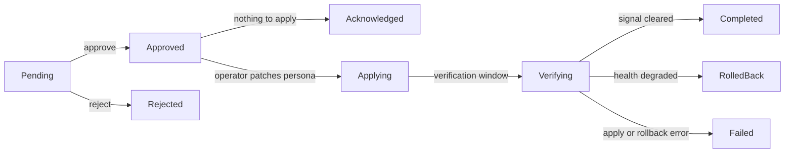

## Overview

The `dorgu remediation` command group is how you work with `RemediationAction` resources — the fixes the Dorgu Operator proposes after it detects and diagnoses an incident. You list them, read the proposed plan as a diff, then approve or reject.

Approving does two things: it records your decision on the `RemediationAction`, and where Dorgu is allowed to, it heals the running workload. The operator patches the `ApplicationPersona` (desired state); the CLI patches the `Deployment` with your credentials. See [Self-healing](/operator/features/self-healing) for the full loop.

<Warning>
  **Dorgu will not patch a Deployment that Helm, ArgoCD, or Flux owns.** `approve` and `heal` read `spec.workloadRef` and decline for every `managedBy` except `unmanaged`, exiting **`4`** (`ExitDeclined`). Nothing is approved and nothing changes; instead you get the owner named and the fix restated as what to change in your source of truth.

  There is no `--force` and no override flag, on purpose. Read [the ownership model](/ownership-model) for why, and note that it needs **CLI v0.10.0 with operator v0.9.0**: an older CLI ignores the record and patches anyway.
</Warning>

<Note>
  All subcommands shell out to `kubectl`, so `kubectl` must be on your `PATH` and your current context must point at the target cluster. The alias `dorgu rem` works everywhere `dorgu remediation` does.
</Note>

## Exit codes

| Code | Meaning |
|------|---------|
| `0` | The command did what it was asked, including a `--no-heal` approval |
| `1` | Failure: unreachable cluster, missing kubeconfig, no `kubectl`, a failed API call, wrong phase |
| `4` | **Declined.** Dorgu understood the plan, could see exactly what to do, and chose not to write because something else owns the workload. Nothing failed and nothing changed. |

<Warning>
  **`4` is not a failure, and a wrapper that treats every non-zero exit as breakage will now misreport it.** Update the wrapper to accept `4`, or use `dorgu remediation approve <name> -n <ns> --no-heal`, which records the decision without a workload patch and exits `0`.
</Warning>

## Lifecycle



| Phase | What it means |
|-------|---------------|
| `Pending` | Waiting for your decision. The operator takes no action. |
| `Approved` | You approved it. The operator applies the patch to the ApplicationPersona. |
| `Acknowledged` | You approved a plan that had nothing to apply. The approval is recorded, the operator changed nothing, and the incident is marked `acknowledged` rather than resolved, because nothing was fixed. |
| `Applying` | The patch landed. The operator is waiting out the verification window. |
| `Verifying` | The operator is re-running detection to check whether the original signal cleared. |
| `Completed` | Verification passed — the signal is gone and no new critical signals appeared. |
| `RolledBack` | Verification found the health degraded, so the operator restored `prePatchState`. |
| `Failed` | The apply failed, the rollback failed, or verification returned `Unknown` after 2 retries. |
| `Rejected` | You rejected it. |
| `Expired` | The approval deadline passed. |

Two condition reasons are worth knowing, both on the `Applied` condition. `AdvisoryOnly` accompanies `Acknowledged`. `PreconditionRejected` marks a plan the executor refused before touching the cluster, and is deliberately excluded from the 30-minute failure cooldown, since nothing in the cluster actually went wrong.

<Warning>
  `Completed` only arrives **after the verification window** — 10 minutes by default (`spec.rollback.healthCheckAfter`). Your pod recovers within seconds of `approve`, but the remediation sits in `Applying` and then `Verifying` for the rest of that window. This is not stuck. It is the operator waiting long enough to be able to tell a real fix from a temporary one, so it can auto-roll-back if the health regresses.
</Warning>

---

## remediation list

### Synopsis

```bash
dorgu remediation list [flags]
```

Lists `RemediationAction` resources. By default it shows only active ones — `Pending`, `Approved`, `Applying`, `Verifying`, and `Failed`. Use `--all` to include `Completed`, `RolledBack`, `Rejected`, and `Expired`.

### Flags

| Flag | Type | Default | Description |
|------|------|---------|-------------|
| `-n, --namespace` | string | all namespaces | Filter by namespace |
| `--phase` | string | all | Filter by exact phase (`Pending`, `Approved`, `Applying`, `Verifying`, `Completed`, …) |
| `--all` | bool | `false` | Include completed, rolled-back, rejected, and expired remediations |
| `--limit` | int | `50` | Maximum number of remediations to show |
| `--kubeconfig` | string | `~/.kube/config` | Path to kubeconfig file |
| `--json` | bool | `false` | Output as JSON (inherited global flag) |

### Example output

```
Active Remediations (1)

NAMESPACE   NAME                PHASE    TYPE            PLAN          STEPS  CONFIDENCE  PERSONA     AGE
production  fix-oom-api-server  Pending  persona-update  ai-anthropic  3      0.85        api-server  4m
```

### Output columns

| Column | Description |
|--------|-------------|
| NAMESPACE | Namespace of the RemediationAction |
| NAME | Resource name |
| PHASE | Lifecycle phase (see [Lifecycle](#lifecycle)) |
| TYPE | `spec.action.type` — `persona-update`, `notification`, or `git-pr` |
| PLAN | `ai-anthropic` when Claude wrote the plan, `rule-based` when the deterministic rules did, `-` for older objects that carry no ordered plan |
| STEPS | Number of ordered steps in the plan, or `-` for a single-action object |
| CONFIDENCE | Diagnosis confidence as a decimal string, e.g. `0.85` |
| PERSONA | Name of the persona being remediated |
| AGE | Time since the RemediationAction was created |

<Note>
  **There is no severity here.** `RemediationAction` carries no `severity` field, so this command cannot filter or sort by it — the blank `SEVERITY` column and the `--severity` flag that matched nothing were both removed. Filter by `--phase`, and read severity from the linked incident with [`dorgu incidents describe`](/cli/commands/incidents), where `--severity` does work.
</Note>

### Examples

```bash
# Active remediations across all namespaces
dorgu remediation list

# Only the ones waiting on you
dorgu remediation list --phase Pending

# Everything in one namespace, including terminal phases
dorgu remediation list -n production --all --limit 100

# JSON for scripting
dorgu remediation list --json
```

---

## remediation diff

### Synopsis

```bash
dorgu remediation diff <name> -n <namespace> [flags]
```

Shows the full proposal: the target, the workload and its owner, the confidence, the AI's plan summary, every step in execution order with its own YAML diff, and what the change does to the running Deployment. This is the review surface. Read it before you approve anything.

### Flags

| Flag | Type | Default | Description |
|------|------|---------|-------------|
| `-n, --namespace` | string | **required** | Namespace of the remediation |
| `--kubeconfig` | string | `~/.kube/config` | Path to kubeconfig file |
| `--json` | bool | `false` | Output the raw resource as JSON (inherited global flag) |

### Example output

```
Remediation: fix-oom-api-server
═══════════════════════════════

Target:     ApplicationPersona/api-server (production)
Workload:   Deployment production/api-server (container app)
Owner:      unmanaged (nothing reconciles it, so Dorgu may patch it)
Type:       persona-update
Confidence: 0.85
Plan:       ai-anthropic
Phase:      Pending
Incident:   im-oom

Explanation:
  AI remediation plan: 3 steps, 1 applied on approval and 2 advisory

Plan summary:
  Container OOMKilled due to a low memory limit.
  Increase the limit then restart the workload.

Plan (3 steps):

  [1] persona-update (low; auto): Increase memory limit to 512Mi
      256Mi is insufficient; container is OOMKilled
--- old
+++ new
@@ -1,3 +1,3 @@
 resources:
     limits:
-        memory: 256Mi
+        memory: 512Mi

  [2] restart (low; advisory): Restart the deployment to pick up new limits
      New limits only apply to new pods
      Run: kubectl rollout restart deployment/api-server -n production

  [3] manual (medium; advisory): Verify no further OOM events for 30m

Deployment change (production/api-server, container app):
  resources.limits.memory  256Mi -> 512Mi

Rollback:
  Automatic rollback if health degrades (verified after 10m0s)
  Max retries: 1

Actions:
  dorgu remediation approve fix-oom-api-server -n production
  dorgu remediation reject fix-oom-api-server -n production --reason "..."
```

Each step line reads `[order] type (risk; mode): description`, with the rationale indented underneath, an optional `Run:` command, and a unified diff of `prePatchState → patch` where the step carries one.

<Note>
  **There is no `Severity:` row.** `RemediationAction` carries no severity field. Read severity from the linked incident with [`dorgu incidents describe`](/cli/commands/incidents).

  `Explanation:` and `Plan summary:` say different things: the summary is the root cause (why it broke), the explanation is the shape of the response (what the plan will and will not do for you). They used to render the same paragraph twice; where an older operator wrote both fields identically, the CLI now prints it once.
</Note>

### The `Workload:` and `Owner:` header, and the Deployment change block

Two blocks in that output are about the thing that is actually failing, rather than about the persona.

**`Workload:` and `Owner:`** name the live Deployment the operator observed and who reconciles it. The persona is what Dorgu records; the workload is what runs, and on a brownfield cluster the two rarely share a name (persona `frontend` over Deployment `frontend-podinfo`). `Owner:` reads `unmanaged (nothing reconciles it, so Dorgu may patch it)` when Dorgu may write, and otherwise names the owner: `Helm release "frontend" in namespace apps`. Both lines are omitted when the operator resolved no workload at all.

**`Deployment change`** is a workload-to-workload diff, built from `workloadRef.observedResources`. The old diff read the *persona* on both sides, which is why a fix that silently introduced a CPU limit the container never had showed nothing at all:

```
Deployment change (apps/frontend-podinfo, container podinfo):
  resources.limits.memory  32Mi -> 128Mi
  resources.limits.cpu     not set -> 200m   (adds a key this workload does not set)
```

| Before column | Meaning |
|---------------|---------|
| A value | What the container actually had at proposal time |
| `not set` | Dorgu read the container and the key is absent. Never rendered as blank and never as zero. |
| `unknown` | Dorgu never observed the workload. "Not read" is a different fact from "not set". |

<Note>
  Adding a key the workload does not set is now refused at proposal time, so the `(adds a key this workload does not set)` marker should not appear on a v0.9.0 operator. It stays in the renderer because objects proposed by an older operator are still readable, and an added key is exactly the thing that must not be invisible.
</Note>

### On an owned workload

The header names the owner, and the suggested actions change: `approve` is not offered, because that command would be declined.

```
Target:     ApplicationPersona/frontend (apps)
Workload:   Deployment apps/frontend-podinfo (container podinfo)
Owner:      Helm release "frontend" in namespace apps
...

Deployment change (apps/frontend-podinfo, container podinfo):
  resources.limits.memory  32Mi -> 128Mi

Dorgu will not patch this Deployment: Helm release "frontend" in namespace apps owns it.
Make the change in the values for Helm release "frontend" in namespace apps (the key is
chart-specific, commonly under `resources`), then run your usual helm upgrade.

Actions:
  dorgu remediation approve fix-oom-frontend -n apps --no-heal   (record the decision, patch no workload)
  dorgu remediation reject fix-oom-frontend -n apps --reason "..."
```

Once the action leaves `Pending`, that action block is gone, so the Deployment change block carries the fact instead: `Dorgu did not apply this: <owner> owns this Deployment.`

### Ready-to-run commands on advisory steps

An advisory step is one Dorgu will not carry out for you. Where a single command does the job, the step carries it and `diff` prints it under the rationale:

```
  [2] workload-apply (low; advisory): Correct the mistyped image tag
      nginx:1.27-alpineX does not exist; the published tag is nginx:1.27-alpine
      Run: kubectl set image deployment/web web=nginx:1.27-alpine -n demo
```

This is the difference between a correct diagnosis and an actual fix. Before this existed, Dorgu would identify a mistyped image tag at 0.91 confidence, name the correct tag, link Docker Hub, and then leave you to write the `kubectl set image` yourself.

<Warning>
  **The command is only ever printed. Nothing executes it**, not the operator and not the CLI. Read it before you run it.

  Because the field can be written by an AI planner, the operator sanitizes it before storing it and the CLI re-checks it before displaying it: it must be a single line, start with `kubectl `, contain none of `; & | < > ` $`, and stay under 1024 characters. A command that fails any of those checks is not shown at all rather than shown with a warning.
</Warning>

Requires operator **v0.8.0** and CLI **v0.9.0** or newer. Older objects simply carry no command, and no `Run:` line is printed.

#### On an owned workload, only read-only commands are printed

A command that writes to a Deployment that Helm or ArgoCD owns takes field ownership from them and breaks their next apply, so it is not something to hand over. On an owned workload the CLI prints only commands it can positively classify as read-only:

| Kept | Dropped |
|------|---------|
| `kubectl logs`, `get`, `describe`, `events`, `top`, `diff`, `explain`, `auth`, `version`, `api-resources`, `api-versions`, `cluster-info` | `patch`, `apply`, `set`, `scale`, `edit`, `replace`, `create`, `delete`, `annotate`, `label`, `autoscale`, `expose`, `run`, `cordon`, `drain`, `uncordon`, `taint` |
| `kubectl rollout status`, `kubectl rollout history` | `kubectl rollout undo`, `restart`, `pause`, `resume`, and a bare `kubectl rollout` with no subcommand |

`kubectl logs` and `kubectl get events` matter **most** on the workloads Dorgu will not patch, because reading is the whole of what is left to hand over. Anything on an `unmanaged` workload is printed unchanged.

Classification is positive, not inferred from the absence of a write verb: a command whose verb matches nothing at all is refused rather than assumed harmless. The verb is found by scanning for the first token that is a known kubectl subcommand, so `kubectl -n apps patch ...` cannot hide `patch` behind a flag argument.

<Note>
  The operator already strips workload-writing commands before it stores the object. The CLI establishes read-only-ness again anyway, because the command is model-authored and the CLI reads `RemediationAction` objects straight out of the cluster, where an older operator or anything with permission to create the CRD could have written a `kubectl patch`. The shell-metacharacter check still runs first, on owned and unmanaged workloads alike.
</Note>

### Advisory plans

Some plans have nothing the CLI can apply, typically a `notification` action or a plan whose every step is advisory. Those say so plainly and offer only `reject`:

```
This plan is advisory: nothing in it can be applied for you.
Carry out the steps above yourself. Nothing changes in the cluster until you do.

Actions:
  dorgu remediation reject fix-image-web -n demo --reason "..."
```

Approving one anyway is safe: it records the approval, changes nothing, and settles the action as `Acknowledged`. It used to be offered `approve` as its suggested next action, and following that advice failed the remediation and put the app into a 30-minute cooldown.

| Part | Values | Meaning |
|------|--------|---------|
| `type` | `persona-update`, `workload-apply`, `restart`, `scale`, `config-change`, `manual` | What kind of change the step is |
| `risk` | `low`, `medium`, `high`, or `unknown` when unset | The AI's risk assessment for that step |
| mode | `auto` or `advisory` | `auto` means the step is applied for you; `advisory` means it is printed for a human to act on |

<Note>
  Only `persona-update` steps can ever be `auto`. The Kubernetes API server enforces this with a CEL validation rule on the CRD, so no plan — AI-written or otherwise — can mark a workload change as auto-executable.
</Note>

Older `RemediationAction` objects that carry a single `spec.action` instead of an ordered plan render a single `Proposed change:` diff rather than a `Plan (n steps):` block.

---

## remediation approve

### Synopsis

```bash
dorgu remediation approve [name] -n <namespace> [flags]
```

Approves a `Pending` remediation and, when Dorgu owns the write, heals the workload.

### What approval actually does

<Steps>
  <Step title="The CLI preflights the workload change">
    Before anything is written: the kube-context guard, the remediation plan, **the ownership check**, the target Deployment, the container, and the patch. If any of it fails, nothing is approved. On an **owned** workload this is where the command stops: it prints the refusal and exits `4`, having written neither a Deployment patch nor a status patch.
  </Step>
  <Step title="The CLI records your decision">
    It patches the RemediationAction status subresource to `phase: Approved`, with `approvedBy: cli-user` and the current timestamp.
  </Step>
  <Step title="The operator patches the ApplicationPersona">
    Seeing `Approved`, the operator applies the JSON merge patch to the persona's `spec`, the app's desired-state record, then moves the action to `Applying`. It never touches your Deployment, and it cannot: its ClusterRole has no write verbs on `apps/deployments`. See [security and permissions](/security-and-permissions).
  </Step>
  <Step title="The CLI heals the workload">
    The CLI translates the approved resource change into an equivalent strategic-merge patch on the matching Deployment and applies it with **your** credentials, so the pod actually restarts with the new limits. Use `--no-heal` to skip this.
  </Step>
</Steps>

Advisory steps (`restart`, `scale`, `config-change`, `manual`, and any `persona-update` that is not a resource change) are printed as numbered manual instructions. They are never executed.

<Warning>
  **Approval is withheld along with the patch.** On an owned workload the gate sits in the preflight, ahead of any write, so `approve` records nothing at all.

  That is deliberate rather than incidental. Approving is what tells the operator to patch the persona and start the verification clock, so approving a change the CLI will not apply would leave the persona at 128Mi, the workload at 32Mi, and a ten-minute verification window running over a fix that was never coming. Use `--no-heal` when you want the decision recorded and intend to apply the change at its source yourself.
</Warning>

### On an owned workload

```
$ dorgu remediation approve fix-oom-frontend -n apps

Dorgu will not patch this workload.

  Workload: Deployment apps/frontend-podinfo (container podinfo)
  Owner:    Helm release "frontend" in namespace apps

  A direct patch would claim the fields it sets away from Helm release "frontend"
  in namespace apps, and your next helm upgrade would then fail with a
  field-manager conflict.

Deployment change (apps/frontend-podinfo, container podinfo):
  resources.limits.memory  32Mi -> 128Mi

Apply it where this workload's desired state lives:
  [1] Set resources.limits.memory: 128Mi in the values for Helm release "frontend"
      in namespace apps (the key is chart-specific, commonly under `resources`),
      then run your usual helm upgrade for that release.

Nothing was approved and nothing in the cluster was changed.
To record the decision without a workload patch: dorgu remediation approve fix-oom-frontend -n apps --no-heal

$ echo $?
4
```

The owner-shaped steps come from the operator, which generated them at proposal time, so the refusal and the plan send you to the same place. Where the plan carries no owner-shaped step, the CLI builds one instruction from the concrete resource change, so a refusal is never a dead end.

Read [the ownership model](/ownership-model) for how ownership is detected and what each owner's failure mode is.

### Flags

| Flag | Type | Default | Description |
|------|------|---------|-------------|
| `-n, --namespace` | string | required unless `--next` | Namespace of the remediation |
| `--next` | bool | `false` | Approve the oldest pending remediation instead of naming one |
| `--reason` | string | `""` | Optional approval reason, echoed in the success message |
| `--heal` | bool | `true` | After approval, apply the resource change to the workload. Only ever acts on an `unmanaged` workload. |
| `--no-heal` | bool | `false` | Skip the workload heal; only patch the RemediationAction status |
| `--workload` | string | auto-discovered | Explicit Deployment name. Must **match** the workload recorded in `spec.workloadRef`; it cannot redirect the patch elsewhere. |
| `--container` | string | the container the operator observed | Explicit container name to patch |
| `--yes` | bool | `false` | Skip the heal confirmation prompt |
| `--kubeconfig` | string | `~/.kube/config` | Path to kubeconfig file |

`--heal` and `--no-heal` are mutually exclusive.

<Note>
  `--next` takes the **oldest** pending remediation, so the longest-waiting incident goes first; ties break on namespace and name, making the pick reproducible. It previously ranked by severity, which `RemediationAction` does not carry — every candidate tied, so the winner was effectively arbitrary.
</Note>

<Warning>
  **`--workload` can no longer aim the patch at a different Deployment.** It still resolves the workload, but the name must agree with the one in `spec.workloadRef`, and a mismatch is refused:

  ```
  refusing to patch Deployment frontend-canary: Dorgu checked ownership for
  frontend-podinfo, and a decision about one workload does not carry to another
  ```

  Ownership is a fact about one specific object, so a flag that redirects the patch to a Deployment the operator never observed is the guard with a hole in it: Dorgu would clear `frontend` as unmanaged and then write to `frontend-canary`, which Helm owns.

  **`--container` still overrides freely,** because ownership is per-Deployment, not per-container. Omit it and the CLI uses the container the operator actually read, so the patch targets the same container whose values were the diff's before-state.
</Warning>

### Examples

```bash
# Review, then approve and heal (prompts before patching the Deployment)
dorgu remediation diff fix-oom-api-server -n production
dorgu remediation approve fix-oom-api-server -n production

# Non-interactive — used in the demo flow
dorgu remediation approve fix-oom-api-server -n production --yes

# Record the approval but apply the workload change yourself:
# GitOps, a Helm release, or any workload Dorgu will not patch
dorgu remediation approve fix-oom-api-server -n production --no-heal

# Patch a different container in the observed Deployment
dorgu remediation approve fix-oom-api-server -n production --container app
```

### Recording a decision without a patch

`--no-heal` is how you say "I have read this, I agree, and I will apply it myself". It records `phase: Approved`, lets the operator patch the persona spec, skips the Deployment patch, and exits **`0`**.

It is the intended path in three situations: an owned workload, a GitOps-managed persona, and any time you would rather apply the change through your own pipeline.

The CLI warns that the persona and the running workload will disagree until you do apply it. Heed that: the operator's verification window will run against a workload that has not changed yet.

<Note>
  The target Deployment is resolved **before** the approval is recorded. If the workload cannot be found, nothing is approved and nothing is changed, and the error lists the Deployments that are present. Approving first and failing to resolve afterwards used to leave the persona at the new limits, the workload at the old ones, and a 10-minute verification window running over a change that never landed.
</Note>

If a heal does fail after approval, the CLI names the divergence rather than reporting success: `the remediation is Approved but <ns>/<deployment> was NOT patched; the persona and the workload now disagree`. `--no-heal` warns about the same divergence up front.

Only `Pending` remediations can be approved. Anything else exits with an error naming the current phase.

---

## remediation reject

### Synopsis

```bash
dorgu remediation reject <name> -n <namespace> [flags]
```

Moves a remediation to `Rejected`. Works from `Pending` or `Approved` — any other phase is refused.

### Flags

| Flag | Type | Default | Description |
|------|------|---------|-------------|
| `-n, --namespace` | string | **required** | Namespace of the remediation |
| `--reason` | string | `""` | Rejection reason — optional, but record it |
| `--kubeconfig` | string | `~/.kube/config` | Path to kubeconfig file |

```bash
dorgu remediation reject fix-oom-api-server -n production --reason "handling in the 1.4 release instead"
```

Rejecting is also a safety gate: `dorgu remediation heal` refuses to run against a rejected remediation.

---

## remediation heal

### Synopsis

```bash
dorgu remediation heal <name> -n <namespace> [flags]
```

Applies an approved remediation's resource change to the workload on its own. `approve` runs this for you unless you passed `--no-heal`, so reach for `heal` when you deferred the apply, or when a previous heal failed and you want to retry it.

### Flags

| Flag | Type | Default | Description |
|------|------|---------|-------------|
| `-n, --namespace` | string | **required** | Namespace of the remediation |
| `--workload` | string | auto-discovered | Explicit Deployment name. Must match the workload recorded in `spec.workloadRef`. |
| `--container` | string | the container the operator observed | Explicit container name to patch |
| `--yes` | bool | `false` | Skip the confirmation prompt |
| `--kubeconfig` | string | `~/.kube/config` | Path to kubeconfig file |

### How the workload is found

<Steps>
  <Step title="Ownership">
    The first gate. `spec.workloadRef.managedBy` must be `unmanaged`. Everything else, including `unknown` and an absent `workloadRef`, is declined with the refusal and exit code `4`. Nothing after this step runs.
  </Step>
  <Step title="Namespace">
    The persona's namespace (`spec.personaRef.namespace`), falling back to the remediation's own namespace. Never anywhere else.
  </Step>
  <Step title="Deployment">
    Every Deployment in that namespace is a candidate, and the CLI walks the same ordered chain the operator uses, taking the first rung that matches exactly one Deployment: the `app.kubernetes.io/name` label, then the `app` label, then `metadata.name`, then `spec.selector.matchLabels`. All against the persona's `spec.name`.

    **No label is required on the Deployment object.** Helm, kustomize, and most hand-written YAML label the pod template only; that resolves on the last rung. Zero matches and an ambiguous rung are both errors, and both list the Deployments actually present in the namespace and point at `--workload`. See [discovery](/operator/features/self-healing#how-a-persona-finds-its-deployment).

    Whatever this resolves to, and however it was resolved, it must **agree with `spec.workloadRef.name`**. A mismatch is refused rather than patched.
  </Step>
  <Step title="Container">
    The container the operator observed, unless `--container` names another. Failing that, the only container if there is one, otherwise the container whose name matches the app. Anything else asks for `--container`.
  </Step>
  <Step title="Patch">
    A strategic-merge patch that sets exactly the `resources.limits` and `resources.requests` fields the remediation changed (`cpu` and `memory` only), and nothing broader than the proposal. It runs under the field manager `dorgu` rather than kubectl's default `kubectl-patch`, so the entry it creates is distinguishable from a `kubectl patch` you ran yourself.
  </Step>
  <Step title="Release">
    The `dorgu` entry is then removed from `metadata.managedFields` and the object is read back to confirm it is gone, so a heal leaves **no ownership footprint** and a later server-side apply does not conflict with it. If the removal fails, the heal still succeeded and the CLI says loudly what is left behind and how to clear it. **Merged, ships in the next CLI release.** See [Dorgu leaves no field manager behind](/ownership-model#dorgu-leaves-no-field-manager-behind).
  </Step>
</Steps>

### Safety gates

| Gate | Behavior |
|------|----------|
| **Workload owned by Helm, ArgoCD, or Flux** | **Declined, exit code `4`.** Prints the owner, the Deployment diff, and the owner-shaped steps. No `--force` exists. A `managedBy: kustomize` workload is declined identically, but that value is only ever set from an [opt-in marker](/ownership-model#the-kustomize-limitation). |
| **`spec.workloadRef` absent** | **Declined.** Treated as owned: it means either an operator older than v0.9.0 or a workload that could not be read, and neither is evidence that patching is safe. |
| Resolved Deployment disagrees with `workloadRef.name` | Refused. A decision about one workload does not carry to another. |
| Phase `Rejected`, `Failed`, `Expired`, `RolledBack` | Refused. |
| Phase `Approved`, `Applying`, `Verifying`, `Completed` | Proceeds — this is the expected path. |
| Phase `Pending` or unset | Warns that healing directly is an implicit approval, then proceeds. |
| Production-looking context | Refused if the current kube-context name contains `prod`. |
| Confirmation | Prints the namespace, Deployment, container, and the exact field changes, then prompts `[y/N]` unless `--yes` is set. It also states the limit of the `unmanaged` classification: nothing Dorgu can see reconciles this Deployment, and [a kustomize overlay leaves no marker](/ownership-model#the-kustomize-limitation), so re-applying one would revert the change. |

<Note>
  The ownership gate runs before the plan is resolved against the cluster, and an **advisory-only** plan never reaches it: there is no workload change to refuse, so an advisory remediation behaves identically on owned and unmanaged workloads.
</Note>

```bash
# Re-run the workload sync after --no-heal
dorgu remediation heal fix-oom-api-server -n production

# Skip the prompt
dorgu remediation heal fix-oom-api-server -n production --yes
```

<Warning>
  `heal` only auto-applies **resource limits and requests** (`cpu`, `memory`) — the OOM and saturation path. A remediation with no resource change reports that there is nothing to heal automatically and prints its advisory steps instead.
</Warning>

---

## Next steps

<CardGroup cols={2}>
  <Card title="Ownership model" icon="user-lock" href="/ownership-model">
    Why a Helm or ArgoCD-owned workload is declined, and what to do instead
  </Card>
  <Card title="Self-healing" icon="heart-pulse" href="/operator/features/self-healing">
    How detection, diagnosis, planning, and verification fit together
  </Card>
  <Card title="AI setup" icon="sparkles" href="/operator/configuration/ai-setup">
    Turn on the AI planner with your own Anthropic key
  </Card>
  <Card title="dorgu incidents" icon="triangle-exclamation" href="/cli/commands/incidents">
    Inspect the IncidentMemory a remediation was proposed for
  </Card>
  <Card title="CRD reference" icon="file-code" href="/cli/architecture/crds">
    Full RemediationAction schema, including `steps[]` and rollback
  </Card>
</CardGroup>
