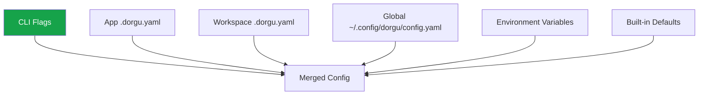

# Configuration Overview

Dorgu uses a **layered configuration system** that lets you set defaults globally, override them per workspace, and fine-tune per application. Higher-priority sources override lower ones on a per-key basis.

## Priority Order

Configuration is resolved from six sources, highest priority first:

| Priority | Source | Description |
|----------|--------|-------------|
| 1 (highest) | CLI flags | `--namespace`, `--llm-provider`, etc. |
| 2 | App `.dorgu.yaml` | Config file in the application directory being analyzed |
| 3 | Workspace `.dorgu.yaml` | Config file in the current working directory |
| 4 | Global config | `~/.config/dorgu/config.yaml` |
| 5 | Environment variables | `OPENAI_API_KEY`, `KUBECONFIG`, etc. |
| 6 (lowest) | Built-in defaults | Sensible defaults shipped with Dorgu |

## Config File Locations

| File | Location | Created by |
|------|----------|------------|
| App config | `<app-dir>/.dorgu.yaml` | `dorgu init` |
| Workspace config | `<cwd>/.dorgu.yaml` | `dorgu init` |
| Global config | `~/.config/dorgu/config.yaml` | `dorgu init --global` |

## How Merging Works

Dorgu reads all available configuration sources and merges them together. Higher-priority sources override lower ones **per-key** -- not as a wholesale replacement. This means you can set organization-wide defaults in the global config and only override specific values (like resource limits or LLM provider) at the app or workspace level.

For example, if your global config sets `llm.provider: openai` and your app `.dorgu.yaml` sets `llm.provider: anthropic`, the app-level value wins. But all other global settings still apply.

<Info>
CLI flags always take the highest priority. Use them for one-off overrides without modifying any config file.
</Info>

## Next Steps

<CardGroup cols={2}>
  <Card title="App Configuration" icon="file" href="/cli/configuration/app-config">
    .dorgu.yaml reference for workspace and application config
  </Card>
  <Card title="Global Configuration" icon="globe" href="/cli/configuration/global-config">
    ~/.config/dorgu/config.yaml reference
  </Card>
  <Card title="LLM Providers" icon="brain" href="/cli/configuration/llm-providers">
    Configure OpenAI, Anthropic, Gemini, or Ollama
  </Card>
  <Card title="Environment Variables" icon="key" href="/cli/configuration/environment-variables">
    All environment variables recognized by Dorgu
  </Card>
</CardGroup>
