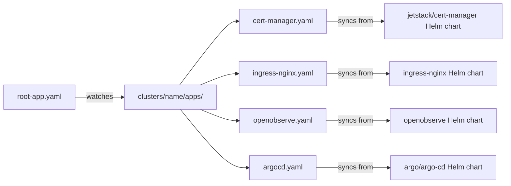
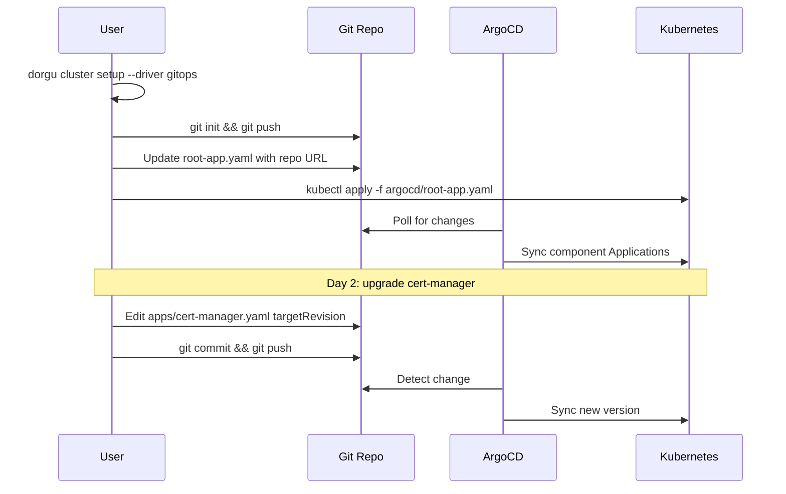

## What is GitOps Mode

GitOps mode is an alternative to the default imperative Helm installation performed by `dorgu cluster setup`. Instead of running `helm install` commands directly against your cluster, GitOps mode scaffolds a complete, Git-ready ArgoCD directory structure that you commit to a repository and let ArgoCD reconcile.

```bash
dorgu cluster setup --driver gitops
```

This produces a self-contained scaffold containing ArgoCD Application manifests and Helm values for every blessed stack component. You push it to a Git repository, point ArgoCD at the root application, and ArgoCD handles the rest.

## GitOps vs Helm

The imperative Helm driver works well for quick setups and local development. GitOps mode solves the operational limitations that emerge at scale:

| Problem (imperative Helm) | Solution (GitOps mode) |
|---------------------------|------------------------|
| Chart upgrades require a new CLI release | Edit `targetRevision` in YAML and push |
| No audit trail for infrastructure changes | Full Git history with diffs, PRs, and approvals |
| No drift reconciliation | ArgoCD continuously reconciles desired vs actual state |
| Limited Helm customization | Full `values/*.yaml` files under your control |

<Info>
  GitOps mode does not install components directly. It only generates files. You need an ArgoCD instance on the target cluster to reconcile the scaffold. ArgoCD itself is included in the generated scaffold and can be bootstrapped manually.
</Info>

## Generated Directory Structure

Running `dorgu cluster setup --driver gitops` produces the following layout:

```
<outputDir>/
├── README.md
├── argocd/
│   └── root-app.yaml
└── clusters/
    └── <cluster-name>/
        ├── values/
        │   ├── cert-manager.yaml
        │   ├── ingress-nginx.yaml
        │   ├── cloudnative-pg.yaml
        │   ├── openobserve.yaml
        │   ├── argocd.yaml
        │   └── external-secrets.yaml
        └── apps/
            ├── cert-manager.yaml
            ├── ingress-nginx.yaml
            ├── cloudnative-pg.yaml
            ├── openobserve.yaml
            ├── argocd.yaml
            └── external-secrets.yaml
```

- **`argocd/root-app.yaml`** — The root ArgoCD Application that watches the `clusters/<name>/apps/` directory
- **`clusters/<name>/apps/`** — One ArgoCD Application per blessed stack component
- **`clusters/<name>/values/`** — Helm values files tailored to the cluster environment (from the ClusterPersona)

## App-of-Apps Pattern

The scaffold uses ArgoCD's **App-of-Apps** pattern. A single root application watches a directory of child applications, each pointing to an upstream Helm chart with local values overrides.



Adding a new component is as simple as creating a new Application YAML in the `apps/` directory and a corresponding values file. ArgoCD picks it up automatically on the next sync.

## User Workflow

The end-to-end flow from scaffold to running infrastructure:



### Step-by-step

<Steps>
  <Step title="Scaffold the GitOps repository">
    ```bash
    dorgu cluster setup --driver gitops --gitops-output ./infra-gitops
    ```
  </Step>

  <Step title="Initialize and push to Git">
    ```bash
    cd ./infra-gitops
    git init
    git add .
    git commit -m "Initial cluster infrastructure scaffold"
    git remote add origin <your-repo-url>
    git push -u origin main
    ```
  </Step>

  <Step title="Update the root application with your repo URL">
    Edit `argocd/root-app.yaml` and set the `repoURL` field to your Git repository URL:

    ```yaml
    spec:
      source:
        repoURL: https://github.com/your-org/infra-gitops.git
        path: clusters/<cluster-name>/apps
        targetRevision: main
    ```

    Commit and push the change.
  </Step>

  <Step title="Bootstrap ArgoCD and apply the root application">
    If ArgoCD is not already running on your cluster, install it first:

    ```bash
    kubectl create namespace argocd
    kubectl apply -n argocd -f https://raw.githubusercontent.com/argoproj/argo-cd/stable/manifests/install.yaml
    ```

    Then apply the root application:

    ```bash
    kubectl apply -f argocd/root-app.yaml
    ```

    ArgoCD will discover all child applications in the `apps/` directory and begin syncing them.
  </Step>

  <Step title="Verify components">
    Monitor sync status in the ArgoCD UI or via CLI:

    ```bash
    kubectl port-forward svc/argocd-server -n argocd 8080:443
    # Open https://localhost:8080
    ```

    Or check with `dorgu`:

    ```bash
    dorgu cluster status
    ```
  </Step>
</Steps>

## Day-2 Operations

### Upgrading a component

To upgrade a blessed stack component (e.g., cert-manager from v1.14.0 to v1.15.0):

1. Edit `clusters/<name>/apps/cert-manager.yaml` and update `targetRevision`:

    ```yaml
    spec:
      source:
        chart: cert-manager
        repoURL: https://charts.jetstack.io
        targetRevision: v1.15.0  # was v1.14.0
    ```

2. Optionally update `clusters/<name>/values/cert-manager.yaml` if the new version introduces configuration changes.

3. Commit and push. ArgoCD detects the change and syncs the new version.

### Adding a new component

1. Create `clusters/<name>/apps/my-component.yaml` with an ArgoCD Application pointing to the Helm chart.
2. Create `clusters/<name>/values/my-component.yaml` with your Helm values.
3. Commit and push. The root application discovers the new child application automatically.

### Multi-cluster support

The scaffold uses cluster-scoped directories (`clusters/<name>/`), making it straightforward to manage multiple clusters from a single repository:

```
infra-gitops/
├── argocd/
│   └── root-app.yaml
└── clusters/
    ├── dev-us-east/
    │   ├── apps/
    │   └── values/
    ├── staging-eu-west/
    │   ├── apps/
    │   └── values/
    └── prod-us-east/
        ├── apps/
        └── values/
```

Each cluster gets its own root application pointing to its `apps/` directory. You can use separate ArgoCD instances per cluster or a single hub ArgoCD managing multiple clusters.

## Key Design Decisions

### Self-contained scaffold

The generated scaffold includes everything needed to bootstrap a cluster from scratch. There are no external dependencies on the Dorgu CLI after generation -- the scaffold is pure ArgoCD YAML and Helm values.

### Flat layout

Each component gets a single Application YAML and a single values file. There is no deep nesting or abstraction layers. This makes it easy to understand, review in PRs, and debug when something goes wrong.

### Cluster-scoped directories

Infrastructure configuration is scoped per cluster rather than per environment. This allows clusters in the same environment to have different configurations (e.g., different node counts, storage classes, or cloud provider settings) while sharing the same repository.

## Next Steps

<CardGroup cols={2}>
  <Card title="Cluster Onboarding" icon="server" href="/cli/guides/cluster-onboarding">
    Full onboarding guide including the imperative Helm path.
  </Card>
  <Card title="Cluster Setup Command" icon="terminal" href="/cli/commands/cluster-setup">
    All flags for dorgu cluster setup including --driver and --gitops-output.
  </Card>
  <Card title="Manifest Generation" icon="wand-magic-sparkles" href="/cli/guides/manifest-generation">
    How Dorgu analyzes applications and generates Kubernetes manifests.
  </Card>
  <Card title="Configuration" icon="sliders" href="/cli/configuration/overview">
    Layered configuration for controlling generated output.
  </Card>
</CardGroup>
