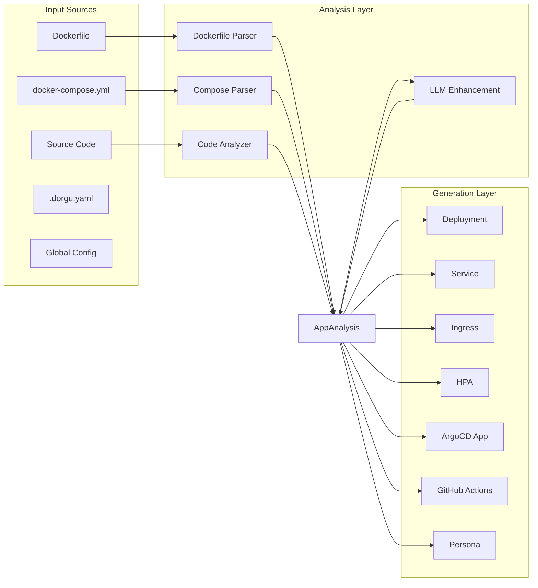

## Analysis Pipeline

Dorgu runs three specialized analyzers against your application directory. Each extracts different signals, and all results are merged into a single `AppAnalysis` struct that drives manifest generation.

### Dockerfile Analyzer

Parses the `Dockerfile` to extract:

- **Base image** — image name, tag, and registry
- **Exposed ports** — from `EXPOSE` directives
- **Environment variables** — from `ENV` directives
- **Working directory** — from `WORKDIR`
- **Entrypoint and command** — from `ENTRYPOINT` and `CMD`
- **User** — from `USER` (used to set security context)
- **Labels** — from `LABEL` (extracted for metadata and OCI annotations)
- **Multi-stage builds** — identifies build vs runtime stages, uses the final stage for analysis

### Docker-Compose Analyzer

Parses `docker-compose.yml` to extract:

- **Services** — each service is analyzed independently
- **Images** — image references per service
- **Ports** — host:container port mappings
- **Environment** — env vars and env_file references
- **Volumes** — bind mounts and named volumes
- **depends_on** — service dependency graph
- **Health checks** — `healthcheck` directives (test command, interval, timeout, retries)

### Code Analyzer

Inspects source files to detect:

- **Language** — detected from file extensions, lock files, and build configs
- **Framework** — matched against known framework signatures (e.g., `express`, `gin`, `fastapi`, `spring-boot`)
- **Dependencies** — parsed from `package.json`, `go.mod`, `requirements.txt`, `pom.xml`, etc.
- **Health endpoints** — scans route definitions for `/health`, `/healthz`, `/ready`, `/readiness`, `/metrics`

## Pipeline Diagram



## Analysis Result

All three analyzers contribute to a unified `AppAnalysis` structure. This is the central data type that flows through the rest of the pipeline. It contains:

- **Name** — application name (auto-detected from directory, git remote, or `.dorgu.yaml`)
- **Type** — workload type (e.g., `web`, `api`, `worker`, `cronjob`)
- **Language** — detected programming language
- **Framework** — detected framework (if any)
- **Ports** — list of exposed ports with protocol and purpose
- **Health checks** — discovered health and readiness endpoint paths
- **Environment variables** — all detected env vars with source annotations
- **Dependencies** — parsed dependency list with versions
- **Resource profile** — CPU and memory estimates based on language, framework, and dependency count
- **Scaling config** — min/max replicas and scaling metrics
- **Build info** — base image, multi-stage details, build arguments
- **Metadata** — labels, annotations, team, repository URL

<Info>
  Configuration from `.dorgu.yaml` and the global config is merged into the analysis result. CLI flags take the highest priority. See [Configuration Overview](/cli/configuration/overview) for the full priority order.
</Info>

## LLM Enhancement

The analysis pipeline works in two modes depending on whether an LLM provider is configured.

### Without LLM (default)

Dorgu relies entirely on static parsing. The analyzers extract what they can from file contents and known patterns. This produces solid results for common frameworks but may miss nuances like framework-specific best practices or optimal resource sizing.

### With LLM

When an LLM provider is configured (`--llm-provider` or via config), the `AppAnalysis` is sent to the LLM for enrichment. The LLM can:

- **Deeper framework understanding** — recognize framework idioms and suggest appropriate health check paths, graceful shutdown signals, and startup probes
- **Better resource sizing** — estimate CPU and memory requirements based on the dependency graph and workload type
- **Security recommendations** — suggest security context settings, network policies, and pod security standards based on the application's characteristics
- **Dependency insights** — identify database clients, message queue drivers, and cache libraries to inform service discovery and configuration

```bash
# Enable LLM enhancement
dorgu generate . --llm-provider openai
```

See [LLM Providers](/cli/configuration/llm-providers) for supported providers and configuration.

## Generators

Seven generators consume the `AppAnalysis` and produce output files:

| Generator | Output | Key Features |
|-----------|--------|--------------|
| **Deployment** | `deployment.yaml` | Resource limits/requests, liveness and readiness probes, security context with non-root UID, rolling update strategy |
| **Service** | `service.yaml` | ClusterIP type, maps all detected container ports, named ports for readability |
| **Ingress** | `ingress.yaml` | nginx ingress class, TLS via cert-manager `ClusterIssuer`, configurable domain suffix |
| **HPA** | `hpa.yaml` | CPU-based scaling by default, optional memory metric, configurable min/max replicas |
| **ArgoCD** | `argocd/application.yaml` | Auto-detected repository URL from git remote, automated sync policy with self-heal and prune |
| **GitHub Actions** | `.github/workflows/deploy.yaml` | Multi-stage pipeline: build image, push to registry, deploy to cluster on `main` branch |
| **Persona** | `PERSONA.md` | Human-readable persona document describing the application's identity, dependencies, and operational profile |

Each generator is independent and can be skipped with the corresponding `--skip-*` flag (e.g., `--skip-argocd`, `--skip-ci`, `--skip-persona`).

## Validation

After generation, a validation report runs automatically (unless `--skip-validation` is set). The report checks:

| Check | Severity | Description |
|-------|----------|-------------|
| Resource limits | Warning | Limits should be greater than or equal to requests |
| Port consistency | Error | Service ports must match deployment container ports |
| Health probes | Warning | Liveness and readiness probes should be configured |
| Security context | Warning | Containers should run as non-root with read-only filesystem |
| HPA bounds | Warning | Min replicas should be less than max replicas |
| Ingress host | Warning | Ingress should have a host configured |
| Image placeholder | Warning | Image should not be a placeholder value |
| kubectl dry-run | Error | Manifests must pass `kubectl apply --dry-run=client` |

Issues are reported with severity levels: **Error** (must fix), **Warning** (should fix), and **Info** (recommendation).

## Output Layout

After running `dorgu generate .`, the default output directory structure looks like this:

```
my-app/
├── k8s/
│   ├── deployment.yaml       # Kubernetes Deployment
│   ├── service.yaml          # ClusterIP Service
│   ├── ingress.yaml          # Ingress with TLS
│   ├── hpa.yaml              # HorizontalPodAutoscaler
│   └── argocd/
│       └── application.yaml  # ArgoCD Application
├── .github/
│   └── workflows/
│       └── deploy.yaml       # GitHub Actions CI/CD pipeline
└── PERSONA.md                # Human-readable persona document
```

The output directory defaults to `./k8s` and can be changed with `--output`:

```bash
dorgu generate . --output ./manifests
```

## Next Steps

<CardGroup cols={2}>
  <Card title="dorgu generate" icon="terminal" href="/cli/commands/generate">
    Full command reference with all flags and examples.
  </Card>
  <Card title="Configuration" icon="sliders" href="/cli/configuration/overview">
    Customize generated manifests with layered configuration.
  </Card>
  <Card title="LLM Providers" icon="brain" href="/cli/configuration/llm-providers">
    Configure OpenAI, Anthropic, Gemini, or Ollama.
  </Card>
  <Card title="Cluster Onboarding" icon="server" href="/cli/guides/cluster-onboarding">
    Bootstrap a production-ready Kubernetes stack.
  </Card>
</CardGroup>
