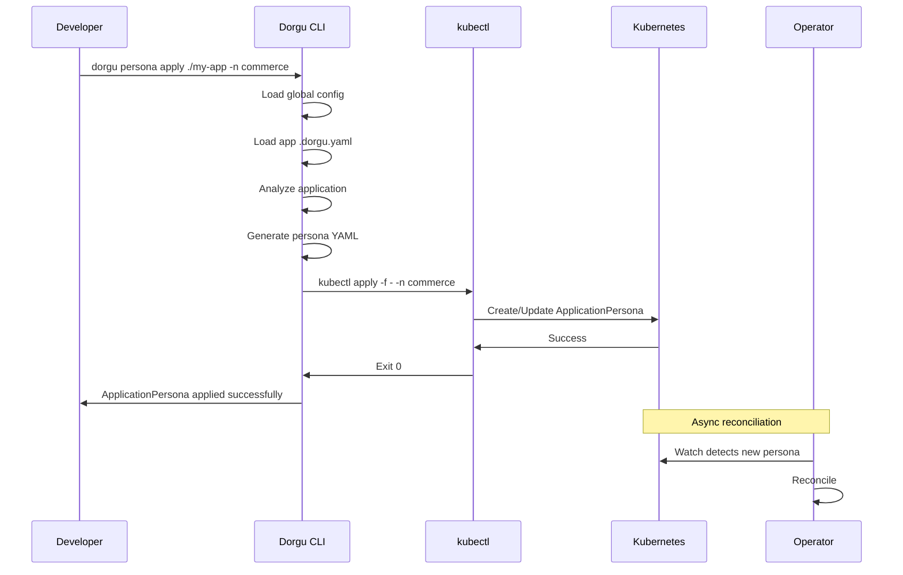

## What is an ApplicationPersona

An **ApplicationPersona** is a Kubernetes Custom Resource that represents the identity and requirements of an application. It captures:

- **Resource constraints** — CPU and memory requests/limits
- **Scaling parameters** — min/max replicas, HPA thresholds
- **Health probes** — liveness, readiness, and startup checks
- **Security policies** — security contexts, pod security standards
- **Ownership info** — team, repository, contact details

Think of it as a "living document" for your application. Once applied to a cluster, the Dorgu Operator continuously validates the persona against actual cluster state — flagging drift, misconfigurations, and degraded health.

## Persona lifecycle

<Steps>
  <Step title="Generate">
    Analyze your application and produce a persona YAML manifest. Use `--dry-run` to preview without writing files:

    ```bash
    dorgu persona generate ./my-app --dry-run
    ```

    This inspects the `Dockerfile`, dependency manifests, source code, and `.dorgu.yaml` config to produce a complete `ApplicationPersona` resource.
  </Step>

  <Step title="Apply">
    Analyze and apply the persona directly to your cluster in a single command:

    ```bash
    dorgu persona apply ./my-app -n commerce
    ```

    This combines generation and `kubectl apply` — the CLI produces the YAML and pipes it to kubectl targeting the specified namespace.
  </Step>

  <Step title="Monitor status">
    Check the reconciliation status of your persona:

    ```bash
    dorgu persona status order-service -n commerce
    ```

    The operator reconciles the persona asynchronously. Status fields tell you whether validation passed, what issues were found, and the current health of the application.
  </Step>
</Steps>

## Status fields

The `persona status` command reports the following fields from the `ApplicationPersona` resource:

| Field | Values | Description |
|-------|--------|-------------|
| `.status.phase` | `Pending`, `Active`, `Degraded`, `Unknown` | Current persona lifecycle phase |
| `.status.validation.passed` | `true` / `false` | Whether validation checks passed |
| `.status.validation.issues[]` | array | List of validation issues found by the operator |
| `.status.health.status` | `Healthy`, `Degraded`, `Unknown` | Application health status |
| `.status.health.replicas` | object | Current and desired replica counts |
| `.status.argoCD.syncStatus` | `Synced`, `OutOfSync` | ArgoCD sync status (if integrated) |
| `.status.learned.resourceBaseline` | object | Resource usage learned from Prometheus |

## What the operator validates

When a persona is applied, the Dorgu Operator runs continuous validation against the workload it describes. The operator checks:

- **Resource limits** — CPU and memory requests/limits are set and within acceptable bounds
- **Replica counts** — actual replicas match the declared scaling parameters
- **Health probes** — liveness and readiness probes are configured and endpoints are reachable
- **Security contexts** — containers run as non-root, drop capabilities, use read-only root filesystems

<Note>
  The operator **never writes** to workload resources (Deployments, Services, etc.). It only reads cluster state and updates the `ApplicationPersona` status fields. This is a core architectural invariant.
</Note>

## Persona apply flow

The following diagram shows what happens when you run `dorgu persona apply`:



## ClusterPersona

A **ClusterPersona** is a cluster-scoped CRD (as opposed to the namespace-scoped `ApplicationPersona`). It represents the identity of the entire cluster — what nodes are available, what add-ons are installed, and the total resource capacity.

Create a ClusterPersona with:

```bash
dorgu cluster init
```

This discovers:

- **Nodes** — count, instance types, capacity
- **Add-ons** — ingress controllers, cert-manager, monitoring stack, service mesh
- **Resource capacity** — total allocatable CPU and memory across the cluster

The ClusterPersona is used during persona generation to make smarter defaults — for example, if the cluster has an NGINX ingress controller, generated Ingress resources use the correct `ingressClassName`.

## Real-time monitoring

Use `dorgu watch personas` to stream live updates for all personas in a namespace:

```bash
dorgu watch personas -n commerce
```

This opens a WebSocket connection to the Dorgu Operator and displays real-time status changes — phase transitions, validation results, and health updates — as they happen.
