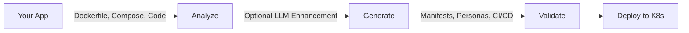

# What is Dorgu?

Dorgu analyzes your containerized applications — Dockerfile, docker-compose, and source code — and generates production-ready Kubernetes manifests, ArgoCD configs, CI/CD workflows, and ApplicationPersona CRDs. Pair it with the Dorgu Operator for cluster-side validation, discovery, and real-time insights.

## Products

<CardGroup cols={3}>
  <Card title="Dorgu CLI" icon="terminal" href="/cli/quickstart">
    Analyze apps and generate K8s manifests, personas, and CI/CD pipelines from the command line.
  </Card>
  <Card title="Dorgu Operator" icon="gears" href="/operator">
    Kubernetes operator for deployment validation, cluster discovery, and persona lifecycle management.
  </Card>
  <Card title="Dorgu Platform" icon="browser" href="/platform">
    Web dashboard for ClusterPersona visualization and cluster insights.
  </Card>
</CardGroup>

## How it works

<Steps>
  <Step title="Analyze">
    Dorgu parses your Dockerfile, docker-compose.yml, and source code to detect language, framework, ports, health endpoints, dependencies, and resource requirements.
  </Step>
  <Step title="Generate">
    Produces production-ready Kubernetes Deployment, Service, Ingress, HPA, ArgoCD Application, GitHub Actions workflow, and an ApplicationPersona CRD — all from a single command.
  </Step>
  <Step title="Validate">
    Post-generation validation checks resource bounds, port consistency, health probes, security contexts, and optionally runs `kubectl` dry-run against your cluster.
  </Step>
</Steps>

## Key capabilities

- **Multi-language analysis** — Node.js, Python, Go, Java, Ruby, Rust with framework detection (Express, FastAPI, Django, Spring, Rails, and more)
- **LLM-enhanced analysis** — Optional deeper understanding via OpenAI, Anthropic, Gemini, or Ollama
- **Layered configuration** — Global, workspace, and app-level config with CLI flag overrides
- **Post-generation validation** — Resource bounds, ports, health probes, HPA, security contexts
- **ApplicationPersona CRDs** — Living identity documents for your applications, validated by the operator
- **GitOps support** — ArgoCD App-of-Apps scaffold with `dorgu cluster setup --driver gitops`
- **Cluster bootstrapping** — Interactive wizard installs a production-ready stack: cert-manager (v1.16.3), ingress-nginx (4.11.3), CloudNativePG (0.23.0), OpenObserve (0.60.0), Argo CD (7.8.28), and External Secrets (0.10.7)

## Next steps

<CardGroup cols={2}>
  <Card title="Installation" icon="download" href="/cli/installation">
    Install the Dorgu CLI via Go, binary release, or from source.
  </Card>
  <Card title="Quickstart" icon="rocket" href="/cli/quickstart">
    Generate your first Kubernetes manifests in 5 minutes.
  </Card>
</CardGroup>
