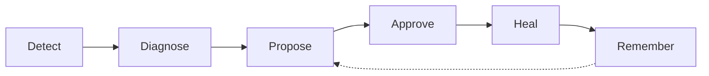

# Dorgu

Dorgu is an open-source AI SRE for Kubernetes — built for teams that don't have a platform team. It runs on your own cluster, watches your apps, and when something breaks it doesn't just alert. It diagnoses the root cause, proposes a reviewable fix, and heals the workload with your approval.

Code detects. AI explains. A human approves.

## See it in three minutes

<iframe
  className="w-full aspect-video rounded-xl"
  src="https://www.youtube.com/embed/lB_529ydWw4"
  title="Dorgu AI self-healing demo"
  frameBorder="0"
  allow="accelerometer; autoplay; clipboard-write; encrypted-media; gyroscope; picture-in-picture"
  allowFullScreen
></iframe>

A 3-minute screencast recorded on a real EKS cluster: an app is deployed with too little memory, gets OOMKilled, and crash-loops. Dorgu detects it, Claude diagnoses the root cause and proposes an ordered fix, one command approves it, and the pod recovers. No audio — the terminal is the whole story.

## The self-healing loop

```mermaid
flowchart LR
    D["Detect"] --> DG["Diagnose"]
    DG --> P["Propose"]
    P --> A["Approve"]
    A --> H["Heal"]
    H --> R["Remember"]
    R -.-> P
```

<Steps>
  <Step title="Detect">
    The operator's health-check reconciler watches for OOMKills, crash loops, image-pull failures, long-pending pods, resource saturation, node pressure, and control-plane trouble — and opens an `IncidentMemory`.
  </Step>
  <Step title="Diagnose">
    Deterministic rules produce a root cause and a confidence score. They are always on. With your own Anthropic key, Claude enhances the diagnosis with cluster context.
  </Step>
  <Step title="Propose">
    The AI planner reads your app persona, cluster persona, past incidents, and **which past fixes actually worked**, then returns an ordered plan with a per-step YAML diff. Only persona updates are ever auto-executable.
  </Step>
  <Step title="Approve">
    You review the plan with `dorgu remediation diff` and approve with one command. Approval is required by default.
  </Step>
  <Step title="Heal">
    The operator updates the app's desired state; the CLI applies the change to the running Deployment with your credentials. The pod recovers.
  </Step>
  <Step title="Remember">
    The operator verifies the fix, rolls it back automatically if health regresses, and keeps the incident and its outcome as organizational memory for next time.
  </Step>
</Steps>

<Note>
  **The operator never writes workloads.** It reads cluster state and updates its own CRDs. Deployments, Services, and everything else stay under the control of ArgoCD, Flux, `kubectl`, or the Dorgu CLI. This is an architectural invariant, not a setting.
</Note>

## Products

<CardGroup cols={3}>
  <Card title="Dorgu Operator" icon="heart-pulse" href="/operator/features/self-healing">
    The AI SRE: detects incidents, diagnoses root cause, and proposes reviewable fixes with guardrails.
  </Card>
  <Card title="Dorgu CLI" icon="terminal" href="/cli/quickstart">
    Review and approve remediations, inspect cluster health — and generate K8s manifests and personas.
  </Card>
  <Card title="Dorgu Platform" icon="browser" href="/platform">
    Web dashboard for ClusterPersona visualization and cluster insights.
  </Card>
</CardGroup>

## Key capabilities

- **AI self-healing loop** — detect → diagnose → propose → approve → heal → remember, with human approval required by default
- **Ordered, reviewable fixes** — a plan with per-step diffs, rationale, and risk levels, not an opaque action
- **Real guardrails** — 2× blast-radius cap, rate limits, one remediation per incident, `kube-system` deny-listed, automatic rollback on regression
- **Kubernetes-native memory** — `IncidentMemory` and `RemediationAction` CRDs, so the record lives in your cluster, not a vendor's database
- **BYO key, optional AI** — Anthropic only, operator-side; everything works rule-based with no key
- **ApplicationPersona CRDs** — living identity documents for your apps, and the desired-state record a fix is applied to
- **Manifest generation** — analyze a Dockerfile, docker-compose file, or source tree and produce Deployment, Service, Ingress, HPA, ArgoCD Application, and CI/CD workflow
- **Cluster bootstrapping** — an interactive wizard installs cert-manager, ingress-nginx, CloudNativePG, OpenObserve, Argo CD, and External Secrets

## Next steps

<CardGroup cols={2}>
  <Card title="Self-healing quickstart" icon="rocket" href="/cli/quickstart">
    Break an app and watch Dorgu fix it, in under 15 minutes
  </Card>
  <Card title="Turn on AI" icon="sparkles" href="/operator/configuration/ai-setup">
    Enable the AI planner with your own Anthropic key
  </Card>
  <Card title="Installation" icon="download" href="/cli/installation">
    Install the Dorgu CLI via Go, binary release, or from source
  </Card>
  <Card title="Manifest generation" icon="file-code" href="/cli/guides/manifest-generation">
    Generate Kubernetes manifests from your app
  </Card>
</CardGroup>
