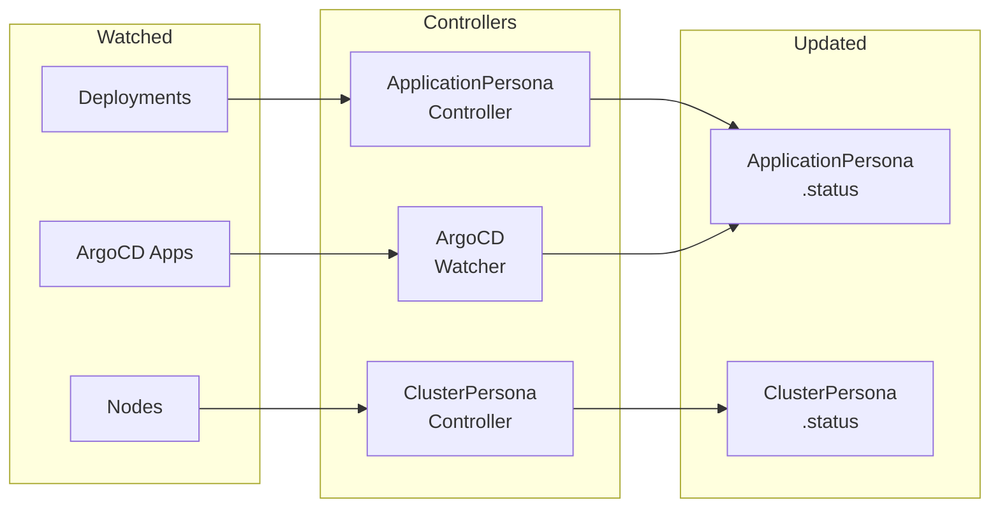
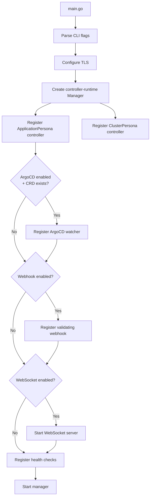

The dorgu operator is a Kubernetes operator built with [controller-runtime](https://github.com/kubernetes-sigs/controller-runtime) that manages two custom resources: **ApplicationPersona** and **ClusterPersona**. It follows the standard operator pattern of watching resources and reconciling desired state.

## Design principles

| Principle | Description |
|-----------|-------------|
| **Read-only workloads** | The operator NEVER writes to workload resources (Deployments, Services). It only updates Persona CRD status fields. |
| **Fail-open** | If the operator is down or encounters errors, workloads are unaffected. The webhook uses `failurePolicy: Ignore`. |
| **Opt-in features** | Only the core controllers are enabled by default. Webhook, Prometheus, and WebSocket require explicit opt-in. |
| **No ArgoCD dependency** | ArgoCD integration uses the unstructured API — no compile-time dependency on ArgoCD types. |
| **Graceful degradation** | Missing integrations (no Prometheus, no ArgoCD) are silently skipped without affecting core functionality. |

## Project structure

```
dorgu-operator/
├── api/v1/                           # CRD type definitions
│   ├── applicationpersona_types.go   # ApplicationPersona spec + status
│   ├── clusterpersona_types.go       # ClusterPersona spec + status
│   ├── groupversion_info.go          # API group registration
│   └── zz_generated.deepcopy.go     # Generated deep copy methods
│
├── cmd/                              # Entrypoint
│   ├── main.go                       # Manager setup, controller registration
│   └── config.go                     # CLI flag parsing
│
├── internal/
│   ├── controller/                   # Reconciliation controllers
│   │   ├── applicationpersona_controller.go    # Main reconciler
│   │   ├── applicationpersona_validation.go    # Validation logic
│   │   ├── applicationpersona_status.go        # Status update helpers
│   │   ├── clusterpersona_controller.go        # Cluster reconciler
│   │   ├── clusterpersona_discovery.go         # Node/resource discovery
│   │   ├── clusterpersona_addons.go            # Add-on detection
│   │   ├── argocd_watcher.go                   # ArgoCD Application watcher
│   │   └── controller_helpers.go               # Shared utilities
│   │
│   ├── metrics/                      # Prometheus integration
│   │   └── prometheus_client.go      # PromQL queries for baselines
│   │
│   ├── webhook/                      # Admission webhook
│   │   └── deployment_validator.go   # Validating webhook handler
│   │
│   └── websocket/                    # WebSocket server
│       ├── server.go                 # Server lifecycle, client management
│       ├── handlers.go               # Message handlers
│       └── protocol.go              # Message types and payloads
│
├── charts/dorgu-operator/            # Helm chart
├── config/                           # Kustomize manifests (CRDs, RBAC)
└── test/e2e/                         # End-to-end tests
```

## Reconciliation model

The operator runs three independent controllers, each watching different resources:



| Controller | Watches | Updates | Requeue interval |
|------------|---------|---------|-----------------|
| ApplicationPersona | Deployments, Pods | `.status` on ApplicationPersona | 60 seconds |
| ClusterPersona | Nodes, Namespaces, Pods | `.status` on ClusterPersona | 5 minutes |
| ArgoCD Watcher | ArgoCD Applications | `.status.argocd` on ApplicationPersona | 30 seconds |

## Startup sequence



## CRD ownership model

The operator follows a strict ownership model for the two CRDs:

| CRD | Scope | Created by | Spec owned by | Status owned by |
|-----|-------|------------|---------------|-----------------|
| ApplicationPersona | Namespaced | User / CLI | User / CLI | Operator |
| ClusterPersona | Cluster-scoped | User / CLI | User / CLI | Operator |

The user (or CLI) creates and manages the `.spec` of each persona. The operator exclusively manages `.status`, writing validation results, health information, resource baselines, and ArgoCD sync state.

## RBAC model

The operator needs read access to cluster resources and write access only to Persona status:

| Resource | Verbs | Purpose |
|----------|-------|---------|
| ApplicationPersonas | get, list, watch, update (status) | Reconcile and update status |
| ClusterPersonas | get, list, watch, update (status) | Reconcile and update status |
| Deployments | get, list, watch | Validate against persona constraints |
| Pods | get, list | Check pod health, count running pods |
| Nodes | get, list | Discover cluster capacity |
| Namespaces | get, list | Count namespaces |
| ArgoCD Applications | get, list, watch | Sync status tracking (optional) |

<CardGroup cols={2}>
  <Card title="CRD specification" icon="file-code" href="/cli/architecture/crds">
    Full ApplicationPersona and ClusterPersona schema
  </Card>
  <Card title="Configuration" icon="gear" href="/operator/configuration/overview">
    All operator configuration options
  </Card>
</CardGroup>
