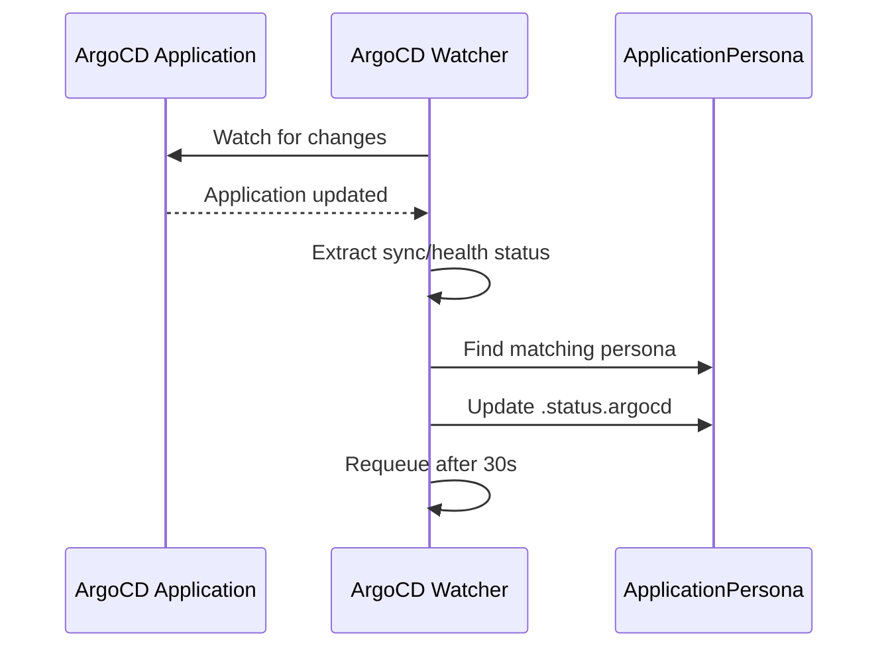
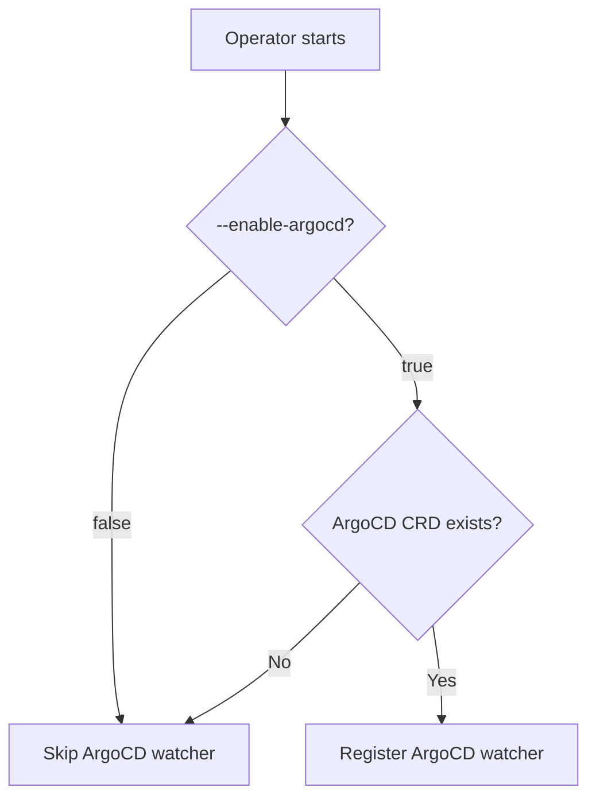

The operator includes an ArgoCD watcher that monitors ArgoCD Application resources and updates matching ApplicationPersonas with sync and health status. This gives you a unified view of application state across both dorgu and ArgoCD.

## How it works



The watcher reconciles every 30 seconds and on watch events. It uses the Kubernetes unstructured API to read ArgoCD Applications, so the operator has **no compile-time dependency on ArgoCD**.

## Matching logic

The watcher matches ArgoCD Applications to ApplicationPersonas using the application name:

1. Extract the app name from the ArgoCD Application (labels first, then `metadata.name`)
2. Extract the destination namespace from `spec.destination.namespace`
3. Search for an ApplicationPersona with a matching `spec.name` in the destination namespace
4. If not found in the destination namespace, search across all namespaces

| Source | Field |
|--------|-------|
| App name (preferred) | `app.kubernetes.io/name` label |
| App name (fallback 1) | `app` label |
| App name (fallback 2) | `metadata.name` |
| Destination namespace | `spec.destination.namespace` |

## Status fields

When a match is found, the watcher populates `.status.argocd` on the ApplicationPersona:

| Field | Description | Example values |
|-------|-------------|----------------|
| `syncStatus` | ArgoCD sync state | `Synced`, `OutOfSync`, `Unknown` |
| `healthStatus` | ArgoCD health state | `Healthy`, `Degraded`, `Progressing`, `Suspended`, `Missing`, `Unknown` |
| `lastSyncTime` | When ArgoCD last synced | RFC 3339 timestamp |
| `revision` | Git revision that was synced | Git SHA or tag |
| `applicationName` | Name of the ArgoCD Application | `my-app` |
| `applicationNamespace` | Namespace of the ArgoCD Application | `argocd` |

## Conditional activation

The watcher only starts if **both** conditions are met:

1. The `--enable-argocd` flag is `true` (default)
2. The ArgoCD Application CRD (`argoproj.io/v1alpha1`) exists in the cluster

If the CRD is missing, the watcher silently skips registration. This means the operator works safely in clusters without ArgoCD installed.



## Configuration

### Via Helm

```yaml
argocd:
  enabled: true  # default
```

### Via CLI flag

```bash
./bin/manager --enable-argocd  # enabled by default
./bin/manager --enable-argocd=false  # disable
```

## Checking ArgoCD status

```bash
dorgu persona status my-app -n production
```

Or query the resource directly:

```bash
kubectl get applicationpersona my-app -n production -o jsonpath='{.status.argocd}'
```

<Note>
The ArgoCD watcher requires RBAC permissions to `get`, `list`, and `watch` ArgoCD Application resources (`argoproj.io/v1alpha1`). The Helm chart configures these permissions automatically.
</Note>

<CardGroup cols={2}>
  <Card title="ApplicationPersona validation" icon="shield-check" href="/operator/features/validation">
    Continuous validation via the reconciliation loop
  </Card>
  <Card title="Configuration" icon="gear" href="/operator/configuration/overview">
    All operator configuration options
  </Card>
</CardGroup>
