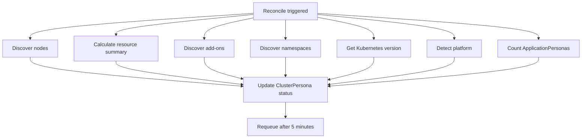

The ClusterPersona controller runs a discovery loop every 5 minutes to build a comprehensive picture of your cluster's nodes, resources, add-ons, and platform type.

## What gets discovered



## Node discovery

The controller lists all nodes and extracts:

| Field | Source |
|-------|--------|
| Name | `node.metadata.name` |
| Role | `node-role.kubernetes.io/control-plane` or `master` label |
| Ready | `Ready` condition in `node.status.conditions` |
| Capacity | CPU, memory, pods, ephemeral storage from `node.status.capacity` |
| Allocatable | CPU, memory, pods, ephemeral storage from `node.status.allocatable` |
| Kubelet version | `node.status.nodeInfo.kubeletVersion` |
| Container runtime | `node.status.nodeInfo.containerRuntimeVersion` |
| Taints | `node.spec.taints` formatted as `key=value:effect` |
| Labels | Filtered to interesting prefixes: `node.kubernetes.io/`, `topology.kubernetes.io/`, `kubernetes.io/arch`, `kubernetes.io/os`, `node-role.kubernetes.io/` |

## Resource summary

The controller aggregates resource information across all nodes:

| Field | Calculation |
|-------|-------------|
| `totalCPU` | Sum of all node CPU capacity |
| `totalMemory` | Sum of all node memory capacity |
| `allocatableCPU` | Sum of all node allocatable CPU |
| `allocatableMemory` | Sum of all node allocatable memory |
| `totalPods` | Sum of all node pod capacity |
| `runningPods` | Count of pods in `Running` phase across all namespaces |
| `nodeCount` | Total number of nodes |

## Add-on detection

The controller probes well-known namespaces for installed add-ons by searching for pods that contain the add-on name.

| Add-on | Namespace checked | Pod name pattern | Type |
|--------|-------------------|-----------------|------|
| ArgoCD | `argocd` | `argocd` | gitops |
| Prometheus | `monitoring` | `prometheus` or `prometheus-server` | monitoring |
| Grafana | `monitoring` | `grafana` | monitoring |
| cert-manager | `cert-manager` | `cert-manager` | cert-management |
| ingress-nginx | `ingress-nginx` | `ingress-nginx-controller` | ingress |
| external-secrets | `external-secrets` | `external-secrets` | secrets |
| Istio | `istio-system` | `istiod` | service-mesh |
| CloudNativePG | `cnpg-system` | `cnpg-cloudnative-pg` | database |
| OpenObserve | `openobserve` | `openobserve` | monitoring |

For each detected add-on, the controller records:
- Whether it is installed
- The version (extracted from the container image tag)
- The namespace
- Whether the pod is healthy (in `Running` phase)

## Platform detection

The controller identifies the Kubernetes platform using two methods:

**Method 1: Node labels**

| Label contains | Platform |
|----------------|----------|
| `eks.amazonaws.com` | EKS |
| `cloud.google.com/gke` | GKE |
| `kubernetes.azure.com` | AKS |
| `node.openshift.io` | OpenShift |
| `minikube.k8s.io` | Minikube |
| `kind.x-k8s.io` | Kind |
| `k3s.io` | K3s |

**Method 2: Provider ID (fallback)**

| Provider ID prefix | Platform |
|--------------------|----------|
| `aws://` | EKS |
| `gce://` | GKE |
| `azure://` | AKS |
| `kind://` | Kind |

If neither method matches, the platform is reported as `Generic`.

## Namespace summary

| Field | Description |
|-------|-------------|
| `total` | Total number of namespaces |
| `active` | Namespaces in `Active` phase |
| `withPersonas` | Namespaces containing at least one ApplicationPersona |

## Phase determination

| Condition | Phase |
|-----------|-------|
| No nodes discovered | `Discovering` |
| All nodes ready | `Ready` |
| Some nodes not ready | `Degraded` |

<Note>
When a transient API failure prevents node discovery, the controller preserves the previously discovered nodes instead of clearing them. This prevents phase regression from `Ready` to `Discovering` on temporary network issues.
</Note>

## Conditions

| Condition | Status | When |
|-----------|--------|------|
| `Discovered` | `True` | Discovery completed (with or without issues) |
| `Discovered` | `False` | Node discovery failed |
| `Healthy` | `True` | All nodes ready |
| `Healthy` | `False` | Some nodes not ready |

## Checking cluster status

```bash
dorgu cluster status
```

Or query the resource directly:

```bash
kubectl get clusterpersona my-cluster -o yaml
```

<CardGroup cols={2}>
  <Card title="Cluster onboarding" icon="server" href="/cli/guides/cluster-onboarding">
    Bootstrap your cluster with dorgu cluster init
  </Card>
  <Card title="Add-on detection" icon="puzzle-piece" href="/operator/features/argocd">
    ArgoCD integration details
  </Card>
</CardGroup>
