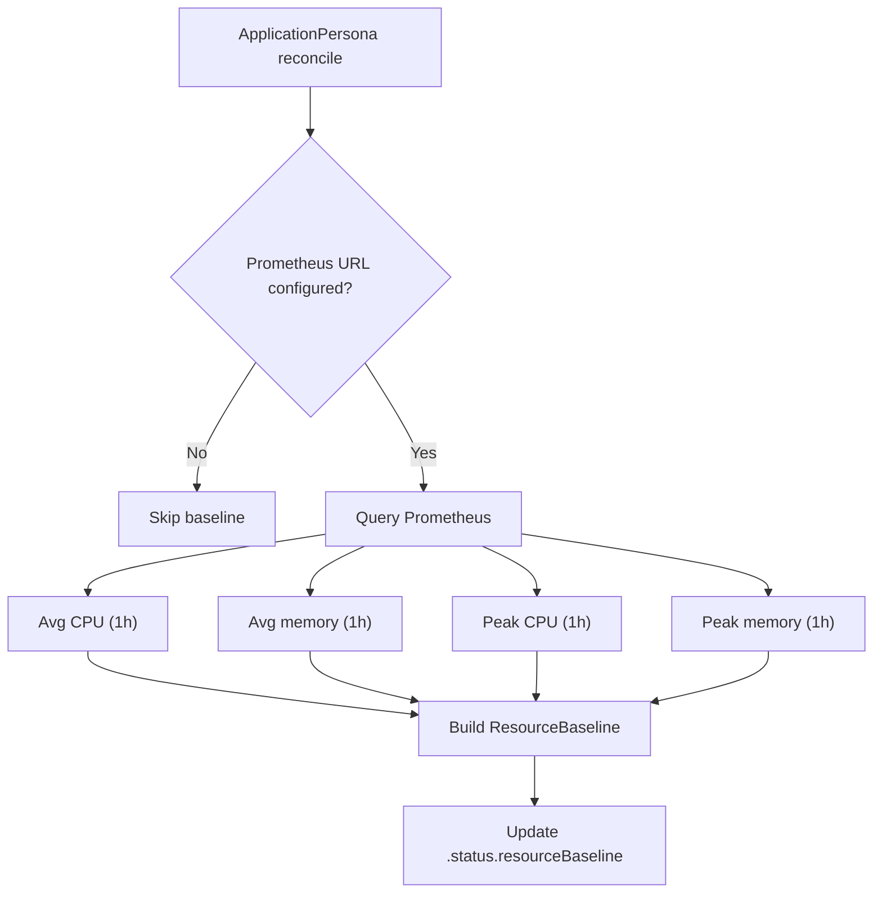

The operator can query a Prometheus server to learn resource usage baselines for each ApplicationPersona. This provides actual CPU and memory usage data alongside the declared persona constraints, helping teams right-size their resource limits.

## How it works



During each ApplicationPersona reconciliation (every 60 seconds), the controller queries Prometheus for the last hour of container metrics and stores the results in `.status.resourceBaseline`.

## Baseline fields

| Field | Description | PromQL metric |
|-------|-------------|---------------|
| `avgCPU` | Average CPU usage (millicores) | `container_cpu_usage_seconds_total` |
| `avgMemory` | Average memory usage | `container_memory_working_set_bytes` |
| `peakCPU` | Peak CPU usage (millicores) | `container_cpu_usage_seconds_total` |
| `peakMemory` | Peak memory usage | `container_memory_working_set_bytes` |

Values are formatted in Kubernetes resource units: CPU in millicores (e.g., `150m`), memory in Mi or Gi (e.g., `256Mi`, `1.2Gi`).

## PromQL queries

The operator runs four queries per reconciliation:

### Average CPU

```promql
avg(rate(container_cpu_usage_seconds_total{
  namespace="<namespace>",
  pod=~"<appName>.*",
  container!="POD",
  container!=""
}[5m])) * 1000
```

### Average memory

```promql
avg(container_memory_working_set_bytes{
  namespace="<namespace>",
  pod=~"<appName>.*",
  container!="POD",
  container!=""
})
```

### Peak CPU

```promql
max_over_time(rate(container_cpu_usage_seconds_total{
  namespace="<namespace>",
  pod=~"<appName>.*",
  container!="POD",
  container!=""
}[5m])[1h:]) * 1000
```

### Peak memory

```promql
max_over_time(container_memory_working_set_bytes{
  namespace="<namespace>",
  pod=~"<appName>.*",
  container!="POD",
  container!=""
}[1h])
```

<Info>
Pods are matched using a regex pattern `<appName>.*` based on the persona's `spec.name` field. The `container!="POD"` and `container!=""` filters exclude pause containers and empty container names.
</Info>

## Graceful failure

If Prometheus is unreachable or returns no data:

- The baseline fields are left empty (not cleared)
- The reconciliation continues normally
- Validation and health checks are unaffected
- A log message is emitted but no error condition is set

This ensures Prometheus is purely additive — it enriches status but never blocks the controller.

## Configuration

### Via Helm

```yaml
prometheus:
  enabled: true
  url: "http://prometheus-server.monitoring:9090"
```

### Via CLI flag

```bash
./bin/manager --prometheus-url http://prometheus-server.monitoring:9090
```

<Warning>
The Prometheus URL must be reachable from inside the cluster. Use the in-cluster service DNS name, not an external URL. The operator uses a 30-second HTTP timeout per query.
</Warning>

## Checking baselines

```bash
dorgu persona status my-app -n production
```

Or query the resource directly:

```bash
kubectl get applicationpersona my-app -n production \
  -o jsonpath='{.status.resourceBaseline}'
```

<CardGroup cols={2}>
  <Card title="ApplicationPersona validation" icon="shield-check" href="/operator/features/validation">
    How validation uses resource constraints
  </Card>
  <Card title="Cluster discovery" icon="server" href="/operator/features/cluster-discovery">
    Cluster-level resource aggregation
  </Card>
</CardGroup>
