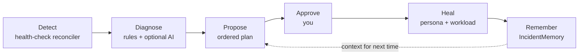

Vanilla Kubernetes restarts a crash-looping pod forever. It never asks *why*. Dorgu's self-healing loop closes that gap: it detects the failure, diagnoses the root cause, proposes a reviewable fix, and — once you approve — heals the workload and remembers the outcome.

Code detects. AI explains. A human approves.

## The loop



| Stage | Owner | Output |
|-------|-------|--------|
| Detect | Health-check reconciler | Signals |
| Diagnose | Rule-based provider, optionally AI-enhanced | Root cause + confidence, stored on `IncidentMemory` |
| Propose | Rule-based proposer, optionally the AI planner | `RemediationAction` with an ordered `steps[]` plan |
| Approve | You, via `dorgu remediation approve` | `phase: Approved` |
| Heal | Operator (persona spec) + CLI (Deployment) | The pod recovers |
| Remember | Operator | `IncidentMemory.spec.resolution` with the outcome |

<Warning>
  **The invariant.** The operator never creates or modifies Deployments, Services, or any other workload resource. It reads cluster state, updates the Persona / Incident / Remediation CRDs, and recommends. Applying workload changes stays with ArgoCD, Flux, `kubectl`, or the Dorgu CLI — which uses **your** credentials, not the operator's.
</Warning>

## Detect

The health-check reconciler runs on a fixed interval — 60 seconds by default, and 30 seconds is a reasonable setting for a tight loop. It collects signals from every detector, correlates them to an `ApplicationPersona`, and opens or updates an `IncidentMemory`.

| Category | Signals |
|----------|---------|
| Pod | `OOMKilled`, `CrashLoopBackOff`, `ImagePullBackOff`, `PodEvicted`, `PodPendingLong` (5 min), `ProbeFailure`, `ContainerHighRestarts` |
| Resource | `CPUSaturationHigh` / `Critical`, `MemorySaturationHigh` / `Critical`, `CPUUsageHigh`, `MemoryUsageHigh` |
| Node | `NodeNotReady`, `NodeMemoryPressure`, `NodeDiskPressure`, `NodePIDPressure`, `NodeNetworkUnavailable` |
| Control plane | `APIServerUnhealthy`, `ETCDUnhealthy`, `SchedulerUnhealthy`, `ControllerManagerUnhealthy`, `ComponentUnhealthy` |

<Note>
  **OOM detection needs no metrics-server.** `OOMKilled` is read straight from the container's current or last termination state in the pod status, so the most valuable signal works on a bare cluster. Metrics-server only adds the container-level usage and saturation signals.
</Note>

When a signal stops appearing, the incident auto-resolves after a 5-minute grace period.

## Diagnose

Diagnosis turns raw signals into a root cause. The deterministic rule-based provider is **always on** and always the floor. It produces a summary, a category, a suggested action, and a confidence score computed from the rule's base confidence, how many correlated signals were seen, how unambiguous those signals are (an `OOMKilled` is clearer than a `PodPending`), and how tightly they cluster in time.

With an Anthropic key configured, an AI provider runs afterwards and enhances those results with cluster context. Its diagnoses are recorded with `provider: ai-enhanced` versus `rule-based`. When two diagnoses describe the same category, action, and resources, the higher-confidence one wins — which naturally prefers the AI result when it is available and silently keeps the rule result when it is not.

Any LLM failure degrades to the rules. It never blocks the loop.

## Propose

With AI remediation planning enabled, the planner assembles the context it sends to Claude:

- The affected **ApplicationPersona** — spec *and* status, including the learned resource baselines
- The singleton **ClusterPersona** — platform, capacity, and the self-healing policy
- Recent **IncidentMemory** records for the same application
- The **RemediationActions those incidents referenced, with their phase and verification result** — so the model can see which past fixes actually worked and which were rolled back

Claude returns an ordered plan. Each step carries an order, type, description, rationale, risk level, and an `autoExecutable` flag, and `persona-update` steps carry the JSON merge patch plus a `prePatchState` snapshot for rollback. The result lands on `RemediationAction.spec.steps[]` with `planSource: ai-anthropic`.

<Note>
  **Only `persona-update` steps may be auto-executable.** This is enforced at the Kubernetes API server by a CEL validation rule on the CRD, not merely in operator code. `workload-apply`, `restart`, `scale`, `config-change`, and `manual` steps are advisory — recorded for a human, the CLI, or your pipeline to act on. No plan can escalate itself.
</Note>

Without a key, or with `aiRemediation.enabled=false`, the deterministic proposer runs instead and emits `planSource: rule-based`. It handles the resource-adjustment path — the OOM and saturation cases.

Read the resulting plan with [`dorgu remediation diff`](/cli/commands/remediation#remediation-diff).

## Guardrails

Every proposal passes the safety checker before it is created.

| Guardrail | Limit |
|-----------|-------|
| Blast radius | Resource increases capped at **2×**; decreases capped at 50% |
| Rate limit | **5 remediations per persona per hour** (override with `policies.selfHealing.maxRemediationsPerHour`) |
| Concurrency | **One active remediation per persona** — a second is skipped while one is `Approved`, `Applying`, or `Verifying` |
| Failure cooldown | 30 minutes after a `Failed` remediation for the same persona |
| Namespace deny list | `kube-system` and `dorgu-operator-system` always; plus anything in `policies.selfHealing.excludeNamespaces` |
| Approval | **Required by default.** Every proposal is created with `approval.required: true` and phase `Pending`. |
| Deduplication | One remediation per incident, and one per persona-plus-target — so an OOM that also trips a crash-loop yields **two incidents but one fix** |
| Rollback | Automatic. The operator restores `prePatchState` when verification finds the health degraded. |

## Verify and remember

Approval starts a timed verification, not an instant success.

<Steps>
  <Step title="Apply">
    The operator patches the ApplicationPersona spec and moves to `Applying`, recording `appliedAt`.
  </Step>
  <Step title="Wait">
    It waits out `spec.rollback.healthCheckAfter` — **10 minutes** by default — then moves to `Verifying`.
  </Step>
  <Step title="Verify">
    It re-runs the whole detection engine and asks two questions: is the original signal still present for this persona, and are there new critical signals?
  </Step>
  <Step title="Settle">
    Clean → `Completed`, and the incident is marked `Resolved` with the outcome and duration. Degraded → the `prePatchState` is restored and the action becomes `RolledBack`. `Unknown` → retried twice, one minute apart, then `Failed`.
  </Step>
</Steps>

<Warning>
  Your pod recovers within seconds of `approve`, but the remediation stays in `Applying` / `Verifying` for the full window and the incident stays open until then. That is the design, not a hang — the wait is what makes automatic rollback meaningful.
</Warning>

Either way the record persists. `IncidentMemory` keeps the signal, the root cause, the confidence, the occurrence count, and the resolution outcome; `RemediationAction` keeps the plan and the verification result. Both become context for the next proposal.

## Trust model

The `ClusterPersona` carries the self-healing policy:

```yaml
spec:
  policies:
    selfHealing:
      enabled: true
      mode: propose          # observe | propose (auto-approve is not implemented)
      trustLevel: 2          # 0-5
      maxRemediationsPerHour: 5
      excludeNamespaces: []
```

**`mode` gates the loop:**

| Mode | What happens |
|------|--------------|
| `observe` | Detect, diagnose, and record an `IncidentMemory`. **No `RemediationAction` is created** — the operator logs `selfHealing.mode=observe — proposal suppressed` and stops. The gate runs ahead of the AI planner, so observe costs no API calls. |
| `propose` | **Default.** Also propose a `RemediationAction` for every actionable incident, which a human approves before anything is applied. |
| `auto-approve` | **Not implemented.** Accepted for forward compatibility and treated exactly like `propose`, with a warning logged on every proposal. |

The operator auto-creates its default `dorgu-cluster` persona with `mode: propose`. Set `mode: observe` to watch the loop diagnose without proposing anything.

<Warning>
  **`trustLevel`, `enabled`, and `autoApproveRule` are descriptive, not enforced.** `trustLevel` is only fed to the AI planner as context; detection, diagnosis, and proposal run regardless of `enabled` (use `mode: observe` to stop at diagnosis); and `spec.approval.autoApproveRule` exists in the `RemediationAction` CRD but no controller reads it. **Every remediation requires human approval.** `maxRemediationsPerHour` and `excludeNamespaces` *are* enforced.
</Warning>

See the [trust model](/cli/architecture/trust-model) for how the levels are meant to progress.

## Prerequisites

| Component | Required? | What you lose without it |
|-----------|-----------|--------------------------|
| `healthCheck.enabled` | **Yes**, and **`true` by default** since chart 0.8.0 | The whole loop. Set it to `false` to run validation and discovery only. |
| An ApplicationPersona per app | **Yes** | Signals have nothing to correlate to, so no incident is opened. On a cluster that already has apps, create them with [`dorgu persona import`](/cli/commands/persona#persona-import). |
| Resource **limits** on the persona | **Yes** for resource fixes | The proposer skips with `persona has no resource limits configured` |
| A label on the Deployment | **No** | Nothing. Resolution walks a fallback chain (below) and pod-template-only labelling resolves fine. |
| metrics-server | No | Container-level CPU/memory usage and saturation signals. OOM and crash-loop detection still work. |
| Prometheus | No | Learned resource baselines in `status.learned.resourceBaseline`, which the AI uses to size fixes |
| Anthropic API key | No | AI diagnosis and AI ordered plans. Rule-based detection, diagnosis, and remediation all still work. |
| WebSocket | No | Live `dorgu watch remediations` streaming |

### How a persona finds its Deployment

Two separate lookups run in the loop, and confusing them is the usual reason nothing happens.

**Persona to Deployment.** The operator lists every Deployment in the persona's namespace and walks an ordered chain, taking the first rung that matches exactly one Deployment:

| Order | Rung | Read from |
|-------|------|-----------|
| 1 | `app.kubernetes.io/name` label | The Deployment object |
| 2 | `app` label | The Deployment object |
| 3 | `metadata.name` | The Deployment object |
| 4 | `spec.selector.matchLabels` | Either `app.kubernetes.io/name` or `app` in the selector |

Earlier rungs are more explicit statements of intent, so they win. The value matched against every rung is the persona's `spec.name`.

<Note>
  **No label is required.** Helm, kustomize, and most hand-written YAML label the pod template only and leave the Deployment object bare; rung 3 or rung 4 resolves those. Requiring a label on the Deployment object is what used to leave personas for pre-existing apps `Pending` forever. The `dorgu` CLI walks the identical chain when it picks the Deployment to patch, so the CLI and the operator never disagree about which workload a persona describes.
</Note>

If a rung matches several Deployments, the persona reports `AmbiguousDeployment` and names the candidates rather than patching one at random. If no rung matches anything, it reports `NoDeployment` and lists every rung it tried.

**Signal to persona.** Detection goes the other way and matches by **name prefix**: a signal about resource `X` is attributed to a persona when `X` equals the persona's `metadata.name` or `spec.name`, or starts with either followed by a hyphen. That is what handles pod suffixes, so a persona named `memhog` picks up `memhog-7d9f-x2k`. A persona named `api` will never pick up pods named `api-server-...`.

## Troubleshooting

<AccordionGroup>
  <Accordion title="Nothing happens at all: no incidents, no remediations, on a cluster full of running apps">
    Almost always the same cause: **those apps have no `ApplicationPersona`**. Dorgu only watches workloads that have one, so a broken app with no persona raises no incident, which means no diagnosis and no proposed fix. Nothing is misconfigured; there is simply nothing registered to watch.

    Ask Dorgu what it cannot see:

    ```bash
    dorgu health
    ```

    The `Unmonitored` section names every Deployment with no matching persona and prints an import command per namespace. Then create them from the live Deployments:

    ```bash
    dorgu persona import -n <namespace> --all           # read them first
    dorgu persona import -n <namespace> --all --apply    # then create them
    ```

    Requires CLI v0.9.0 or newer. See [`dorgu persona import`](/cli/commands/persona#persona-import) and the [brownfield walkthrough](/cli/quickstart#brownfield-a-cluster-that-already-has-apps).
  </Accordion>

  <Accordion title="A persona sits in Pending with reason NoDeployment">
    The persona exists but the operator could not find the workload it describes. The condition message lists every rung it tried:

    ```
    No Deployment in namespace apps matches persona "checkout" by
    label app.kubernetes.io/name, label app, metadata.name, spec.selector.matchLabels
    ```

    Check it with:

    ```bash
    kubectl get applicationpersona <name> -n <namespace> \
      -o jsonpath='{.status.conditions[?(@.type=="Ready")]}{"\n"}'
    kubectl get deployments -n <namespace>
    ```

    Common causes, in the order worth checking:

    - **The persona is in the wrong namespace.** Resolution never leaves the persona's own namespace. The Deployment being one namespace over looks identical to it not existing.
    - **`spec.name` does not match anything.** The chain matches `spec.name`, not `metadata.name`. Set `spec.name` to the Deployment's name, or add `app.kubernetes.io/name: <spec.name>` to the Deployment object.
    - **The Deployment genuinely is not there yet.** The persona re-resolves on the next reconcile, so this clears itself once the workload lands.

    `dorgu persona import` picks a `spec.name` that resolves back to the Deployment it read, so imported personas do not hit this.
  </Accordion>

  <Accordion title="A persona sits in Pending with reason AmbiguousDeployment">
    Several Deployments matched the same rung, and picking one arbitrarily is how the wrong workload gets patched. The message names the candidates and the fix:

    ```
    2 Deployments match persona "web" by label app (web-blue, web-green);
    set app.kubernetes.io/name=web on exactly one
    ```

    Do exactly that: `app.kubernetes.io/name` is rung 1, so setting it on the one Deployment you mean outranks the collision on a later rung. Alternatively, split them into one persona per Deployment with distinct `spec.name` values.

    For a one-off CLI heal you can bypass discovery entirely with `dorgu remediation heal <name> -n <ns> --workload web-blue`. That fixes the single apply, not the persona, so the operator keeps reporting `AmbiguousDeployment` until the labels say what you mean.
  </Accordion>

  <Accordion title="No incident is created, even though the pod is crash-looping">
    Assuming the app does have a persona, check the **name prefix**. Signals are correlated to a persona by name: the persona matches when the resource name equals the persona's `metadata.name` or `spec.name`, or **starts with either followed by a hyphen**, which is how pod suffixes are handled. If your persona is `api` but the pods are `api-server-7d9f-x2k`, nothing matches. Name the persona so it prefix-matches the pods, and make sure it lives in the same namespace as the workload.

    Note that this is a different lookup from persona-to-Deployment resolution, which needs no label and no prefix. A persona can be `Active`, having resolved its Deployment cleanly, and still collect no incidents because the pod names do not prefix-match. See [how a persona finds its Deployment](#how-a-persona-finds-its-deployment).
  </Accordion>

  <Accordion title="The operator is installed but detects nothing">
    Since chart **0.8.0** detection is on by default, so this should not happen on a fresh install. Confirm what the pod is actually running:

    ```bash
    kubectl -n dorgu-system get deploy dorgu-operator \
      -o jsonpath='{.spec.template.spec.containers[0].args}{"\n"}'
    ```

    You want `--enable-health-check=true`. If it reads `false`, either the values set it or the release predates 0.8.0:

    ```bash
    helm upgrade dorgu-operator oci://ghcr.io/dorgu-ai/dorgu-operator-charts/dorgu-operator \
      -n dorgu-system --reuse-values --set healthCheck.enabled=true
    ```

    Also check that all five CRDs are present. Detection cannot record anything without `incidentmemories.dorgu.io`. See [installation](/operator/installation#verify-installation).
  </Accordion>

  <Accordion title="An incident exists, but no remediation is proposed">
    The most common cause is a persona with no resource **limits**. The proposer needs a current value to compute a bounded change, so it skips with a logged `persona has no resource limits configured`. Add `spec.resources.limits` to the persona.

    Other logged skip reasons worth checking: `safety check failed: [rate-limit ...]` (5 per persona per hour), `[concurrent ...]` (one active remediation at a time), `[deny-list ...]` (the namespace is excluded), `[blast-radius ...]` (the change exceeded 2×), and the dedup skip when an active remediation already covers the same target.
  </Accordion>

  <Accordion title="Two incidents for one problem">
    Expected. A single OOM usually raises both `OOMKilled` and `CrashLoopBackOff`. Dedup runs at the remediation layer, not the incident layer, so you see two incidents and one fix. Approving that one fix resolves both.
  </Accordion>

  <Accordion title="The remediation is stuck in Applying or Verifying">
    It is not stuck. The operator waits out the verification window — 10 minutes by default — before it will call the fix good. Check the pod itself: if it is `1/1 Running` with no new restarts, the heal worked and the phase will settle on its own.
  </Accordion>

  <Accordion title="Plans come back rule-based when AI is enabled">
    The AI planner degrades to the deterministic rules on any failure and logs `AI remediation planning failed, falling back to rules` with the error. Check that the operator can reach the Anthropic API (egress and NAT), that the key is valid, and that the startup log includes `AI remediation planning enabled`. See [AI setup](/operator/configuration/ai-setup).
  </Accordion>
</AccordionGroup>

## Next steps

<CardGroup cols={2}>
  <Card title="Turn on AI" icon="sparkles" href="/operator/configuration/ai-setup">
    BYO Anthropic key, injected from a Secret in your own cluster
  </Card>
  <Card title="dorgu remediation" icon="terminal" href="/cli/commands/remediation">
    Review, approve, reject, and heal from the CLI
  </Card>
  <Card title="Operator quickstart" icon="rocket" href="/operator/quickstart">
    Watch the loop run end to end on a real cluster
  </Card>
  <Card title="CRD reference" icon="file-code" href="/cli/architecture/crds">
    IncidentMemory, RemediationAction, and DorguEvent schemas
  </Card>
</CardGroup>
