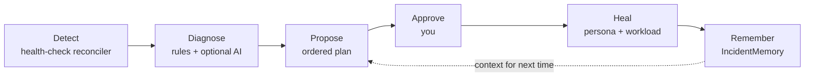

Vanilla Kubernetes restarts a crash-looping pod forever. It never asks *why*. Dorgu's self-healing loop closes that gap: it detects the failure, diagnoses the root cause, proposes a reviewable fix, and — once you approve — heals the workload and remembers the outcome.

Code detects. AI explains. A human approves.

## The loop



| Stage | Owner | Output |
|-------|-------|--------|
| Detect | Health-check reconciler | Signals |
| Diagnose | Rule-based provider, optionally AI-enhanced | Root cause + confidence, stored on `IncidentMemory` |
| Propose | Rule-based proposer, optionally the AI planner | `RemediationAction` with an ordered `steps[]` plan |
| Approve | You, via `dorgu remediation approve` | `phase: Approved` |
| Heal | Operator (persona spec) + CLI (Deployment, **only if unmanaged**) | The pod recovers, or you get owner-shaped instructions |
| Remember | Operator | `IncidentMemory.spec.resolution` with the outcome |

<Warning>
  **The invariant.** The operator never creates or modifies Deployments, Services, or any other workload resource. It reads cluster state, updates the Persona / Incident / Remediation CRDs, and recommends. This is enforced by RBAC, not by convention: its ClusterRole grants only `get`, `list`, and `watch` on Deployments, and no access to Secrets at all. The role is published in full on [security and permissions](/security-and-permissions).

  Applying workload changes stays with ArgoCD, Flux, `kubectl`, or the Dorgu CLI, which uses **your** credentials, not the operator's.
</Warning>

## Understanding first: who owns the workload

Detection and diagnosis run on every workload with a persona. **Healing does not.**

As of operator v0.9.0 the operator reads the live Deployment at proposal time and records who owns it on `RemediationAction.spec.workloadRef.managedBy`, one of `helm`, `argocd`, `flux`, `kustomize`, `unmanaged`, or `unknown`. For anything except `unmanaged`, Dorgu is **understanding and recommendation only**: it detects, diagnoses, and tells you exactly what to change in *your* source of truth, and it will not patch the Deployment.

The reason is concrete. Under server-side apply, patching a Helm-owned Deployment claims those fields away from Helm's field manager, and the next `helm upgrade` then **fails outright** with a field-manager conflict rather than quietly reverting the fix. A fix that breaks your next deploy is not a fix.

The same logic runs the other way on the workloads Dorgu *does* patch. **A heal leaves no ownership footprint:** the CLI patches under its own `dorgu` field manager and then strips that entry, so the fields end up owned by nobody and a later server-side apply succeeds. Because an `Update` takes fields away from whoever held them, a heal even clears a pre-existing `kubectl-set` claim rather than adding to it. New in CLI v0.11.0: [Dorgu leaves no field manager behind](/ownership-model#dorgu-leaves-no-field-manager-behind).

| `managedBy` | Detection | Diagnosis | Proposal | CLI patches the Deployment |
|-------------|-----------|-----------|----------|----------------------------|
| `unmanaged` | Yes | Yes | Yes | **Yes** |
| `helm`, `argocd`, `flux` | Yes | Yes | Yes, shaped for the owner | No |
| `kustomize` | Yes | Yes | Yes, shaped for the owner | No. Set only from an [opt-in marker](/ownership-model#the-kustomize-limitation); a plain `kubectl apply -k` reads as `unmanaged`. |
| `unknown` (including an unresolvable Deployment) | Yes | Yes | Yes | No |

For an owned workload the operator rewrites every step whose command would write to the cluster: the command is dropped, and the description becomes the chart values to set for a Helm release, the Git path for an ArgoCD application, or the overlay for kustomize. **Read-only commands survive**, because `kubectl logs` and `kubectl get events` matter most on exactly the workloads Dorgu will not touch.

<Note>
  **kustomize is named in the enum but not in the claim.** It is a client-side renderer with no controller, and it stamps nothing on its output unless the kustomization opts in, so a Deployment from `kubectl apply -k` is indistinguishable from one applied by hand. The published guarantee therefore names **Helm, ArgoCD and Flux**, the three that run controllers and stamp what they reconcile. Full detail, and what the CLI prints before it writes: [the kustomize limitation](/ownership-model#the-kustomize-limitation).
</Note>

<Note>
  **Persona writes are not gated on ownership.** A `persona-update` step patches the `ApplicationPersona`, the operator does that itself, and it is always safe whoever owns the workload. `autoExecutable` semantics are unchanged. Ownership governs one thing only: the CLI patching your Deployment.
</Note>

<Warning>
  **The guard is enforced by the CLI, so upgrade both.** Operator v0.9.0 supplies the facts and strips the workload-writing commands; declining the patch is `dorgu remediation approve` / `heal`'s job, and that landed in **CLI v0.10.0**. An older CLI against a v0.9.0 operator will still patch an owned Deployment. See [version coupling](/ownership-model#version-coupling) for both mismatch directions.
</Warning>

Full detail, including how ownership is detected, exit code `4`, and what the refusal looks like: **[the ownership model](/ownership-model)**.

## Detect

The health-check reconciler runs on a fixed interval — 60 seconds by default, and 30 seconds is a reasonable setting for a tight loop. It collects signals from every detector, correlates them to an `ApplicationPersona`, and opens or updates an `IncidentMemory`.

| Category | Signals |
|----------|---------|
| Pod | `OOMKilled`, `CrashLoopBackOff`, `ImagePullBackOff`, `PodEvicted`, `PodPendingLong` (5 min), `ProbeFailure`, `ContainerHighRestarts` |
| Resource | `CPUSaturationHigh` / `Critical`, `MemorySaturationHigh` / `Critical`, `CPUUsageHigh`, `MemoryUsageHigh` |
| Node | `NodeNotReady`, `NodeMemoryPressure`, `NodeDiskPressure`, `NodePIDPressure`, `NodeNetworkUnavailable` |
| Control plane | `APIServerUnhealthy`, `ETCDUnhealthy`, `SchedulerUnhealthy`, `ControllerManagerUnhealthy`, `ComponentUnhealthy` |

<Note>
  **OOM detection needs no metrics-server.** `OOMKilled` is read straight from the container's current or last termination state in the pod status, so the most valuable signal works on a bare cluster. Metrics-server only adds the container-level usage and saturation signals.
</Note>

### One application at a time

Before anything is diagnosed, signals are **partitioned by application and namespace**. A rule handed only one application's signals can only ever describe one application.

That ordering is load-bearing. Diagnosis used to run once across every signal in the cluster, so a rule that takes "all the OOMKilled signals" as a single finding named the first persona it saw as the owner and listed every OOM-killed pod as affected. On a clean-room cluster with four unrelated apps failing at once it produced **one** `IncidentMemory` holding pods from three namespaces, and the planner, handed a bundle spanning three namespaces, concluded the nodes were under memory pressure. The nodes were at 23%.

Attribution is correspondingly strict:

- **Namespace-scoped.** Only personas in the signal's own namespace are considered. An app can never claim another namespace's pod.
- **Exactly one owner, most specific claim wins.** Personas `api` and `api-server` both prefix-match pod `api-server-7f9d-x2q`; the longer name is the real claim and the shorter one is a coincidence of prefixes. A genuine tie at the same specificity is left unattributed rather than handed to whichever persona the API server listed first.

<Note>
  **Unattributed incidents.** A workload no single persona claims still gets an incident, filed against **the workload** with `spec.attribution: unattributed` and the label `dorgu.io/attribution=unattributed`. It is a real outage Dorgu can see but cannot diagnose against a persona, so no remediation is proposed for it and the log says why. Once you import a persona and an attributed incident starts tracking the same workload, the unattributed one closes as superseded, so onboarding an app mid-outage does not count it twice.

  An honest "something here is broken and I do not know whose it is" beats a confident attribution to the wrong app. List them with:

  ```bash
  kubectl get incidentmemory -A -l dorgu.io/attribution=unattributed
  ```
</Note>

Cluster-scoped findings (nodes, control plane) belong to no application. They are diagnosed and logged, and deliberately **not** filed against a persona, because giving them an owner they do not have is the mistake above.

### Resolution needs evidence, not silence

An incident closes only when recovery can be **observed**. Two conditions have to hold together:

1. The signal has been absent for the 5-minute grace period, and
2. the workload's pods are present, `Ready`, and have stayed `Ready` with no container restarts and no container in a waiting state for a **6-minute stability window**.

If the cluster cannot be read, if the pods cannot be found, or if they are there but not yet stable, **the incident stays open** and the reason is logged. When one does close, the evidence is written to `spec.resolution.action` as `auto-resolved: <what was observed>`, so the reason lives on the object rather than only in a log line that has since rotated away.

<Warning>
  **Absence of a signal is not recovery.** The old rule needed only two absences: no matching signal this cycle, plus the grace period. A crash loop backs off in lengthening intervals up to five minutes, so a completely dead pod falls silent *inside* the grace period and used to read as fixed. In clean-room run #3 an incident reached **51 occurrences**, went `Resolved`, and stayed in `CrashLoopBackOff`, while `dorgu health` reported one active incident with three applications down. The stability window is longer than the longest backoff interval for exactly that reason.

  The one case where no pods still resolves: the workload has no pods **and** no Deployment (you deleted it), or its Deployment is scaled to zero. A Deployment that wants replicas and has none running is down, not recovered.
</Warning>

<Note>
  **New in operator v0.10.0.** Grouping, strict attribution, unattributed incidents, and evidence-based resolution ship in v0.10.0. None of them are in v0.9.0.
</Note>

## Diagnose

Diagnosis turns raw signals into a root cause. The deterministic rule-based provider is **always on** and always the floor. It produces a summary, a category, a suggested action, and a confidence score computed from the rule's base confidence, how many correlated signals were seen, how unambiguous those signals are (an `OOMKilled` is clearer than a `PodPending`), and how tightly they cluster in time.

With an Anthropic key configured, an AI provider runs afterwards and enhances those results with cluster context. Its diagnoses are recorded with `provider: ai-enhanced` versus `rule-based`. When two diagnoses describe the same category, action, and resources, the higher-confidence one wins, and a **tie goes to the later provider**, the one enhancing the earlier result. That matters because an AI-enhanced diagnosis re-runs the rule-based logic and often carries the identical confidence to the digit, so a strict comparison used to drop every AI result silently. The losing diagnosis is now logged at INFO with the reason.

Any LLM failure degrades to the rules. It never blocks the loop.

## Propose

Every proposal starts from the **live workload**, not the persona.

The `ApplicationPersona` is a point-in-time record, and on a brownfield cluster it drifts from the running Deployment. Dorgu used to compute sizes, state numbers, and diff as though the persona were authoritative, which is how it once quoted a 96Mi memory limit for a container that had been running with 32Mi for weeks. Since operator v0.9.0:

- The operator reads the live Deployment at proposal time and records what it found on [`spec.workloadRef`](/ownership-model#specworkloadref): the workload's real name, the container, the observed image, and the observed `requests` and `limits`.
- **Every stated fact comes from the live container**, and names the Deployment and container it was read from. Where the workload is unreadable, Dorgu says so and warns that the persona figure may have drifted.
- **The blast-radius cap is measured against the live value**, not against whichever of persona and live is larger. Capping against the larger one permitted a 192Mi proposal on a 32Mi container whenever the persona was the stale, bigger number.
- **A remediation may only change a resource key the workload already sets.** `observedResources` distinguishes absent from zero, so approving a memory fix can no longer silently introduce a CPU limit the Deployment never had. The rule-based path refuses and says why; the AI path drops the offending patch leaf, records the omission in the step rationale, and demotes a step whose patch is emptied by the pruning.
- **The planner may only name versions Dorgu has actually read**, from the `dorgu.io/imported-image` annotation and `status.deployments`. It can no longer invent a prior-good image tag.

With AI remediation planning enabled, the planner assembles the context it sends to Claude:

- A **`## Live workload (ground truth, read from the cluster just now)`** section, ahead of the persona: the observed container, its resources, and its image
- The affected **ApplicationPersona**, spec *and* status, including the learned resource baselines, explicitly labelled a stale snapshot
- The singleton **ClusterPersona** — platform, capacity, and the self-healing policy
- Recent **IncidentMemory** records for the same application
- The **RemediationActions those incidents referenced, with their phase and verification result** — so the model can see which past fixes actually worked and which were rolled back

Claude returns an ordered plan. Each step carries an order, type, description, rationale, risk level, an `autoExecutable` flag, and optionally a ready-to-run `command`; `persona-update` steps carry the JSON merge patch plus a `prePatchState` snapshot for rollback. The result lands on `RemediationAction.spec.steps[]` with `planSource: ai-anthropic`.

For an owned workload the plan is then reshaped for its owner: see [what changes about the plan](/ownership-model#what-changes-about-the-plan).

<Note>
  **Only `persona-update` steps may be auto-executable.** This is enforced at the Kubernetes API server by a CEL validation rule on the CRD, not merely in operator code. `workload-apply`, `restart`, `scale`, `config-change`, and `manual` steps are advisory — recorded for a human, the CLI, or your pipeline to act on. No plan can escalate itself.
</Note>

Without a key, or with `aiRemediation.enabled=false`, the deterministic proposer runs instead and emits `planSource: rule-based`. It handles the resource-adjustment path — the OOM and saturation cases.

Read the resulting plan with [`dorgu remediation diff`](/cli/commands/remediation#remediation-diff).

## Guardrails

Every proposal passes the safety checker before it is created.

| Guardrail | Limit |
|-----------|-------|
| Blast radius | Resource increases capped at **2× the live container value**; decreases capped at 50%. Measured against `workloadRef.observedResources`, never against the persona. |
| No new keys | A remediation may only change a resource key the container **already sets**. Approving a memory fix cannot silently add a CPU limit. |
| Workload ownership | The CLI patches the Deployment only when `workloadRef.managedBy` is `unmanaged`. See [the ownership model](/ownership-model). |
| Rate limit | **5 remediations per persona per hour** (override with `policies.selfHealing.maxRemediationsPerHour`) |
| Concurrency | **One active remediation per persona** — a second is skipped while one is `Approved`, `Applying`, or `Verifying` |
| Failure cooldown | 30 minutes after a `Failed` remediation for the same persona |
| Rejection cooldown | A rejected remediation suppresses re-proposal for the same incident and target for **1 hour**, or until the signal materially changes |
| Namespace deny list | `kube-system` and `dorgu-operator-system` always; plus anything in `policies.selfHealing.excludeNamespaces` |
| Approval | **Required by default.** Every proposal is created with `approval.required: true` and phase `Pending`. |
| Deduplication | One remediation per incident, and one per persona-plus-target — so an OOM that also trips a crash-loop yields **two incidents but one fix** |
| Rollback | Automatic. The operator restores `prePatchState` when verification finds the health degraded. |

<Note>
  **Rejecting no longer costs you money 30 seconds later.** A `Rejected` action used to count as terminal and therefore non-blocking, so the next health-check cycle proposed the same fix again, including another billable planning call. The remediation controller now stamps a `Rejected` condition once, on first sight of the phase, and the health-check reconciler consults that history **before** calling the proposer.

  Suppression lifts after an hour, or sooner when the signal materially changes: the live diagnosis outranks the severity the declined incident was opened at, so a warning someone waved off that has since gone critical is treated as a different question. An unreadable rejection history fails closed, and a rejection with no timestamp still suppresses, because an un-timestamped no is still a no.
</Note>

<Note>
  **A discarded AI diagnosis is now visible.** Concurrent writes to an `IncidentMemory` used to drop the whole diagnosis with no retry and no record: one clean-room run lost 176 of them across 4 hours 20 minutes, and the dropped ones were the *better* ones. The spec write now retries with a re-fetch. If it still fails, the loss is logged at ERROR, recorded as a `DorguEvent`, and emitted as a Kubernetes Warning under the reason `DorguDiagnosisDiscarded`, so it shows up in `kubectl get events` and in log-based alerting. Every cycle ends with a tally.
</Note>

## Verify and remember

Approval starts a timed verification, not an instant success.

<Steps>
  <Step title="Apply">
    The operator patches the ApplicationPersona spec and moves to `Applying`, recording `appliedAt`.
  </Step>
  <Step title="Wait">
    It waits out `spec.rollback.healthCheckAfter` — **10 minutes** by default — then moves to `Verifying`.
  </Step>
  <Step title="Verify">
    It re-runs the whole detection engine and asks two questions: is the original signal still present for this persona, and are there new critical signals?
  </Step>
  <Step title="Settle">
    Clean → `Completed`, and the incident is marked `Resolved` with the outcome and duration. Degraded → the `prePatchState` is restored and the action becomes `RolledBack`. `Unknown` → retried twice, one minute apart, then `Failed`.
  </Step>
</Steps>

<Warning>
  Your pod recovers within seconds of `approve`, but the remediation stays in `Applying` / `Verifying` for the full window and the incident stays open until then. That is the design, not a hang — the wait is what makes automatic rollback meaningful.
</Warning>

Either way the record persists. `IncidentMemory` keeps the signal, the root cause, the confidence, the occurrence count, and the resolution outcome; `RemediationAction` keeps the plan and the verification result. Both become context for the next proposal.

## Trust model

The `ClusterPersona` carries the self-healing policy:

```yaml
spec:
  policies:
    selfHealing:
      enabled: true
      mode: propose          # observe | propose (auto-approve is not implemented)
      trustLevel: 2          # 0-5
      maxRemediationsPerHour: 5
      excludeNamespaces: []
```

**`mode` gates the loop:**

| Mode | What happens |
|------|--------------|
| `observe` | Detect, diagnose, and record an `IncidentMemory`. **No `RemediationAction` is created** — the operator logs `selfHealing.mode=observe — proposal suppressed` and stops. The gate runs ahead of the AI planner, so observe costs no API calls. |
| `propose` | **Default.** Also propose a `RemediationAction` for every actionable incident, which a human approves before anything is applied. |
| `auto-approve` | **Not implemented.** Accepted for forward compatibility and treated exactly like `propose`, with a warning logged on every proposal. |

The operator auto-creates its default `dorgu-cluster` persona with `mode: propose`. Set `mode: observe` to watch the loop diagnose without proposing anything.

<Warning>
  **`trustLevel`, `enabled`, and `autoApproveRule` are descriptive, not enforced.** `trustLevel` is only fed to the AI planner as context; detection, diagnosis, and proposal run regardless of `enabled` (use `mode: observe` to stop at diagnosis); and `spec.approval.autoApproveRule` exists in the `RemediationAction` CRD but no controller reads it. **Every remediation requires human approval.** `maxRemediationsPerHour` and `excludeNamespaces` *are* enforced.
</Warning>

See the [trust model](/cli/architecture/trust-model) for how the levels are meant to progress.

## Prerequisites

| Component | Required? | What you lose without it |
|-----------|-----------|--------------------------|
| `healthCheck.enabled` | **Yes**, and **`true` by default** since chart 0.8.0 | The whole loop. Set it to `false` to run validation and discovery only. |
| An ApplicationPersona per app | **Yes** | Signals have nothing to correlate to, so no incident is opened. On a cluster that already has apps, create them with [`dorgu persona import`](/cli/commands/persona#persona-import). |
| Resource **limits** on the persona | **Yes** for resource fixes | The proposer skips with `persona has no resource limits configured` |
| A label on the Deployment | **No** | Nothing. Resolution walks a fallback chain (below) and pod-template-only labelling resolves fine. |
| A resolvable Deployment | **Yes** for grounding and for healing | Facts fall back to the persona with a drift warning, `managedBy` is `unknown`, advisory `kubectl` commands are dropped, and the heal is declined. |
| CLI v0.10.0 or newer | **Yes** for the ownership guard | An older CLI ignores `workloadRef` and will patch a Deployment that Helm or ArgoCD owns. |
| metrics-server | No | Container-level CPU/memory usage and saturation signals. OOM and crash-loop detection still work. |
| Prometheus | No | Learned resource baselines in `status.learned.resourceBaseline`, which the AI uses to size fixes |
| Anthropic API key | No | AI diagnosis and AI ordered plans. Rule-based detection, diagnosis, and remediation all still work. |
| WebSocket | No | Live `dorgu watch remediations` streaming |

### How a persona finds its Deployment

Two separate lookups run in the loop, and confusing them is the usual reason nothing happens.

**Persona to Deployment.** The operator lists every Deployment in the persona's namespace and walks an ordered chain, taking the first rung that matches exactly one Deployment:

| Order | Rung | Read from |
|-------|------|-----------|
| 1 | `app.kubernetes.io/name` label | The Deployment object |
| 2 | `app` label | The Deployment object |
| 3 | `metadata.name` | The Deployment object |
| 4 | `spec.selector.matchLabels` | Either `app.kubernetes.io/name` or `app` in the selector |

Earlier rungs are more explicit statements of intent, so they win. The value matched against every rung is the persona's `spec.name`.

<Note>
  **No label is required.** Helm, kustomize, and most hand-written YAML label the pod template only and leave the Deployment object bare; rung 3 or rung 4 resolves those. Requiring a label on the Deployment object is what used to leave personas for pre-existing apps `Pending` forever. The `dorgu` CLI walks the identical chain when it picks the Deployment to patch, so the CLI and the operator never disagree about which workload a persona describes.
</Note>

If a rung matches several Deployments, the persona reports `AmbiguousDeployment` and names the candidates rather than patching one at random. If no rung matches anything, it reports `NoDeployment` and lists every rung it tried.

**Signal to persona.** Detection goes the other way and matches by **name prefix**: a signal about resource `X` is attributed to a persona when `X` equals the persona's `metadata.name` or `spec.name`, or starts with either followed by a hyphen. That is what handles pod suffixes, so a persona named `memhog` picks up `memhog-7d9f-x2k`.

Two rules bound it. Only personas in the **signal's own namespace** are considered, and the resource must be claimed by **exactly one** persona: where several match, the longest matching name wins, and a tie at the same length leaves the signal [unattributed](#one-application-at-a-time) rather than filed against a guess. So a persona named `api` does pick up `api-server-7f9d-x2q` when it is the only persona in the namespace, and loses it to `api-server` when that persona also exists.

## Troubleshooting

<AccordionGroup>
  <Accordion title="Nothing happens at all: no incidents, no remediations, on a cluster full of running apps">
    Almost always the same cause: **those apps have no `ApplicationPersona`**. Dorgu only watches workloads that have one, so a broken app with no persona raises no incident, which means no diagnosis and no proposed fix. Nothing is misconfigured; there is simply nothing registered to watch.

    Ask Dorgu what it cannot see:

    ```bash
    dorgu health
    ```

    The `Unmonitored` section names every Deployment with no matching persona and prints an import command per namespace. Then create them from the live Deployments:

    ```bash
    dorgu persona import -n <namespace> --all           # read them first
    dorgu persona import -n <namespace> --all --apply    # then create them
    ```

    Requires CLI v0.9.0 or newer. See [`dorgu persona import`](/cli/commands/persona#persona-import) and the [brownfield walkthrough](/cli/quickstart#brownfield-a-cluster-that-already-has-apps).
  </Accordion>

  <Accordion title="A persona sits in Pending with reason NoDeployment">
    The persona exists but the operator could not find the workload it describes. The condition message lists every rung it tried:

    ```
    No Deployment in namespace apps matches persona "checkout" by
    label app.kubernetes.io/name, label app, metadata.name, spec.selector.matchLabels
    ```

    Check it with:

    ```bash
    kubectl get applicationpersona <name> -n <namespace> \
      -o jsonpath='{.status.conditions[?(@.type=="Ready")]}{"\n"}'
    kubectl get deployments -n <namespace>
    ```

    Common causes, in the order worth checking:

    - **The persona is in the wrong namespace.** Resolution never leaves the persona's own namespace. The Deployment being one namespace over looks identical to it not existing.
    - **`spec.name` does not match anything.** The chain matches `spec.name`, not `metadata.name`. Set `spec.name` to the Deployment's name, or add `app.kubernetes.io/name: <spec.name>` to the Deployment object.
    - **The Deployment genuinely is not there yet.** The persona re-resolves on the next reconcile, so this clears itself once the workload lands.

    `dorgu persona import` picks a `spec.name` that resolves back to the Deployment it read, so imported personas do not hit this.
  </Accordion>

  <Accordion title="A persona sits in Pending with reason AmbiguousDeployment">
    Several Deployments matched the same rung, and picking one arbitrarily is how the wrong workload gets patched. The message names the candidates and the fix:

    ```
    2 Deployments match persona "web" by label app (web-blue, web-green);
    set app.kubernetes.io/name=web on exactly one
    ```

    Do exactly that: `app.kubernetes.io/name` is rung 1, so setting it on the one Deployment you mean outranks the collision on a later rung. Alternatively, split them into one persona per Deployment with distinct `spec.name` values.

    <Warning>
      **`--workload` is no longer an escape hatch here.** As of CLI v0.10.0 the Deployment you name must match the one the operator recorded in `spec.workloadRef`, because an ownership decision made about one workload does not carry to another. When the operator could not resolve the persona at all, `managedBy` is `unknown` and the heal is declined regardless. Fix the labels; that is the only path through an `AmbiguousDeployment`.
    </Warning>
  </Accordion>

  <Accordion title="No incident is created, even though the pod is crash-looping">
    Assuming the app does have a persona, check the **name prefix** and the **namespace**. Signals are correlated to a persona by name: the persona matches when the resource name equals the persona's `metadata.name` or `spec.name`, or **starts with either followed by a hyphen**, which is how pod suffixes are handled. A persona named `checkout` never picks up pods named `payments-...`, and it never picks up pods in another namespace, because correlation never leaves the signal's own namespace.

    Note that this is a different lookup from persona-to-Deployment resolution, which needs no label and no prefix. A persona can be `Active`, having resolved its Deployment cleanly, and still collect no incidents because the pod names do not prefix-match. See [how a persona finds its Deployment](#how-a-persona-finds-its-deployment).

    If the pods do prefix-match more than one persona at the same length, the signal is deliberately left [unattributed](#one-application-at-a-time) rather than filed against whichever one happened to be listed first. The incident still exists; it is filed against the workload:

    ```bash
    kubectl get incidentmemory -n <namespace> -l dorgu.io/attribution=unattributed
    ```
  </Accordion>

  <Accordion title="The operator is installed but detects nothing">
    Since chart **0.8.0** detection is on by default, so this should not happen on a fresh install. Confirm what the pod is actually running:

    ```bash
    kubectl -n dorgu-system get deploy dorgu-operator \
      -o jsonpath='{.spec.template.spec.containers[0].args}{"\n"}'
    ```

    You want `--enable-health-check=true`. If it reads `false`, either the values set it or the release predates 0.8.0:

    ```bash
    helm upgrade dorgu-operator oci://ghcr.io/dorgu-ai/dorgu-operator-charts/dorgu-operator \
      -n dorgu-system --reuse-values --set healthCheck.enabled=true
    ```

    Also check that all five CRDs are present. Detection cannot record anything without `incidentmemories.dorgu.io`. See [installation](/operator/installation#verify-installation).
  </Accordion>

  <Accordion title="An incident exists, but no remediation is proposed">
    The most common cause is a persona with no resource **limits**. The proposer needs a current value to compute a bounded change, so it skips with a logged `persona has no resource limits configured`. Add `spec.resources.limits` to the persona.

    Other logged skip reasons worth checking: `safety check failed: [rate-limit ...]` (5 per persona per hour), `[concurrent ...]` (one active remediation at a time), `[deny-list ...]` (the namespace is excluded), `[blast-radius ...]` (the change exceeded 2×), and the dedup skip when an active remediation already covers the same target.
  </Accordion>

  <Accordion title="Two incidents for one problem">
    Expected. A single OOM usually raises both `OOMKilled` and `CrashLoopBackOff`. An incident is keyed by persona, category, and primary signal, so one application can hold several at once. Dedup runs at the remediation layer, not the incident layer, so you see two incidents and one fix. Approving that one fix resolves both.

    What will *not* happen any more is the reverse: two applications sharing one incident. Signals are grouped per application per namespace before anything is diagnosed. See [one application at a time](#one-application-at-a-time).
  </Accordion>

  <Accordion title="An incident stays open although the pod looks healthy">
    Give it the stability window. Closing an incident needs the signal absent for the 5-minute grace period **and** the pods observed `Ready`, restart-free, and out of any waiting state for a further **6 minutes**. A pod that came back 90 seconds ago has not cleared that bar yet.

    The operator logs the specific reason each cycle at `V(1)`, naming the pod that is holding it open:

    ```bash
    kubectl -n dorgu-system logs deploy/dorgu-operator | grep "incident stays open"
    ```

    Typical reasons are a container that restarted inside the window, a pod in phase `Failed` (an evicted pod can outlive the failure that produced it, so delete it), or a Deployment that wants replicas and has none running. Anything Dorgu could not read leaves the incident open on purpose: under-reporting an outage is the one failure a reliability tool cannot afford. See [resolution needs evidence](#resolution-needs-evidence-not-silence).
  </Accordion>

  <Accordion title="Approve prints &quot;Dorgu will not patch this workload&quot; and exits 4">
    Working as designed. Something else owns that Deployment, so changing it belongs to that owner, and Dorgu declined rather than breaking their next apply. Exit code **4** (`ExitDeclined`) exists to say "declined by design" rather than "broke". Nothing was approved and nothing in the cluster changed.

    The refusal names the owner and prints the owner-shaped steps. Apply the change there, then record the decision:

    ```bash
    dorgu remediation approve <name> -n <ns> --no-heal
    ```

    To see what Dorgu thinks owns it:

    ```bash
    kubectl get remediationaction <name> -n <ns> \
      -o jsonpath='{.spec.workloadRef.managedBy}{" "}{.spec.workloadRef.managedByDetail}{"\n"}'
    ```

    If that reads `unknown` on a workload you know nothing reconciles, ownership detection found a server-side-apply field manager it does not recognise, and `managedByDetail` names it. `unknown` is treated as owned on purpose: nothing is patched on a guess. Full detail in [the ownership model](/ownership-model).
  </Accordion>

  <Accordion title="Every heal is declined, even on workloads nothing manages">
    Check the operator version. `spec.workloadRef` is written by **operator v0.9.0 and newer**, and CLI v0.10.0 treats an absent record as owned, because it means either an operator too old to know or a workload that could not be read. Neither is evidence that patching is safe.

    ```bash
    kubectl get remediationaction <name> -n <ns> -o jsonpath='{.spec.workloadRef}{"\n"}'
    ```

    Empty output against a v0.10.0 CLI means an operator upgrade is what you need. Until then, `--no-heal` records decisions and you apply changes by hand. See [version coupling](/ownership-model#version-coupling).
  </Accordion>

  <Accordion title="The numbers Dorgu quotes do not match my pod">
    They should, as of operator v0.9.0: every stated fact and every cap comes from the live container, and the explanation names the Deployment and container it read. If you are seeing persona figures quoted as current reality, you are on an older operator.

    Compare what Dorgu observed against what is running:

    ```bash
    kubectl get remediationaction <name> -n <ns> -o jsonpath='{.spec.workloadRef}{"\n"}'
    kubectl get deploy <deployment> -n <ns> \
      -o jsonpath='{.spec.template.spec.containers[*].resources}{"\n"}'
    ```

    An empty string in `observedResources` means the container does not set that key, which is different from a value of zero, and is what stops a memory fix from adding a CPU limit. A `workloadRef` with no `name` means the operator could not resolve the Deployment at all: fix that first, since an unresolved workload loses its grounding and its advisory commands together.
  </Accordion>

  <Accordion title="The remediation is stuck in Applying or Verifying">
    It is not stuck. The operator waits out the verification window — 10 minutes by default — before it will call the fix good. Check the pod itself: if it is `1/1 Running` with no new restarts, the heal worked and the phase will settle on its own.
  </Accordion>

  <Accordion title="Plans come back rule-based when AI is enabled">
    The AI planner degrades to the deterministic rules on any failure and logs `AI remediation planning failed, falling back to rules` with the error. Check that the operator can reach the Anthropic API (egress and NAT), that the key is valid, and that the startup log includes `AI remediation planning enabled`. See [AI setup](/operator/configuration/ai-setup).
  </Accordion>
</AccordionGroup>

## Next steps

<CardGroup cols={2}>
  <Card title="Ownership model" icon="user-lock" href="/ownership-model">
    Which workloads Dorgu patches, which it only recommends for, and why
  </Card>
  <Card title="Security and permissions" icon="shield-check" href="/security-and-permissions">
    The operator's ClusterRole, and the verbs it deliberately lacks
  </Card>
  <Card title="Turn on AI" icon="sparkles" href="/operator/configuration/ai-setup">
    BYO Anthropic key, injected from a Secret in your own cluster
  </Card>
  <Card title="dorgu remediation" icon="terminal" href="/cli/commands/remediation">
    Review, approve, reject, and heal from the CLI
  </Card>
  <Card title="Operator quickstart" icon="rocket" href="/operator/quickstart">
    Watch the loop run end to end on a real cluster
  </Card>
  <Card title="CRD reference" icon="file-code" href="/cli/architecture/crds">
    IncidentMemory, RemediationAction, and DorguEvent schemas
  </Card>
</CardGroup>
