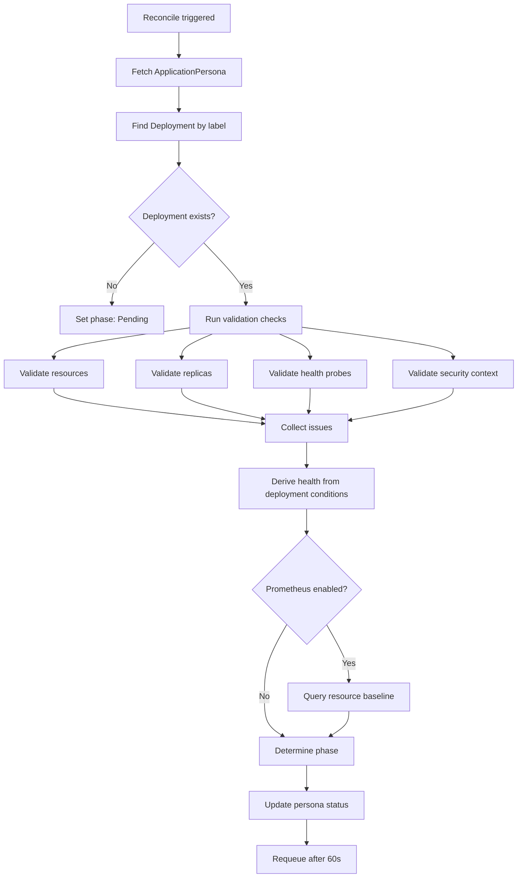

The ApplicationPersona controller continuously validates each deployment against its persona's declared constraints. It reconciles on watch events and on a 60-second timer, reporting issues in the persona's `.status.validation` field.

## Reconciliation flow



The controller matches deployments to personas using the `app.kubernetes.io/name` label. The label value must match the persona's `spec.name` field.

## Validation checks

### Resource validation

Checks container resource limits and requests against persona constraints.

| Check | Severity | Condition |
|-------|----------|-----------|
| CPU limit exceeds persona limit | warning | Container CPU limit > `spec.resources.limits.cpu` |
| Memory limit exceeds persona limit | warning | Container memory limit > `spec.resources.limits.memory` |
| No resource requests set | warning | Container has no CPU or memory requests |

### Replica validation

Checks the deployment replica count against the persona's scaling parameters.

| Check | Severity | Condition |
|-------|----------|-----------|
| Below minimum replicas | error | Deployment replicas < `spec.scaling.minReplicas` |
| Above maximum replicas | warning | Deployment replicas > `spec.scaling.maxReplicas` |

### Health probe validation

Checks that the deployment configures probes matching the persona's health specification.

| Check | Severity | Condition |
|-------|----------|-----------|
| Missing liveness probe | warning | Persona specifies `livenessPath` but container has no HTTP liveness probe |
| Liveness path mismatch | info | Probe path differs from persona's `livenessPath` |
| Missing readiness probe | warning | Persona specifies `readinessPath` but container has no readiness probe |

### Security context validation

Checks pod and container security settings against persona policies.

| Check | Severity | Condition |
|-------|----------|-----------|
| `runAsNonRoot` not enforced | error | Persona requires `runAsNonRoot` but pod security context does not set it |
| `readOnlyRootFilesystem` not set | warning | Persona requires read-only root but container does not set it |
| Privilege escalation allowed | error | Persona forbids privilege escalation but container allows it |

## Severity levels

| Severity | Meaning | Effect on phase |
|----------|---------|-----------------|
| `error` | Policy violation that must be fixed | Phase becomes `Degraded` or `Failed` |
| `warning` | Best practice deviation | Phase remains `Active` unless combined with health issues |
| `info` | Informational difference | No effect on phase |

## Phase determination

The persona phase is derived from validation results and deployment health:

| Condition | Phase |
|-----------|-------|
| Healthy + no validation errors | `Active` |
| Validation errors present | `Degraded` |
| Unhealthy deployment | `Failed` |
| No matching deployment found | `Pending` |
| Partially healthy or warnings only | `Degraded` |

## Health derivation

The controller derives health from the deployment's status conditions:

| Deployment state | Health status |
|-----------------|---------------|
| Available + all replicas ready | `Healthy` |
| Available + some replicas ready | `Degraded` |
| Progressing (rollout in progress) | `Unknown` |
| Not available | `Unhealthy` |

When health is not `Healthy`, the controller also queries pod statuses for specific failure reasons:

- `CrashLoopBackOff`
- `ImagePullBackOff` / `ErrImagePull`
- `CreateContainerConfigError`
- `OOMKilled`
- `RunContainerError`

These appear in `.status.health.podFailures[]` with the pod name, container name, reason, and message.

## Conditions

The controller sets two standard Kubernetes conditions:

| Condition | Status | When |
|-----------|--------|------|
| `Ready` | `True` | Phase is `Active` |
| `Ready` | `False` | Any other phase |
| `Validated` | `True` | No validation errors |
| `Validated` | `False` | One or more validation errors |

## Checking validation status

Use the CLI to inspect validation results:

```bash
dorgu persona status my-app -n production
```

Or query the resource directly:

```bash
kubectl get applicationpersona my-app -n production -o jsonpath='{.status.validation}'
```

<CardGroup cols={2}>
  <Card title="Webhook validation" icon="traffic-light" href="/operator/features/webhook">
    Block non-compliant deployments at admission time
  </Card>
  <Card title="CRD specification" icon="file-code" href="/cli/architecture/crds">
    Full ApplicationPersona and ClusterPersona schema
  </Card>
</CardGroup>
