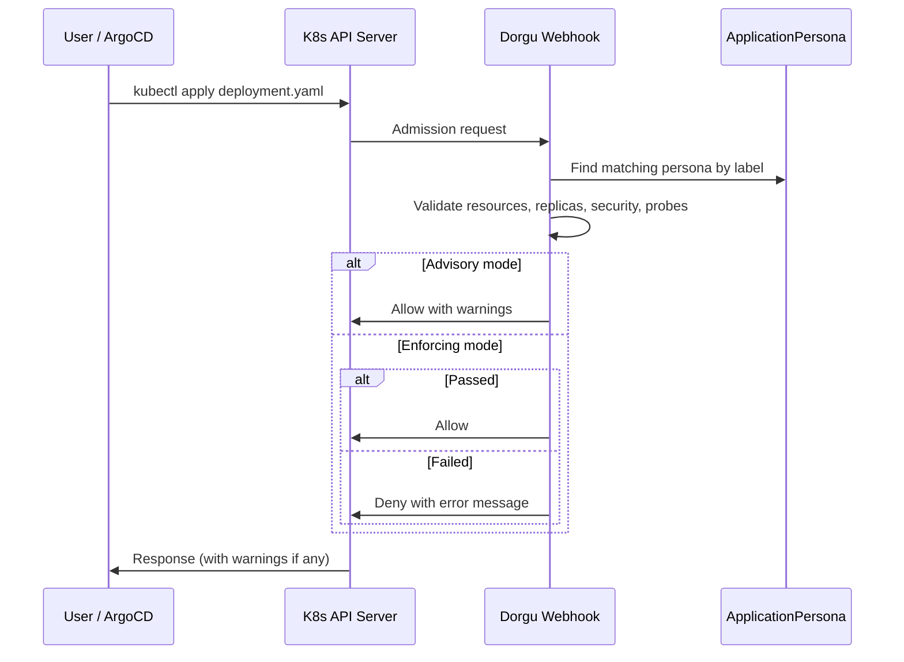

The operator includes an optional validating admission webhook that intercepts Deployment `CREATE` and `UPDATE` operations. It runs the same validation checks as the controller but at admission time, before the change is persisted.

## How it works



The webhook looks up the matching ApplicationPersona by the deployment's `app.kubernetes.io/name` label. If no label is present or no matching persona exists, the deployment is allowed without validation.

## Modes

### Advisory mode (default)

All deployments are allowed. Validation issues are returned as Kubernetes admission warnings, which appear in `kubectl` output:

```
Warning: [nginx] CPU limit 2 exceeds persona limit 500m
Warning: [nginx] no liveness probe; persona expects path /health
deployment.apps/nginx configured
```

### Enforcing mode

Deployments with validation **errors** are denied. Warnings are still attached to allowed responses.

```
Error from server: admission webhook "validate-deployment.dorgu.io" denied the request:
Deployment violates ApplicationPersona 'nginx': replicas (0) below persona minimum (1);
persona requires runAsNonRoot but Deployment does not enforce it
```

<Warning>
Enforcing mode can block deployments and rollouts. Test thoroughly in advisory mode before switching to enforcing in production.
</Warning>

## Validation checks

The webhook runs four validation functions:

| Check | Returns |
|-------|---------|
| Resource limits | warnings |
| Replica counts | warnings + errors |
| Security context | errors |
| Health probes | warnings |

The distinction matters in enforcing mode: **errors** cause denial, **warnings** are attached but do not block.

| Check | Type | Condition |
|-------|------|-----------|
| CPU limit exceeds persona | warning | Container CPU > persona CPU limit |
| Memory limit exceeds persona | warning | Container memory > persona memory limit |
| Below minimum replicas | error | Replicas < `minReplicas` |
| Above maximum replicas | warning | Replicas > `maxReplicas` |
| `runAsNonRoot` not enforced | error | Persona requires it, pod doesn't set it |
| Privilege escalation allowed | error | Persona forbids it, container allows it |
| Missing liveness probe | warning | Persona specifies `livenessPath`, no probe configured |
| Missing readiness probe | warning | Persona specifies `readinessPath`, no probe configured |

## Enabling the webhook

### Via Helm

```yaml
webhook:
  enabled: true
  mode: advisory  # or "enforcing"
```

### Via CLI flag

```bash
./bin/manager --enable-webhook --webhook-mode enforcing
```

## TLS certificates

The webhook server requires TLS certificates. Options:

1. **cert-manager** (recommended) -- The Helm chart supports cert-manager annotations for automatic certificate provisioning
2. **Manual certificates** -- Provide certificates via flags:
   ```bash
   --webhook-cert-path /path/to/certs \
   --webhook-cert-name tls.crt \
   --webhook-cert-key tls.key
   ```
3. **Self-signed** -- controller-runtime generates self-signed certificates automatically for development

## Fail-open behavior

The webhook is designed to fail open:

- If the operator is down, Kubernetes skips the webhook (when configured with `failurePolicy: Ignore`)
- If the ApplicationPersona lookup fails (API error), the deployment is allowed with a log message
- If no `app.kubernetes.io/name` label is present, the deployment is allowed without validation
- If no matching persona exists, the deployment is allowed

This ensures the webhook never blocks deployments due to operator issues.

<CardGroup cols={2}>
  <Card title="Controller validation" icon="shield-check" href="/operator/features/validation">
    Continuous validation via the reconciliation loop
  </Card>
  <Card title="Configuration" icon="gear" href="/operator/configuration/overview">
    All webhook configuration options
  </Card>
</CardGroup>
