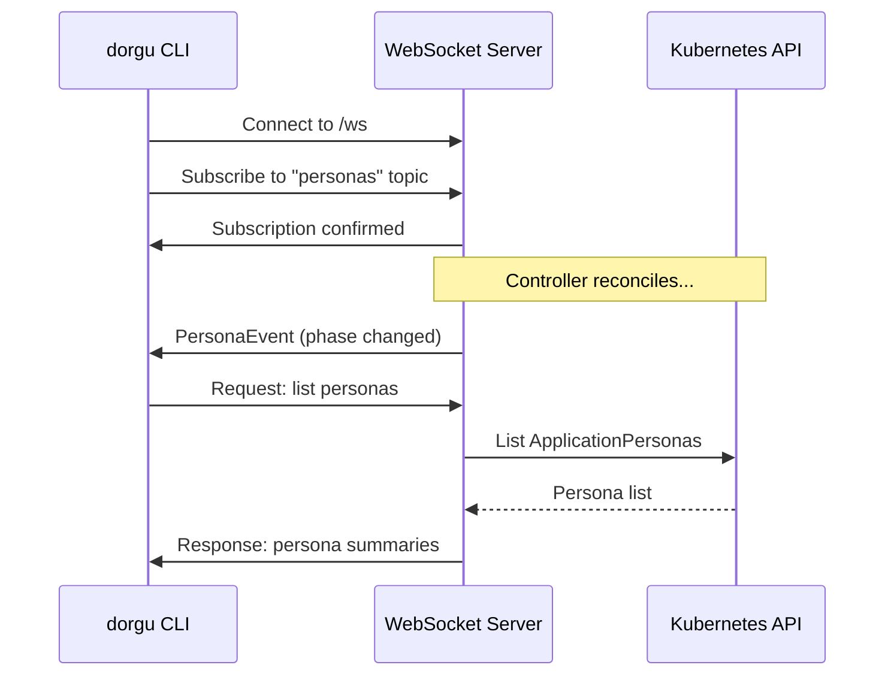

The operator includes an optional WebSocket server that enables real-time communication with the dorgu CLI. It provides live persona and cluster state updates via a topic-based pub/sub protocol.

## How it works



The server exposes two HTTP endpoints:

| Endpoint | Purpose |
|----------|---------|
| `/ws` | WebSocket upgrade endpoint |
| `/health` | Liveness check |

## Protocol

All messages are JSON-encoded with this base structure:

```json
{
  "type": "subscribe",
  "topic": "personas",
  "requestId": "abc-123",
  "payload": {},
  "timestamp": "2026-03-23T10:00:00Z"
}
```

### Message types

| Type | Direction | Purpose |
|------|-----------|---------|
| `subscribe` | Client -> Server | Subscribe to a topic |
| `unsubscribe` | Client -> Server | Unsubscribe from a topic |
| `request` | Client -> Server | Request data |
| `event` | Server -> Client | Push event notification |
| `response` | Server -> Client | Response to a request |
| `error` | Server -> Client | Error response |

### Topics

| Topic | Description |
|-------|-------------|
| `personas` | ApplicationPersona changes |
| `cluster` | ClusterPersona state changes |
| `deployments` | Deployment changes |
| `events` | General Kubernetes events |

## Subscribing to topics

Send a `subscribe` message to receive events for a topic:

```json
{
  "type": "subscribe",
  "topic": "personas",
  "requestId": "sub-1",
  "timestamp": "2026-03-23T10:00:00Z"
}
```

The server confirms with:

```json
{
  "type": "response",
  "topic": "personas",
  "requestId": "sub-1",
  "payload": {"status": "subscribed", "topic": "personas"},
  "timestamp": "2026-03-23T10:00:00Z"
}
```

To stop receiving events, send an `unsubscribe` message with the same topic.

## Requesting data

### List personas

```json
{
  "type": "request",
  "topic": "personas",
  "requestId": "req-1",
  "payload": {"namespace": "production"},
  "timestamp": "2026-03-23T10:00:00Z"
}
```

Response:

```json
{
  "type": "response",
  "topic": "personas",
  "requestId": "req-1",
  "payload": {
    "personas": [
      {
        "namespace": "production",
        "name": "nginx",
        "appName": "nginx",
        "type": "web",
        "tier": "frontend",
        "phase": "Active",
        "health": "Healthy"
      }
    ]
  }
}
```

The `namespace` field in the payload is optional. If omitted, personas from all namespaces are returned.

### Get cluster info

```json
{
  "type": "request",
  "topic": "cluster",
  "requestId": "req-2",
  "payload": {"name": "my-cluster"},
  "timestamp": "2026-03-23T10:00:00Z"
}
```

Response:

```json
{
  "type": "response",
  "topic": "cluster",
  "requestId": "req-2",
  "payload": {
    "name": "my-cluster",
    "environment": "production",
    "phase": "Ready",
    "kubernetesVersion": "v1.29.0",
    "platform": "EKS",
    "nodeCount": 3,
    "applicationCount": 5,
    "addons": ["argocd", "prometheus", "cert-manager"]
  }
}
```

If `name` is omitted, the first ClusterPersona found is returned.

## Event types

### PersonaEvent

Broadcast when an ApplicationPersona changes:

```json
{
  "eventType": "updated",
  "namespace": "production",
  "name": "nginx",
  "phase": "Degraded",
  "health": "Unhealthy"
}
```

Event types: `created`, `updated`, `deleted`

### ClusterEvent

Broadcast when cluster state changes:

```json
{
  "eventType": "updated",
  "name": "my-cluster",
  "phase": "Ready",
  "nodeCount": 3,
  "applicationCount": 5
}
```

Event types: `updated`, `nodeAdded`, `nodeRemoved`

### ValidationEvent

Broadcast when validation results change:

```json
{
  "namespace": "production",
  "name": "nginx",
  "passed": false,
  "issueCount": 2,
  "severity": "error",
  "issues": ["replicas below minimum", "runAsNonRoot not enforced"]
}
```

## Connection management

| Parameter | Value |
|-----------|-------|
| Max message size | 512 KB |
| Ping interval | 30 seconds |
| Write timeout | 10 seconds |
| Read timeout | 60 seconds |
| Send buffer | 256 messages per client |

The server uses non-blocking broadcast — if a client's send buffer is full, the message is dropped for that client rather than blocking other clients.

## Configuration

### Via Helm

```yaml
websocket:
  enabled: true
  port: 9090
```

When enabled, the Helm chart creates a ClusterIP Service on the specified port.

### Via CLI flag

```bash
./bin/manager --enable-websocket --websocket-addr :9090
```

## CLI usage

The dorgu CLI connects to the WebSocket server automatically when available:

```bash
dorgu watch personas -n production   # Live persona updates
dorgu watch cluster                  # Live cluster state
dorgu watch events -n production     # Live validation events
```

<CardGroup cols={2}>
  <Card title="Configuration" icon="gear" href="/operator/configuration/overview">
    WebSocket configuration options
  </Card>
  <Card title="Helm values" icon="helm" href="/operator/configuration/helm-values">
    WebSocket Helm chart values
  </Card>
</CardGroup>
