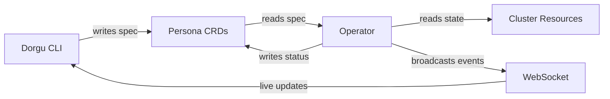

The Dorgu Operator is a Kubernetes operator that validates deployments against persona constraints, discovers cluster state, and provides real-time status updates to the CLI. It is the cluster-side companion to the [Dorgu CLI](/cli/quickstart).

## What the operator does

<CardGroup cols={2}>
  <Card title="ApplicationPersona validation" icon="shield-check">
    Validates deployments against persona constraints: resource limits, replica counts, health probes, and security context. Issues are reported in the persona's status.
  </Card>
  <Card title="ClusterPersona discovery" icon="radar">
    Discovers cluster state including nodes, add-ons, resource capacity, Kubernetes version, and platform type. Reconciles every 5 minutes.
  </Card>
  <Card title="ArgoCD integration" icon="arrows-rotate">
    Watches ArgoCD Application resources and reflects sync status, health status, and revision info into the persona's `.status.argoCD` field.
  </Card>
  <Card title="Prometheus baselines" icon="chart-line">
    Queries Prometheus for CPU and memory usage over a 1-hour window and stores baselines in `.status.learned.resourceBaseline`.
  </Card>
  <Card title="Validating webhook" icon="traffic-light">
    Optionally intercepts Deployment create/update operations. Runs in advisory (warn) or enforcing (deny) mode.
  </Card>
  <Card title="WebSocket server" icon="plug">
    Enables real-time communication with the CLI for `dorgu watch` and `dorgu sync` commands via topic-based pub/sub.
  </Card>
</CardGroup>

<Note>
  **Non-invasive design** -- The operator reads and validates only. It never creates or modifies workload resources (Deployments, Services). This is a core architectural invariant.
</Note>

## How it works

The CLI and GitOps pipelines own the `spec` fields of Persona CRDs (desired state). The operator owns the `status` fields (observed reality). This separation ensures a clean contract between what you declare and what the cluster reports.

## Get started

<CardGroup cols={3}>
  <Card title="Installation" icon="download" href="/operator/installation">
    Install via Helm, kustomize, or build from source
  </Card>
  <Card title="Quickstart" icon="rocket" href="/operator/quickstart">
    Get the operator running in 5 minutes
  </Card>
  <Card title="Configuration" icon="gear" href="/operator/configuration/overview">
    Flags, Helm values, and feature toggles
  </Card>
</CardGroup>
