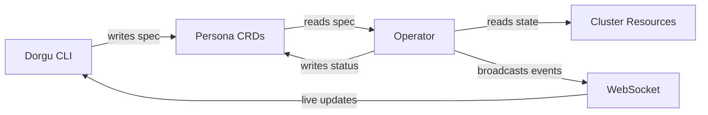

The Dorgu Operator is the AI SRE that runs inside your cluster. It detects incidents, diagnoses their root cause, and proposes reviewable fixes — and it also validates deployments against persona constraints, discovers cluster state, and streams real-time updates to the CLI. It is the cluster-side companion to the [Dorgu CLI](/cli/quickstart).

## What the operator does

<CardGroup cols={2}>
  <Card title="AI self-healing" icon="heart-pulse" href="/operator/features/self-healing">
    Detects OOMKills, crash loops, saturation, and node pressure; diagnoses root cause; proposes an ordered fix with guardrails and automatic rollback. Human approval required by default.
  </Card>
  <Card title="ApplicationPersona validation" icon="shield-check">
    Validates deployments against persona constraints: resource limits, replica counts, health probes, and security context. Issues are reported in the persona's status.
  </Card>
  <Card title="ClusterPersona discovery" icon="radar">
    Discovers cluster state including nodes, add-ons, resource capacity, Kubernetes version, and platform type. Reconciles every 5 minutes.
  </Card>
  <Card title="ArgoCD integration" icon="arrows-rotate">
    Watches ArgoCD Application resources and reflects sync status, health status, and revision info into the persona's `.status.argoCD` field.
  </Card>
  <Card title="Prometheus baselines" icon="chart-line">
    Queries Prometheus for CPU and memory usage over a 1-hour window and stores baselines in `.status.learned.resourceBaseline`.
  </Card>
  <Card title="Validating webhook" icon="traffic-light">
    Optionally intercepts Deployment create/update operations. Runs in advisory (warn) or enforcing (deny) mode.
  </Card>
  <Card title="WebSocket server" icon="plug">
    Enables real-time communication with the CLI for `dorgu watch` and `dorgu sync` commands via topic-based pub/sub.
  </Card>
</CardGroup>

<Note>
  **Non-invasive design** -- The operator never creates or modifies workload resources (Deployments, Services). It reads cluster state, updates its own CRDs, and recommends. When you approve a remediation it patches the ApplicationPersona spec — the app's desired-state record — and the CLI applies the workload change with your credentials. This is a core architectural invariant, not a setting.
</Note>

## How it works

```mermaid
flowchart LR
    CLI["Dorgu CLI"] -->|writes spec| CRD["Persona CRDs"]
    CRD -->|reads spec| Op["Operator"]
    Op -->|reads state| K8s["Cluster Resources"]
    Op -->|writes status| CRD
    Op -->|broadcasts events| WS["WebSocket"]
    WS -->|live updates| CLI
```

The CLI and GitOps pipelines own the `spec` fields of Persona CRDs (desired state). The operator owns the `status` fields (observed reality). This separation ensures a clean contract between what you declare and what the cluster reports.

## Get started

<CardGroup cols={2}>
  <Card title="Self-healing" icon="heart-pulse" href="/operator/features/self-healing">
    The loop, the guardrails, and how verification works
  </Card>
  <Card title="Quickstart" icon="rocket" href="/operator/quickstart">
    Install with AI self-healing on and watch it run
  </Card>
  <Card title="AI setup" icon="sparkles" href="/operator/configuration/ai-setup">
    BYO Anthropic key, injected from a Secret
  </Card>
  <Card title="Installation" icon="download" href="/operator/installation">
    Install via Helm, kustomize, or build from source
  </Card>
</CardGroup>
