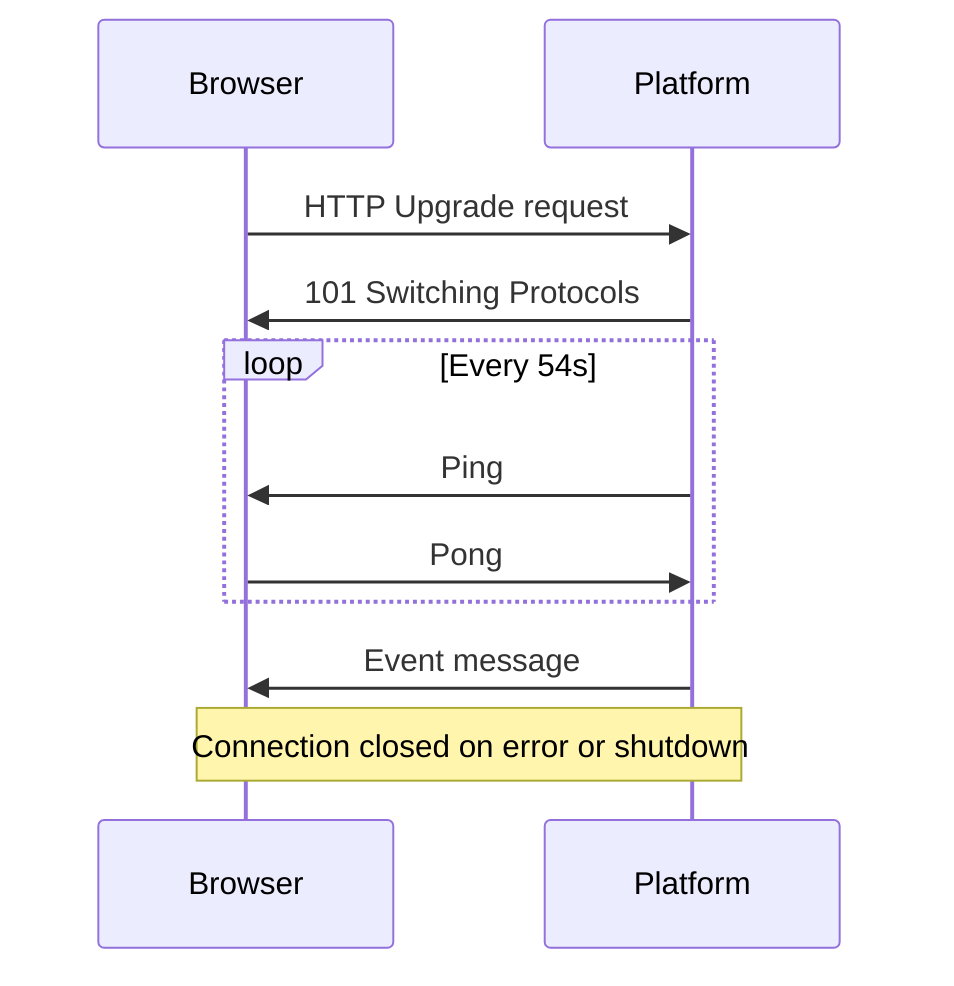

The platform provides a WebSocket endpoint for receiving real-time cluster state change notifications.

## Connecting

```
ws://localhost:8080/ws
```

The WebSocket endpoint accepts standard WebSocket upgrade requests. No authentication is required in the current version.

```javascript
const ws = new WebSocket('ws://localhost:8080/ws');

ws.onmessage = (event) => {
  const message = JSON.parse(event.data);
  console.log(message.type, message.data);
};
```

## Message format

All messages are JSON-encoded:

```json
{
  "type": "cluster.updated",
  "data": {
    "name": "prod-cluster"
  }
}
```

| Field | Type | Description |
|-------|------|-------------|
| `type` | string | Event type identifier |
| `data` | object | Event payload |
| `data.name` | string | Name of the affected cluster |

## Event types

| Type | Trigger | Description |
|------|---------|-------------|
| `cluster.added` | ClusterPersona created | A new cluster has been discovered |
| `cluster.updated` | ClusterPersona modified | Cluster state has changed (nodes, phase, addons, etc.) |
| `cluster.deleted` | ClusterPersona removed | A cluster has been removed |

## Connection lifecycle



### Timeouts

| Parameter | Value |
|-----------|-------|
| Write deadline | 10 seconds |
| Pong wait | 60 seconds |
| Ping period | 54 seconds |
| Max message size | 512 bytes (incoming) |

<Note>
The WebSocket is **notification-only** — messages flow from server to client. The server does not process incoming messages from clients beyond ping/pong frames. To query cluster data, use the [REST API](/platform/api/rest).
</Note>

## Reconnection

The platform frontend automatically reconnects after 5 seconds if the WebSocket connection drops. When building your own client, implement similar reconnection logic:

```javascript
function connect() {
  const ws = new WebSocket('ws://localhost:8080/ws');

  ws.onclose = () => {
    setTimeout(connect, 5000);
  };

  ws.onmessage = (event) => {
    const message = JSON.parse(event.data);
    // Handle event...
  };
}

connect();
```

## Extracting data

WebSocket events carry only the cluster name, not the full cluster object. After receiving an event, fetch the updated data from the REST API:

```javascript
ws.onmessage = async (event) => {
  const message = JSON.parse(event.data);

  if (message.type === 'cluster.updated') {
    const response = await fetch(`/api/clusters/${message.data.name}`);
    const cluster = await response.json();
    // Update UI with fresh data
  }
};
```

<CardGroup cols={2}>
  <Card title="REST API" icon="code" href="/platform/api/rest">
    HTTP API for fetching cluster data
  </Card>
  <Card title="Real-time updates" icon="bolt" href="/platform/features/real-time">
    How the frontend uses WebSocket events
  </Card>
</CardGroup>
