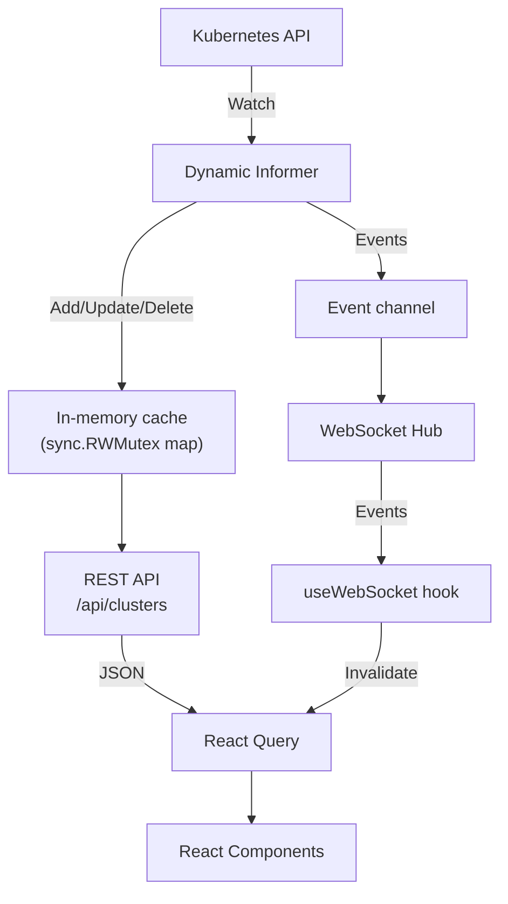

The Dorgu Platform is a full-stack application combining a Go backend with a React frontend, compiled into a single binary with embedded static assets.

## Technology stack

| Layer | Technology |
|-------|------------|
| Backend | Go 1.25 with gorilla/mux and gorilla/websocket |
| Frontend | React 19, TypeScript, Vite, Tailwind CSS, shadcn/ui |
| State management | React Query (TanStack Query v5) |
| Kubernetes | client-go dynamic informer |
| Build | Makefile, `//go:embed` for static assets |

## Data flow



## Project structure

```
dorgu-platform/
├── cmd/server/
│   └── main.go              # Standalone server entry point
│
├── pkg/
│   ├── platform/
│   │   └── platform.go      # Embeddable public API
│   ├── server/
│   │   ├── server.go        # HTTP server, routes, static files
│   │   ├── config.go        # Server configuration
│   │   └── static/          # Embedded frontend build output
│   ├── api/
│   │   └── clusters.go      # REST API handlers
│   ├── watcher/
│   │   ├── watcher.go       # K8s informer + cache
│   │   └── types.go         # ClusterPersona type definitions
│   ├── websocket/
│   │   ├── hub.go           # WebSocket broadcast hub
│   │   └── client.go        # Individual client handler
│   └── models/
│       └── clusterpersona.go  # JSON serialization models
│
└── web/
    └── src/
        ├── pages/            # Dashboard, ClusterView
        ├── components/       # ClusterList, NodeTable, AddonTable, StatusBadge
        ├── hooks/            # useClusters, useCluster, useWebSocket
        └── lib/              # API client, utilities
```

## Backend components

### Kubernetes watcher

The watcher uses `k8s.io/client-go/dynamic/dynamicinformer` to watch `clusterpersonas.dorgu.io/v1` resources. It maintains a thread-safe in-memory cache (`sync.RWMutex`-protected map) and pushes events to a Go channel for WebSocket broadcast.

The informer handles three event types:
- **Add** — New ClusterPersona created, added to cache
- **Update** — ClusterPersona modified, cache entry replaced
- **Delete** — ClusterPersona removed from cache

### REST API

Two endpoints served by gorilla/mux:
- `GET /api/clusters` — Returns all cached clusters
- `GET /api/clusters/{name}` — Returns a single cluster by name

The API layer converts internal watcher types to JSON-serializable models.

### WebSocket hub

A broadcast hub manages all connected clients:
- Clients register on connect, unregister on disconnect
- The hub runs a main event loop in a goroutine
- Events from the watcher channel are broadcast to all clients
- Each client has a buffered send channel to prevent slow clients from blocking

### Static file server

Frontend assets are embedded in the Go binary using `//go:embed`. The server serves static files with SPA fallback — any unmatched route returns `index.html` for client-side routing.

## Frontend components

### React Query

Server state is managed by TanStack Query v5:
- **Query keys**: `['clusters']` for list, `['cluster', name]` for detail
- **Stale time**: 10 seconds
- **Cache invalidation**: Triggered by WebSocket events

### WebSocket hook

The `useWebSocket` hook connects at the app root level and:
- Auto-connects on mount
- Listens for `cluster.*` events
- Invalidates React Query caches on events
- Auto-reconnects after 5 seconds on disconnect

## Embedding

The platform can be embedded in any Go application via the `pkg/platform` package:

```go
import "github.com/dorgu-ai/dorgu-platform/pkg/platform"

config := platform.Config{
    Port:       8080,
    KubeConfig: "~/.kube/config",
    Context:    "prod-cluster",
}

srv, err := platform.NewServer(config)
if err != nil {
    log.Fatal(err)
}

// Blocks until interrupt signal
srv.Start(ctx)
```

The dorgu CLI uses this package for the `dorgu platform serve` command.

## Design decisions

| Decision | Rationale |
|----------|-----------|
| Dynamic informer (not typed) | Avoids importing the full dorgu operator API; works with any ClusterPersona CRD version |
| Embedded static assets | Single binary deployment — no separate web server or file system dependency |
| Event notification + REST fetch | WebSocket carries minimal payloads; REST provides the full data. Simpler than streaming full objects. |
| React Query over Redux | Server state caching with automatic refetch fits the dashboard pattern better than a global store |
| gorilla/mux + gorilla/websocket | Mature, well-tested HTTP and WebSocket libraries for Go |

<CardGroup cols={2}>
  <Card title="Development guide" icon="code" href="/platform/development">
    Run in development mode with hot reload
  </Card>
  <Card title="REST API" icon="code" href="/platform/api/rest">
    API endpoint reference
  </Card>
</CardGroup>
