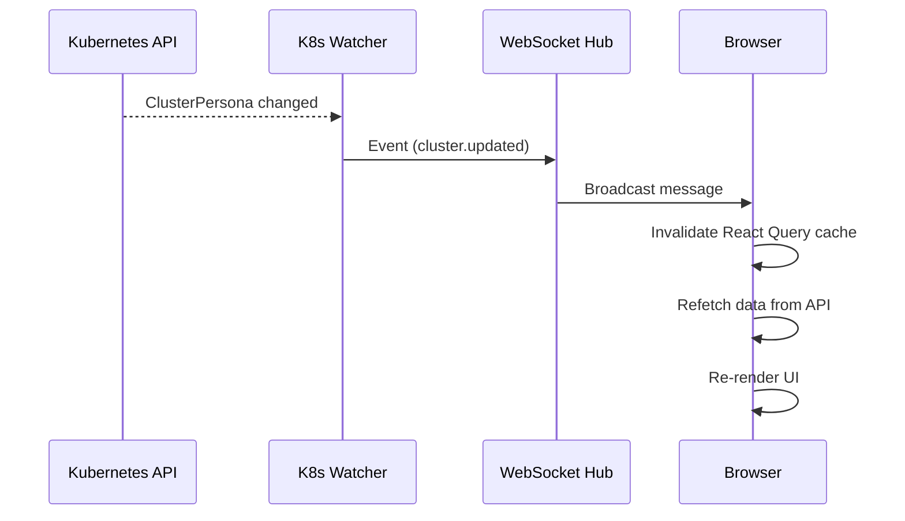

The platform uses WebSocket to push cluster state changes to the browser in real time. When a ClusterPersona is created, updated, or deleted, the UI refreshes automatically without a page reload.

## How it works

## Event flow

1. The Kubernetes informer detects a change to a ClusterPersona resource
2. The watcher sends an event to the WebSocket hub via a Go channel
3. The hub broadcasts the event to all connected browser clients
4. The React frontend invalidates the relevant React Query cache
5. React Query refetches fresh data from the REST API
6. The UI re-renders with the updated state

## Event types

| Event | Trigger |
|-------|---------|
| `cluster.added` | New ClusterPersona created |
| `cluster.updated` | Existing ClusterPersona modified |
| `cluster.deleted` | ClusterPersona removed |

## Connection management

The frontend WebSocket hook manages the connection lifecycle:

| Behavior | Detail |
|----------|--------|
| Auto-connect | Connects on app mount |
| Auto-reconnect | Retries after 5 seconds on disconnect |
| Cleanup | Closes connection on app unmount |
| Ping/pong | Server pings every 54 seconds, client responds |
| Pong timeout | 60 seconds before connection is considered dead |

## Cache invalidation

On receiving a WebSocket event, the frontend invalidates:

| Event | Invalidated query keys |
|-------|----------------------|
| `cluster.added` | `['clusters']` (list) |
| `cluster.updated` | `['clusters']` (list) + `['cluster', name]` (detail) |
| `cluster.deleted` | `['clusters']` (list) |

This triggers React Query to refetch the affected data in the background, ensuring the UI shows the latest state.

<Note>
The WebSocket connection is for event notification only — it does not carry the full cluster data. The frontend always fetches fresh data from the REST API after receiving an event.
</Note>

<CardGroup cols={2}>
  <Card title="WebSocket API" icon="plug" href="/platform/api/websocket">
    WebSocket protocol specification
  </Card>
  <Card title="REST API" icon="code" href="/platform/api/rest">
    REST API that serves the data
  </Card>
</CardGroup>
