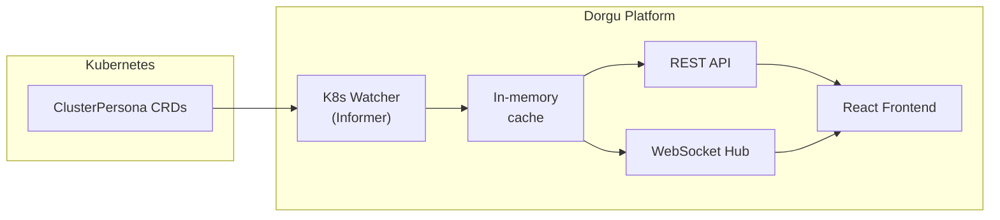

The Dorgu Platform is a web dashboard for visualizing Kubernetes cluster state through ClusterPersona resources. It combines a Go backend with a React frontend into a single binary that can run standalone or be embedded in the dorgu CLI.

## Features

<CardGroup cols={3}>
  <Card title="Cluster Dashboard" icon="grid-2">
    View all clusters at a glance with phase, health, and node count
  </Card>
  <Card title="Cluster Detail" icon="server">
    Inspect nodes, add-ons, resource capacity, and platform info
  </Card>
  <Card title="Real-time Updates" icon="bolt">
    WebSocket-driven live UI updates when cluster state changes
  </Card>
  <Card title="REST API" icon="code">
    JSON API for cluster list and detail queries
  </Card>
  <Card title="Embeddable" icon="puzzle-piece">
    Import as a Go package to embed in any application
  </Card>
  <Card title="Single Binary" icon="box">
    Frontend assets embedded in the Go binary — no separate web server needed
  </Card>
</CardGroup>

## How it works



The platform watches ClusterPersona CRDs using a Kubernetes dynamic informer. Changes flow into an in-memory cache, which feeds both the REST API and WebSocket hub. The React frontend fetches data via the API and receives live updates over WebSocket.

## Quick start

```bash
dorgu platform serve
```

Open [http://localhost:8080](http://localhost:8080) in your browser.

See the [platform serve command](/cli/commands/platform) for all available flags.

<CardGroup cols={2}>
  <Card title="Installation" icon="download" href="/platform/installation">
    All ways to run the platform
  </Card>
  <Card title="Quickstart" icon="rocket" href="/platform/quickstart">
    Get up and running in 5 minutes
  </Card>
</CardGroup>
